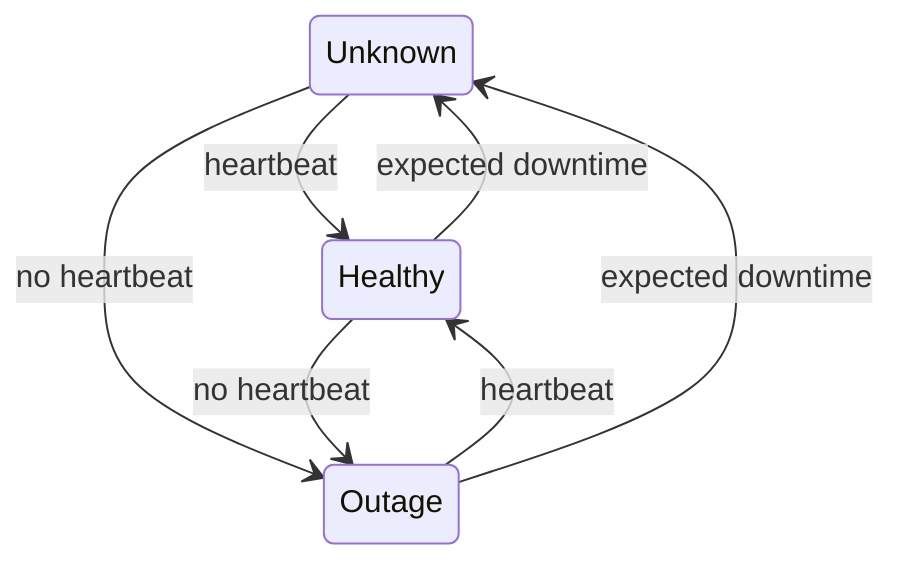

# Node states

## Available states

Each node monitored by Node Recovery can have one of three different states when observed by other nodes. These states exist both in the local view (i.e., how one specific node sees each other node) and in the global view (i.e., the cluster-wide consensus on node states).

- **Healthy**:

  - **Local view:** The node is considered to be alive from the observing node's perspective. Heartbeats have been received from this node recently.

  - **Global view:** In general, a node is marked as Healthy as soon as one voting node sees it as Healthy. See [Global state calculation](#global-state-calculation) for detailed information.

- **Outage**:

  - **Local view:** When no heartbeats have been received for a period of time from the observing node's perspective, the node is considered to be in outage.

  - **Global view:** In general, a node gets marked as Outage when no voting node sees it as Healthy and a cluster majority of nodes agrees that the node is in outage. See [Global state calculation](#global-state-calculation) for detailed information.

- **Unknown**:

  - **Local view:** Initial state for nodes before an initial heartbeat has been received from that node. This occurs during startup of the NodeRecovery DxM or after remote nodes have notified that they expect to have downtime (e.g., on restarts).

  - **Global view:** A node gets marked as Unknown globally in scenarios where it is not possible to determine whether its state should be marked as Healthy or Outage. See [Global state calculation](#global-state-calculation) for detailed information.

Aside from these three states, nodes can also be put into [maintenance mode](#maintenance-mode). This is state that is applied to a node on top of its Healthy, Outage, or Unknown state.

## Local state transitions

Based on the [outage detection](xref:NodeRecovery_Detection), nodes can transition between local view states.

On startup of a Node Recovery node, all nodes in that node's local view state will start out in the `Unknown` state. The following transitions can then occur:

| From State | To State | Trigger |
| ---------- | -------- | ------- |
| Unknown | Healthy | First heartbeat received from the node. |
| Unknown | Outage | `FirstHeartbeatThresholdMilliseconds` exceeded without receiving a heartbeat. |
| Healthy | Outage | `OutageThresholdMilliseconds` exceeded without receiving a heartbeat. |
| Healthy | Unknown | Remote node notifies of expected downtime (e.g., restart). |
| Outage | Healthy | Heartbeat received from the node after outage. |
| Outage | Unknown | Remote node notifies of expected downtime (e.g., restart). |

```mermaid
---
config:
  themeCSS: |
    #edge1, #edge2 { stroke: red; }
    #edge0, #edge4 { stroke: lightgreen; }
    #edge3, #edge5 { stroke: lightgray; }
---
stateDiagram-v2
    Unknown --> Healthy:  heartbeat
    Unknown --> Outage: no heartbeat
    Healthy --> Outage: no heartbeat
    Healthy --> Unknown: expected downtime 
    Outage --> Healthy: heartbeat
    Outage --> Unknown: expected downtime
```

## Global state calculation

The global state is calculated from local view states in the following way:

- If the cluster does not have an elected leader node, global outage detection is not active. This happens when the cluster has less than three nodes or when each node considers a majority of other nodes to be in the Outage state (which could be when a majority of nodes is actually down, or because of certain [network splits](xref:NodeRecovery_Detection#network-splits)).

- Nodes that get to vote are those observed from the leader's perspective as being Healthy. If there are not enough voters to reach a cluster majority, global outage detection is not active.

- A node is marked as Healthy as soon as one voter sees it as Healthy.

- A node is marked as being in the Outage state when no voter sees the node as Healthy and a cluster majority of voters agrees that the node is in outage (for example, in a four- or five-node cluster, at least three voters need to see it as Outage).

- In other scenarios, a node is marked as Unknown. For example, no voters see the node as Healthy, and there is no cluster majority agreement on Outage among voters.

## Maintenance mode

Maintenance mode can be applied as a separate flag on top of the [three main states](#available-states). Setting one or more nodes into maintenance mode does not affect the sending or receiving of heartbeats, nor does it affect outage detection in any way.

However, the [triggered scripts](xref:NodeRecovery_Triggers) receive extra information about whether a node is in maintenance mode or not, so that custom logic can be applied when needed. The scripts are also executed whenever one or more nodes enter or leave maintenance mode, even if no other state changes occur.
