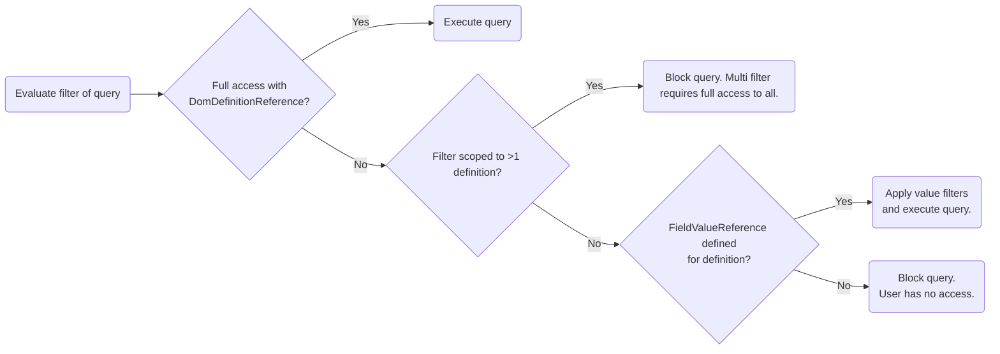
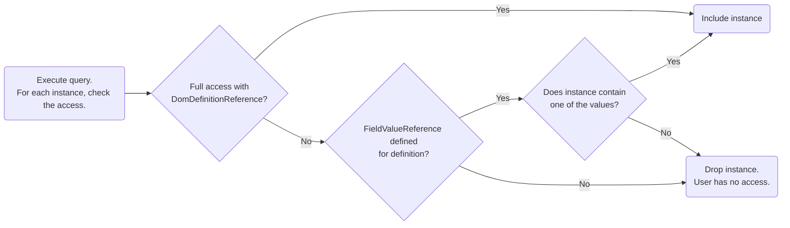
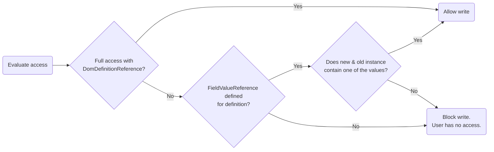

# SecuritySettings

The `DomManagerSecuritySettings` configuration class is mainly used to store the link security settings. There are also some permission flag properties that are deemed obsolete.

## LinkSecuritySettings

Supported from DataMiner 10.5.10/10.6.0 onwards.<!-- RN 43380 -->

The `LinkSecuritySettings` object allows you to restrict access to the [DomInstances](xref:DomInstance) of specific [DomDefinitions](xref:DomDefinition) by linking one or more DataMiner security groups to those definitions. When at least one link is configured for a module, the module enters **Restricted Access** mode, and link security is enforced for all CRUD operations on the instances (create, count, read, update, and delete).

> [!NOTE]
> If no group links are defined, the behavior is the same as prior to DataMiner 10.5.10/10.6.0: every authenticated user can create, read, update, and delete DOM instances. However, the requirement that only users with the [*Module settings* permission](xref:DOM_security#module-settings-user-permission) can create, update, or delete DOM configuration objects still applies (see [Behavior](#behavior)).

This `LinkSecurity` object contains a collection of `GroupLink` entries.

### GroupLink

Each `GroupLink` entry defines access for one DataMiner security group:

| Property | Type | Description |
|--|--|--|
| GroupName | string | Name of the DataMiner security group. **Note:** Changing the name of a security group invalidates the link (you will need to update the link). |
| DomDefinitionReferences | List&lt;DomDefinitionReference&gt; | Stores the references to the `DomDefinition` objects whose instances are accessible to the group. A reference is resolved via the DOM definition ID. |
| FieldValueReferences | List&lt;FieldValueReference&gt; | Stores the references to a `DomDefinition` and `FieldDescriptor` alongside a collection of values that determine what instances will be accessible to the user. A reference is resolved via the IDs of the definition and field descriptor. Supported from DataMiner 10.6.2/10.6.0 onwards.|

> [!NOTE]
> In future versions, additional security-related configuration or link types may be added to the `GroupLink` class.

After updating the `ModuleSettings` with new or modified links, make sure to **reinitialize the DOM manager** for the changes to take effect. See [DOM module settings](xref:DOM_ModuleSettings) for the different reinitialization options. During reinitialization, the manager is briefly unavailable. CRUD requests sent in that short window will fail.

### Kinds of references

There are currently two kinds of references that can be used to specify the access to DOM instances for a DataMiner security group.

#### DomDefinitionReference

Supported from DataMiner 10.5.10/10.6.0 onwards.<!-- RN 43380 -->

With this kind of reference, you grant access to all instances for a given definition. You only need to specify the ID `DomDefinition` in the `DomDefinitionReference` object. Users will be able to do all CRUD actions for all instances linked to that definition.

#### FieldValueReference

Supported from DataMiner 10.6.2/10.6.0 onwards.<!-- RN 44233 -->

With this kind of reference, you grant access to only a subset of instances for a given definition. This subset is defined by providing the ID of a `FieldDescriptor` and a collection of values for that field. Users will then get access to any instance for that definition that contains at least one of the provided values for the specified `FieldDescriptor`.

For example, the user group 'London Employees' can only read the 'Job' instances where the 'Assigned Office' field (which is a `DomInstanceFieldDescriptor`) contains the ID of the London office instance. This way, users part of that specific employee group will only see the 'Job' instances that are assigned to their office. The DOM manager will automatically limit the results when requesting all 'Job' instances.

```csharp
var allowedOffice = Guid.Parse("2f4fee02-4764-4d3d-8e7d-29d391b75e84"); // ID of the London office DOM instance. (part of another DOM definition)
var jobsDefinitionId = Guid.Parse("1836e5c8-0c08-4955-b3ec-14530cc7bdf5"); // ID of the 'Jobs' DOM definition.
var assignedOfficeFieldId = Guid.Parse("5c498769-6951-4d17-a89c-7b60b9ad9816"); // ID of the 'Assigned Office' field on a 'Job'.

var reference = new FieldValueReference(jobsDefinitionId, assignedOfficeFieldId, new [] { allowedOffice });
```

The following `FieldDescriptors` can be referenced:

| FieldDescriptor | Field Type | Referenced Value Collection Type |
|--|--|--|
| DomInstanceFieldDescriptor | Guid or List&lt;Guid&gt; | List&lt;Guid&gt; |
| DomInstanceValueFieldDescriptor | Guid or List&lt;Guid&gt; | List&lt;Guid&gt; |
| GenericEnumFieldDescriptor | GenericEnum&lt;int&gt; or List&lt;GenericEnum&lt;int&gt;&gt; | List&lt;int&gt; |
| GenericEnumFieldDescriptor | GenericEnum&lt;string&gt; or List&lt;GenericEnum&lt;string&gt;&gt; | List&lt;string&gt; |

When reading or counting, the security filtering is done entirely in the DB, which allows this system to be applied on DOM definitions that have millions of DOM instances linked. To ensure optimal performance and stability, some limitations are in place:

- You can define up to 10 values on a reference.
- You can only specify 1 reference per group for a DOM definition.
- When a user is part of multiple groups, and multiple of those groups have this kind of reference for a certain DOM definition, the reference of the group that comes first alphabetically (case insensitive) will be used. It is recommended to avoid these situations by defining & using the groups in such a way that overlaps are avoided. Specific groups could be created for this.

> [!NOTE]
>
> - A user can be part of an additional group that defines full definition level access for the same DOM definition. In that case, this full access will take precedence over the limited access of the other group.
> - The ID of FieldDescriptor IDs should be unique within a DOM module. If there are duplicate IDs used across multiple SectionDefinitions in the module, this may result in unexpected behavior with this type of security reference.

> [!IMPORTANT]
> When `FieldValueReferences` are used to limit access to the instances of a definition, the filter used to read or count the instances must ideally not exceed 100 OR clauses. On Elasticsearch and OpenSearch, there is a default limit of 1024 OR clauses. When you specify a reference with 3 values, this means that the maximum number of conditions sent via the DOM helper read or count method should be 3 times less than this maximum (341). Since there is a limit of 10 condition values, the recommended max clauses of 100 should prevent queries from failing. On STaaS there is no such hard limit, but there is, however, a limit on the general query request size. To ensure a performant and stable solution, a maximum of 100 clauses is also recommended here.

When the `ModuleSettings` object is saved with this kind of references defined, some validation is done to ensure they are valid. If one of these validation rules fail, the `TraceData` will contain a `DomManagerSettingsErrorData` error object that can have one of the following reasons:

| Reason | Explanation |
|--|--|
| DomSecurityFieldValueReferenceHasInvalidIds | A reference was defined that contains an empty Guid value for the `DomDefinitionId` or `FieldDescriptorId` properties. |
| DomSecurityFieldValueReferenceHasNoValues | A reference was defined that contains an empty list of values. |
| DomSecurityFieldValueReferenceHasTooManyValues | A reference was defined that contains more than the maximum of 10 values. |

In all of the above error cases, the `GroupName` and `DomDefinitionId` properties on the error can be used to understand which reference was invalid. The third error also contains a `Limit` property that defines the maximum number of values (10).

Take note of the following validation behavior that occurs at runtime and will not result in errors during saving:

- When multiple `FieldValueReferences` are present for the same group and definition, only the first one in the list will be used. Any subsequent for that same group and definition will be ignored.
- The values defined in the `FieldValueReference` will also be checked on validity before they are being used to apply the security check. Any invalid values will be ignored. These do however count towards the maximum amount of values mentioned in the error section above.
  - Guid: Should not be an empty Guid.
  - Int: Any value is allowed.
  - String: Should not be null or empty.

### Behavior

| Scenario | Behavior |
|--|--|
| No links configured | All DOM instances are accessible for any authenticated user. |
| At least one link configured | Module switches to Restricted Access mode. Only linked groups (and internal connections or users with the [*Module settings* permission](xref:DOM_security#module-settings-user-permission)) have access to instances of linked `DomDefinitions`. |
| Definition has no links while module is restricted | Its instances are not accessible until a link is created for that definition. |

Notes:

- A link grants both read and write access (read-only links are currently not supported).
- Users with the [*Module settings* permission](xref:DOM_security#module-settings-user-permission) always have full access to any DOM instance but still need to adhere to the [filtering requirements](#filtering-requirements-when-security-is-enabled).

The simplified decision trees below may help understand how the security checks work and what kind of reference takes precedence.

#### Count & Read requests with DOM definition scoped filter



#### Count & Read requests with DOM instance scoped filter



#### Create, update and delete requests



### Filtering requirements when security is enabled

When a module is in Restricted Access mode, the manager must be able to determine the access rights from every read or count request. Therefore filters must provide sufficient context.

#### DomInstance read operations

The filter must specify either:

- A DOM definition context (one or more `DomDefinitionId` clauses), OR
- A DOM instance ID context (one or more `DomInstanceId` clauses only).

Allowed examples:

- `(Dom Definition ID == a1ds5z8)`
- `(Dom Definition ID == a1ds5z8) && (Field X == "Some Value")`
- `(Dom Definition ID == a1ds5z8) || (Dom Definition ID == 5ze7s84a)`
- `(Status ID == "in_progress") && ((Dom Definition ID == a1ds5z8) || (Dom Definition ID == 5ze7s84a))`
- `(Dom Instance ID == f4e87d)`
- `(Dom Instance ID == f4e87d) || (Dom Instance ID == qs4z54) || (Dom Instance ID == ezeasf)`

Disallowed examples:

- `TRUEFilterElement<DomInstance>`
- `(Field X == "Some Value")`
- `(Status ID == "in_progress")`

> [!IMPORTANT]
>
> - If a DOM definition context is specified for which the user has no access, the request fails with `NoPermission`. If only instance IDs are specified, inaccessible instances are silently omitted from the result set, but the request itself succeeds.
> - If `FieldValueReferences` are used to grant access to the instances of a definition, only the ID of one definition can be provided in the filter.

> [!TIP]
> A simple way to ensure that your filters are compatible is to take the existing filter applying an AND operation with a filter clause scoped to the relevant `DomDefinition`.
>
> ```csharp
> var existingFilter = GetExistingFilter();
> var definitionFilter = DomInstanceExposers.DomDefinitionId.Equal(domDefinitionId);
> var scopedFilter = existingFilter.AND(definitionFilter);
> ```

#### DomInstance count operations

The filter must specify a DOM definition context (one or more `DomDefinitionId` clauses). Filtering only on DOM instance IDs is not supported for counts.

Allowed examples:

- `(Dom Definition ID == a1ds5z8)`
- `(Dom Definition ID == a1ds5z8) && (Field X == "Some Value")`
- `(Dom Definition ID == a1ds5z8) || (Dom Definition ID == 5ze7s84a)`
- `(Dom Definition ID == a1ds5z8) && ((Dom Instance ID == f4e87d) || (Dom Instance ID == qs4z54) || (Dom Instance ID == ezeasf))`

Disallowed examples:

- `TRUEFilterElement<DomInstance>`
- `(Field X == "Some Value")`
- `(Status ID == "in_progress")`
- `(Dom Instance ID == f4e87d)`
- `(Dom Instance ID == f4e87d) || (Dom Instance ID == qs4z54) || (Dom Instance ID == ezeasf)`

> [!IMPORTANT]
>
> - If a DOM definition context is specified for which the user has no access, the request fails with `NoPermission`.
> - If `FieldValueReferences` are used to grant access to the instances of a definition, only the ID of one definition can be provided in the filter.

> [!NOTE]
> Standard GQI queries (e.g. from a low-code app or dashboard) already include a DOM definition context by default. No special changes are required there; however, queries targeting definitions without access will surface permission errors in the app.

#### DOM history read and count operations

The provided filter must include "SubjectID Equal" clauses that scope the filter to the history of one or more specified DOM instances.

Allowed examples:

- `(SubjectID == "DomInstanceId_a1ds5z8")`
- `(SubjectID == "DomInstanceId_f4e87d") || (SubjectID == "DomInstanceId_qs4z54")`
- `(FullUsername == "some_user") && ((SubjectID == "DomInstanceId_f4e87d") || (SubjectID == "DomInstanceId_qs4z54"))`

Disallowed examples:

- `TRUEFilterElement<HistoryChange>`
- `FullUsername == "some_user"`

> [!IMPORTANT]
>
> - If a filter is not correctly scoped to valid SubjectID clauses, the request will fail with `ReadFilterNotSupportedBySecurity` or `CountFilterNotSupportedBySecurity`.
> - If a DOM instance ID subject context is specified for which the user has no access, or the instance does not exist, the request will fail with `NoPermission`.

### Errors

The following error reasons apply specifically to link security (see also [DomInstance errors](xref:DomInstance#errors)):

| Error reason | Description |
|--|--|
| ReadFilterNotSupportedBySecurity | A read filter lacked the proper context to apply security. When filtering on `DomInstances`, add one or more `DomDefinitionId == X` clauses or only filter on specific instance IDs. When filtering on DOM history, add one or more `SubjectID == X` clauses. The *Message* property may contain extra info. |
| CountFilterNotSupportedBySecurity | A count filter lacked the proper context to apply security. When filtering on `DomInstances`, add one or more `DomDefinitionId == X` clauses. When filtering on DOM history, add one or more `SubjectID == X` clauses. The *Message* property may contain extra info. |
| NoPermission | The user does not have permission to perform the operation. When reading `DomInstances`, the user may not have access to at least one referenced DOM definition. *DomDefinitionIds* contains the inaccessible definition IDs. When reading DOM history, the user may not have access to at least one `DomInstance` for which the history was requested, or the instance does not exist. *DomInstanceIds* contains the inaccessible instance IDs. |

> [!NOTE]
> In bulk operations, successful items are still processed even if some items fail with security-related errors.

### Events

Link security also applies to events:

- `DomInstancesChangedEventMessage` only contains created/updated/deleted instances that the subscribed user is allowed to access.
- If an event contains only instances that the user cannot access, it is dropped for that connection.
- The following properties help identify special cases:
  - `FromSecurityEnabledModule`: Indicates that security was applied. If `true`, additional instance changes may have been omitted for this subscriber.
  - `SecurityEnabledModuleNotAvailable`: If `true` and the event is empty, the security context could not be evaluated (e.g. a remote Agent could not initialize its DOM manager because of database connectivity issues). Subscribers relying on event-driven caches should reload their data upon receiving such an event.

### General notes

- Renaming a DataMiner security group invalidates any existing group links using the old name. Update the links accordingly.
- Enabling link security introduces some overhead. Testing showed only minor measurable impact, predominantly in large-scale bulk operations with very high numbers of links (e.g. 100K). More typical scenarios showed little to no noticeable performance difference.
- When security is enabled, the DOM instance tab in a DOM module window of the [SLNetClientTest tool](xref:SLNetClientTest_tool) will require you to select one or more DOM definitions before you can read the DOM instances.
