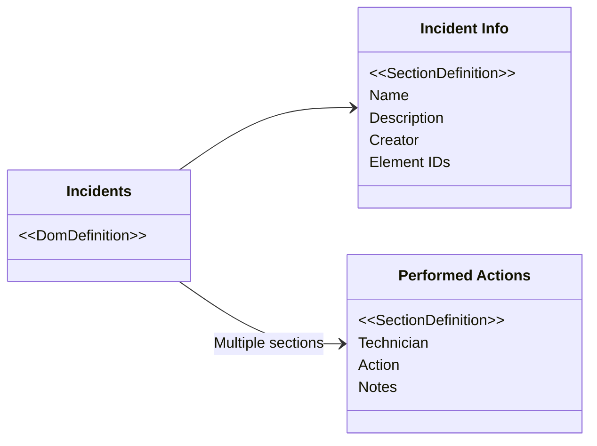
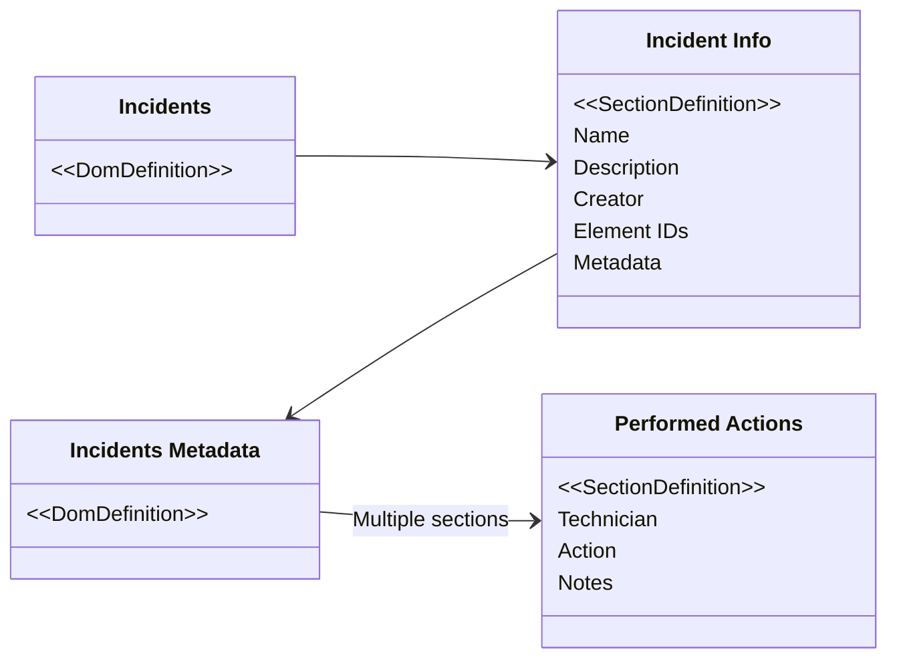

# DOM best practices

When you design a DOM model, you should always keep the best practices in mind that you can find below, and take into account the performance implications of your design decisions.

These are the main things to keep in mind:

- **Group DOM definitions**: Consolidate related DOM definitions within the same module to optimize database performance and minimize resource usage.

- **Disable instance history**: Turn off unnecessary instance history tracking to conserve resources. This is especially beneficial for DOM managers with frequent create or update actions.

- **Use compact DOM instances**: Prioritize essential data, avoid duplication, and limit unnecessary fields to keep DOM instances small and efficient.

- **Optimize CRUD calls**: Use bulk operations for create, update, or delete actions, and avoid multiple updates to the same DOM instance in the same script to reduce overhead.

- **Efficient scripting**: Design scripts for fast and efficient execution, particularly focusing on CRUD scripts, to minimize execution time and potential script queues.

You can find more details below.

## Module and settings

### Group DOM definitions that belong to the same solution within the same DOM module

We recommend limiting the number of DOM modules in a DataMiner System.

Each DOM module has its separate indexes in the Elasticsearch or OpenSearch database. These require a certain amount of system resources, which adds up over time.

We therefore recommend defining all `DomDefinitions` and storing all `DomInstances` within the same DOM module instead of creating a DOM module for each separate DOM model. However, if a certain model is completely standalone and is reused by other solutions, it can still be advisable to keep them separate.

We recommend keeping the number of DOM modules on one system well **below 50**. However, this number depends on the number of database nodes and their resource allocation. If STaaS is used, the performance aspect is less relevant because of the different way the DOM data is stored.

**Not recommended:**

- Module: *people_app_offices*
  - Definition: Offices
- Module: *people_app_grouping*
  - Definition: Teams
  - Definition: Departments
- Module: *people_app_people*
  - Definition: People

**Recommended:**

- Module: *people_app*
  - Definition: Offices
  - Definition: Teams
  - Definition: Departments
  - Definition: People

### Disable DOM instance history when not required

By default, any change made to a `DomInstance` is tracked in [history records](xref:DOM_history). These records are saved asynchronously by default, which should limit the performance impact when saving or updating a `DomInstance`.

However, saving these history records puts an additional load on both DataMiner and the database. If history records are not required, you should therefore [disable the history](xref:DOM_history#disabling-the-history-or-changing-the-storage-behavior) in order to save CPU cycles, memory, and storage.

Especially for DOM managers with frequent create or update actions (> 1 per second on average), the performance benefit of disabling this history can be considerable.

## DOM model

### Try to keep the DomInstance objects small

When you interact with a `DomInstance`, all data for this instance needs to be retrieved from or sent to the server. Therefore, less data results in faster actions.

As such, you should think critically and limit the size of `DomInstances`, following these recommendations:

- **Only include data that is actually required**

  When designing a DOM model, people often want to include any possible piece of information relevant to the represented entity. However, you should include only the needed data to ensure that `DomInstances` are kept small and space-efficient. Updating the DOM model with an extra field later on is much easier than removing a field that turned out to be unnecessary.

- **Avoid data duplication**

  Always strive to store certain data only once and link to it where needed. This not only benefits the size of `DomInstances` but also makes updating this data more straightforward, as it only needs to be done in one location.

- **Avoid storing JSON in a string field**

  While it may be tempting to model JSON and store it in a string field, this is considered bad practice. It hinders data checks, makes the model hard to understand, and introduces a higher risk of storing irrelevant data, leading to performance issues. Instead, use multiple sections or other `DomInstances` where possible.

- **Limit the number of sections/fields**

  Allowing multiple sections for a `SectionDefinition` theoretically enables the addition of an unlimited number of sections to the `DomInstance`. However, every section increases the size of the `DomInstance`, impacting performance, especially when each section contains numerous fields. For such `SectionDefinitions`, it is crucial to ensure that only the most important values are stored.

### Store rarely used (meta)data in separate DOM instances

In most solutions, there are objects that need to be retrieved quite often to display them in a table or on a timeline. These often-retrieved `DomInstances` should be kept as small as possible and should only include the required data.

If values are only needed when a specific object is known (e.g. selected in a low-code app table), create a separate metadata object that stores these additional values. A link can then be made to retrieve these values only when needed. However, as this introduces another read call, you should only do this in case these values are indeed needed less often than the main object values. If these additional values will always be joined to the main object, the performance benefit may be negated, or you may even get the opposite effect.

**Not recommended:**



**Recommended:**



### Use the most efficient field descriptor

The way data is stored can impact the size of a `DomInstance`. Preferably, the data should convey the same meaning using as few bytes as possible.

An example of this is a "severity" field, which could contain "Critical", "Minor", or "Major". Instead of defining these as string values every time, you should use a `GenericEnumFieldDescriptor<int>` instead. Each severity is then mapped to a number, and only that number is stored in the `DomInstance`. This will require fewer bytes compared to storing long string values.

### Avoid reusing section definitions if not all fields are applicable

`SectionDefinitions` can be reused inside a DOM manager. If all fields inside a `SectionDefinition` are applicable to two `DomDefinitions`, it may be advisable to reuse that `SectionDefinition`. However, if only a subset is applicable, it is better to define a new `SectionDefinition` specific to the other `DomDefinition`. This ensures that only relevant data is stored.

### Try to limit the number of statuses and fields allowed per state

In a `DomBehaviorDefinition`, you have very fine control over what fields should be filled in for every state. However, this can result in a large configuration when many fields and statuses are used.

To reduce the size of the `DomBehaviorDefinition`, you should limit the number of fields used in a status system. It could be beneficial to split off data not tied to a specific state into a separate `DomDefinition`.

### Avoid using the AutoIncrementFieldDescriptor when high-performance create actions are required

The [`AutoIncrementFieldDescriptor`](xref:DOM_AutoIncrementFieldDescriptor) generates a unique number for each create operation across the DMS. This may cause additional delays and hinder performance when creating `DomInstances`. It is advisable to avoid using this `FieldDescriptor` type when aiming for high-performance create actions.

## DOM CRUD and scripting

### Try to limit the number of CRUD calls

Every call to DataMiner (e.g. `DomInstance` create call) and the database has a certain overhead. By reducing the number of calls, you can limit this overhead. You can implement the following measures:

- **Use bulk create, update, or delete whenever possible**

  When multiple `DomInstances` need to be created or updated simultaneously, it is advisable to pass them to DataMiner using the [bulk `CreateOrUpdate` method](xref:DomHelper_class#multiple-instances) instead of looping over the list and passing them one by one. This can improve performance up to 10 times. Note that a maximum of 100 `DomInstances` can be passed at once.

- **Avoid doing multiple updates to the same DOM instance in the same script/code**

  When you design a script, it can happen that fields of a `DomInstance` require an update at different points. You should store these updated values and apply them in one go to the `DomInstance` instead of doing separate updates at every stage.

- **Read all relevant DOM data in one call**

  Instead of performing multiple single read operations to retrieve every `DomInstance`, `DomDefinition`, or other DOM data, consider building a filter that retrieves all expected data in one call. For example, when you have a list of IDs from `DomInstances` that need to be retrieved, use a large OR filter that matches these IDs. There is a helper method available in the `Tools` class of the SLNetTypes.dll that can assist with this.

  ```csharp
  private List<DomInstance> GetDomInstances(DomHelper helper, List<DomInstanceId> ids)
  {
      return Tools.RetrieveBigOrFilter(
          ids,
          id => DomInstanceExposers.Id.Equal(id),
          filter => helper.DomInstances.Read(filter));
  }
  ```

  However, it is important that not too many `DomInstances` are read at once. Make sure that there are **less than 1000 records for each call**.

  When there is a need to retrieve a large number of `DomInstances`, you should use [paging](xref:DomHelper_class#reading-dom-data). This increases the number of read calls, but since the payload is large, splitting up the calls is beneficial.

- **Select only the fields you need when reading**

  When you only need a subset of a `DomInstance`'s properties (for example when populating a table), select those fields using the `SelectedFields<DomInstance>` overloads of `Read` or `PreparePaging` instead of retrieving full objects. This feature (see [Read selected fields](xref:DomHelper_class#read-selected-fields)) reduces payload size and can significantly improve performance and memory usage. This feature is available from DataMiner 10.6.0 onwards <!-- RN 43852 -->.

### Avoid using DOM CRUD scripts for DOM definitions that see many instance creates or updates

In the `ModuleSettings` and `DomDefinition`, it is possible to [define a script](xref:ExecuteScriptOnDomInstanceActionSettings) that will be executed when a `DomInstance` is created, updated, or deleted. This can for example be useful when a change to one of these objects needs to be sent to an external system.

However, keep in mind that this script is triggered for every create or update, which may include changes to values not relevant for this script. When you have `DomDefinitions` where a lot of `DomInstances` are created or updated, this may cause performance issues, especially if these scripts contain inefficient and long-running actions.

### Ensure DOM scripts (CRUD or actions) run fast and efficiently

When defining [CRUD scripts](xref:ExecuteScriptOnDomInstanceActionSettings) or [DOM script actions](xref:DOM_actions), always ensure they run fast and efficiently. This is especially crucial for CRUD scripts, as there is a higher chance that they are executed frequently without a user directly waiting for their execution. When numerous CRUD actions occur, a queue could start to build up. It is advised to keep the execution of these scripts well within the milliseconds range.

### Use the 'FullCrudMeta' version of the CRUD script instead of the 'IdOnly' variant

You can also keep your CRUD scripts fast by using the ['FullCrudMeta' variant](xref:ExecuteScriptOnDomInstanceActionSettings#full-crud-meta-type) of the CRUD scripts. This way, you already have access to the full `DomInstance` instead of having to retrieve it from DataMiner inside the script. This saves a lot of time and allows your script to more efficiently retrieve the information from the `DomInstance` that is required.

### Watch out for race conditions when updating DOM instances

Since updates to a DOM instance can be executed on any Agent in a cluster, it is possible for the same DOM instance to be modified at nearly the same time by different Agents. This can lead to a race condition, where one Agent's updates may unintentionally overwrite changes made by another. To minimize the risk of this happening:

- Restrict updates to a single Agent per module, for example by implementing this logic in an element or by ensuring these requests are only sent to the same Agent.
- Reduce the time between retrieving and updating a DOM instance to narrow the window in which another, conflicting update could occur.

## UI and GQI

### Avoid using DOM data on the right side of a join in GQI

With the current behavior of joining data using a [GQI query](xref:About_GQI), all data of the right-hand-side data source will be retrieved. If this is configured to use a `DomDefinition` containing a lot of instances, this will lead to performance and scaling issues.

We recommend implementing an [ad hoc data source](xref:GQI_Ad_hoc_data_sources) instead. This allows you to more efficiently retrieve the DOM data by only retrieving the `DomInstances` that are needed. Within this ad-hoc data source, a potential caching layer can also be implemented.

Note that this recommendation is only important when the DOM data could contain a large number of records. If the expected maximum number of `DomInstances` is limited to about 100, the performance of the default join functionality should not be impacted.

### Limit the use of field descriptors with external references that will be shown in a DOM form

There are `FieldDescriptors` like the `DomInstanceFieldDescriptor` or `ReservationFieldDescriptor` that refer to existing DataMiner objects. When a field like this is shown in a form in a low-code app, a list of possible values will be retrieved to populate a dropdown. When there are many of these types of fields, many calls are executed, impacting the user experience for the low-code app. If these fields are hidden in a form (e.g. because they are only used by scripts), there should be no overhead.

### Limit the use of GQI aggregation operations

While GQI offers versatile [aggregation capabilities](xref:GQI_Aggregate) for DOM data, it is crucial to consider their impact on performance. These operations execute in memory and involve fetching all data from the DOM manager based on configured filters. When you are working with a large data source, certain aggregation operations could significantly slow down, putting strain on the DMA. To ensure efficiency, we recommend only using the *Aggregate* query operator together with the *Count* method, when the ID field of DOM data is selected as the aggregation column. This approach is optimized for database execution, ensuring exceptional performance. For smaller datasets with fewer than 500 records, more intricate aggregations like grouping may be feasible.

## General

### Perform performance and scale testing

Even when you have applied all the recommendations to optimize performance, you should still perform performance and scale testing using the designed DOM model.

Try to estimate the expected load in production (e.g. 50 `DomInstances` updated every minute) and write a script that simulates these actions.

It is considered best practice to design the solution around this testability by providing ways to hook into a certain workflow. An example of this could be a QAction or script that contains all logic to create a certain `DomInstance`, allowing you to trigger that specific part of the solution with dummy data to execute the performance testing. Make sure the dummy data is representative of the final system in both size and amount (ideally it should even be larger).
