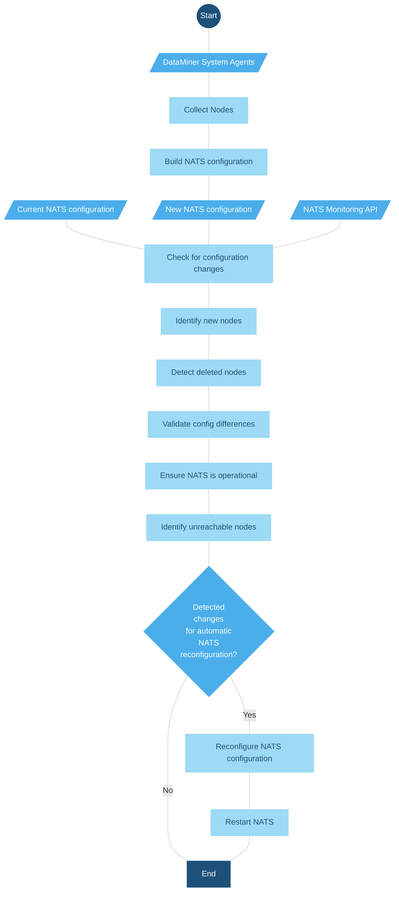
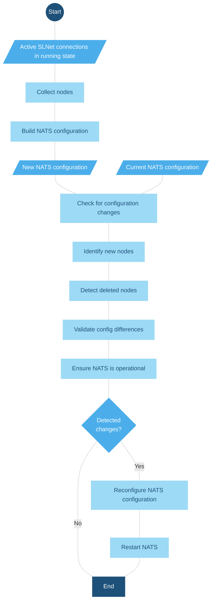

# NatsCustodian

NatsCustodian is a dedicated manager in SLNet designed to monitor and manage NATS configuration in real time. Performing checks every minute, NatsCustodian automates the process of identifying and addressing configuration anomalies. This ongoing monitoring is critical to maintain uninterrupted messaging, system stability, and performance in cluster environments where configuration changes are frequent. As such, NatsCustodian plays an essential role in ensuring the efficient operation of NATS server clusters.

This manager is removed from DataMiner starting from version 10.6.0 onwards, as the NATS management is fully migrated to BrokerGateway.<!-- RN 44035 -->

## NatsCustodian workflow starting from DataMiner 10.2.0 [CU18], 10.3.0 [CU6], and 10.3.9

NatsCustodian acquires the IP addresses of DataMiner Agents in the DataMiner System (i.e. the cluster). It then creates a NATS configuration using these addresses and cross-verifies this against the existing NATS setup. Additionally, the NATS Monitoring API, which provides various endpoints for assessing the NATS server's status, is employed to check the current status of NATS nodes. This functionality is particularly advantageous as the NATS server and its Monitoring API operate independently of the DataMiner server, thus enhancing cluster stability and reducing potential downtime.

The system incorporates several checks, including identification of new nodes, detection of deleted nodes, tracking of unreachable nodes, validation of configuration correctness, and ensuring the running status of the NATS process.

From DataMiner 10.2.0 [CU20]/10.3.0 [CU8]/10.3.11 onwards<!--RN 37271-->, when NatsCustodian detects that a NATS node has been added or deleted, that NATS is in an incorrect state, or that the NATS process is not running, an automatic NATS reconfiguration is initiated. Unreachable nodes do not generate any alarms or trigger a NATS reconfiguration. Instead, an entry is added to the *NATSCustodian.txt* log file for diagnostic purposes.

Prior to DataMiner 10.2.0 [CU20]/10.3.0 [CU8]/10.3.11, should NatsCustodian identify any inconsistency other than unreachable nodes, an automatic NATS reconfiguration is initiated.

## NatsCustodian workflow up to DataMiner 10.2.0 [CU18], 10.3.0 [CU6], and 10.3.9

NatsCustodian operates by gathering the IP addresses of DataMiner Agents that are active and connected to the local DataMiner Agent. Using these IPs, it dynamically assembles a NATS configuration for comparison with the currently active NATS setup. This involves several checks: identification of new nodes, detection of deleted nodes, validation of configuration correctness, and ensuring the NATS process is operational. If any irregularities are detected during these checks, NatsCustodian initiates a reconfiguration of NATS.

> [!NOTE]
> The functionality of this version of NatsCustodian is contingent upon the connection status of the DataMiner Agents within the cluster, which is maintained and verified by the SLNet process. See flowchart below for a more detailed explanation.

### Triggering NATS reconfiguration

See [NATS reset](xref:Investigating_Legacy_NATS_Issues#try-a-nats-reset).
