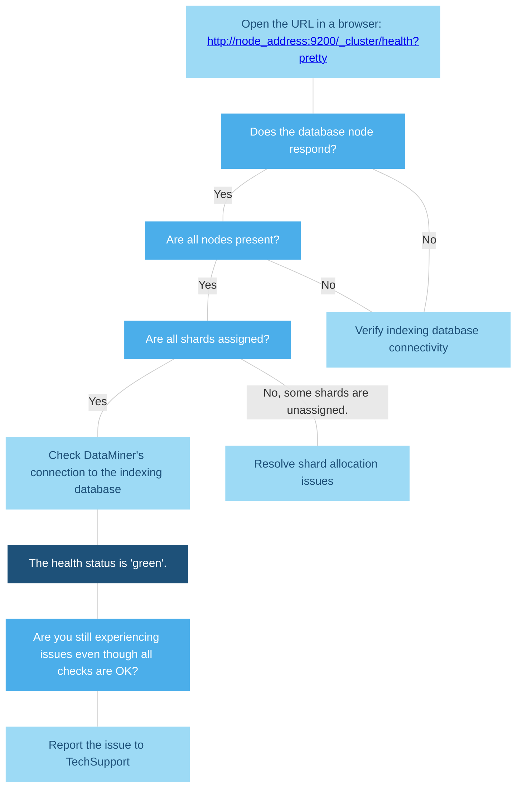

# Diagnostic procedures

When troubleshooting issues related to the indexing database, follow a structured diagnostic approach. This page provides procedures to verify the database's health, check connectivity, and resolve common problems such as shard allocation issues.

[If issues persist](#are-you-still-experiencing-issues) after completing these checks, contact TechSupport with the necessary information.

## Verify that the indexing database is running

The cluster health status can be checked using the following API call: `GET /_cluster/health`.

This query can be sent to the database node using a query tool or by accessing the following URL in a browser: `http://node_address:9200/_cluster/health?pretty`.

> [!NOTE]
> Use `https:` instead of `http:` if TLS is enabled.

An example output is shown below:

```json
{
    "cluster_name": "DMS",
    "status": "green",
    "timed_out": false,
    "number_of_nodes": 11,
    "number_of_data_nodes": 10,
    "discovered_master": true,
    "discovered_cluster_manager": true,
    "active_primary_shards": 649,
    "active_shards": 1728,
    "relocating_shards": 0,
    "initializing_shards": 0,
    "unassigned_shards": 0,
    "delayed_unassigned_shards": 0,
    "number_of_pending_tasks": 8,
    "number_of_in_flight_fetch": 0,
    "task_max_waiting_in_queue_millis": 0,
    "active_shards_percent_as_number": 100.0
}
```

The most important parameters in this message are:

- `status`: The expected status is `green`. `yellow` means the cluster is impacted but all data is still available through redundancy mechanisms. `red` means the cluster is impacted and some data cannot be retrieved.

- `number_of_nodes`: If you know how many nodes are normally in the cluster, this parameter allows checking if any nodes are offline.

- `unassigned_shards`: The expected value is 0. A count higher than 0 indicates that some data is partially unavailable.

If the health status is not retrieved, it means that the database node at the given address is not running.

Further steps:



## Check DataMiner's connection to the indexing database

### Watchdog reports

Watchdog reports are generated every hour and contain the most important Agent status parameters. The most recent report can be found in the following folder: `C:\Skyline DataMiner\logging\WatchDog\Reports\Pending Reports`. The reports are named using the following format `[timestamp]_Report_[extra_timestamps].xml`.

In the report, information on the indexing database status is logged within the `<Search>` element, as shown below:

`<Search timespan="188" unit="ms" state="active" version="2.18.0" type="elastic" health="GREEN">`

If the state and the health attributes are missing from the report, or if the `<Search>` tag is completely absent, this indicates that DataMiner is unable to connect to the indexing database.

### Log files

The dedicated log file for indexing database communication is located at: `C:\Skyline DataMiner\logging\SLSearch.txt`. Critical errors, such as failure to connect to the database, are logged with the tag `|ERR|`. See the example below:

```txt
2024/12/06 12:03:32.630|SLDBConnection|RawCommunication|ERR|0|113 URL: https://xxx:9200/xxx/search?typed keys=true
OpenSearch.Net.OpenSearchClientException: Failed sniffing cluster state.. Call: unknown resource ---> OpenSearch.Net.PipelineException: Failed sniffing cluster state. --->
OpenSearch.Net.PipelineException: An error occurred trying to read the response from the specified node. ---> System.Net.WebException: The underlying connection was closed:
Could not establish trust relationship for the SSL/TLS secure channel. ---> System.Security.Authentication.AuthenticationException: The remote certificate is invalid
according to the validation procedure.
    at System.Net.Security.SslState.StartSendAuthResetSignal (ProtocolToken message, AsyncProtocolRequest asyncRequest, Exception exception)
    at System.Net.Security.SslState.CheckCompletionBeforeNextReceive (ProtocolToken message, AsyncProtocolRequest asyncRequest)
```

The error message usually provides sufficient information to understand the cause of the connection failure. Common examples include:

- Incorrect credentials

- Mismatching communication protocol (e.g., HTTPS enabled on one side but not the other)

- Invalid TLS certificate

- Index in read-only mode (because of insufficient disk space)

- Network failure

> [!NOTE]
> Many of these common issues have root causes outside DataMiner and should be addressed by the network or database administrator.

## Resolve shard allocation issues

Database tables (indices) are divided into shards, which are distributed evenly across the cluster. If unallocated shards appear in the cluster stats, it indicates that some data is either unavailable or cannot be written to the cluster.

To view the current shard allocation state, use the following API call: `GET /_cluster/allocation/explain`. Alternatively, open the following URL `http(s)://node_address:9200/_cluster/allocation/explain?pretty`.

Shard allocation issues can occur for various reasons, including [offline nodes](#one-or-more-nodes-are-offline), [insufficient disk space](#insufficient-disk-space), or an [incompatible replication factor](#replication-factor-higher-than-the-number-of-nodes).

### One or more nodes are offline

The indexing cluster will try to reallocate shards to other nodes. If there are insufficient nodes left in the cluster, the [cluster health status](#verify-that-the-indexing-database-is-running) will change to one of the following:

- `yellow`: All primary shards are available, but some replica shards cannot be allocated. From the user’s perspective, all data remains available thanks to the replication mechanism.

- `red`: Some primary shards are unavailable, meaning at least part of the data is completely inaccessible.

To resolve: Recover the offline nodes.

### Insufficient disk space

When available disk space on a node falls below a certain threshold (see `cluster.routing.allocation.disk.watermark.flood_stage` setting), the Cluster Manager prevents writing to any index that has shards on the affected node. This causes the cluster health status to change to `red`.

To resolve this issue, increase disk space on the affected node or free up disk space by deleting indices. Once there is sufficient disk space, if necessary, send the following API call to disable read-only mode: `PUT /my_index/_settings { "index.blocks.read_only_allow_delete": null }`.

### Replication factor higher than the number of nodes

The default replication factor for new indices is 3 (1 primary shard + 2 replica shards). In a single-node cluster, there are no additional nodes to store replica shards, so the cluster health status will remain `yellow` unless the replication factor is adjusted for every index.

To resolve: Adjust the replication factor to match the cluster's node count.

## Verify indexing database connectivity

Maintaining the health of your indexing database network is vital for optimal performance and reliability. To achieve this, aim to keep latency below 50ms. If you suspect an issue with the indexing database, such as an alarm in DataMiner's Alarm Console indicating that the database is unavailable, follow the procedure below to identify the problem.

1. Check if the indexing database is available and listening on the expected port.

   > [!NOTE]
   > The default client port for OpenSearch/Elasticsearch is 9200. If a non-standard port is configured, use the respective port number for the connectivity check.

   - From a Windows server: Run the following PowerShell command: `tnc -p 9200 [node_address]`

   - From a Linux server: Run the following command in the terminal: `nmap -p 9200 [node_address]`

   If the test succeeds, the indexing database is listening on the specified port. Skip to step 4.

   If the test fails, there may be a communication or database issue. Proceed to step 2.

1. Use the `ping` command to test connectivity between the DMS server and the indexing database server.

   - If the ping fails: There is no network connectivity, or the database server is not running. Make sure the server is running and check the network configuration with the assistance of your IT team.

   - If the ping succeeds: Network connectivity is intact, but communication on the expected port may still be blocked. Proceed to step 3.

1. Work with your IT team to verify that the firewall on the indexing database server is not blocking communication on the required port (e.g., 9200 for OpenSearch/Elasticsearch).

   On Ubuntu-based systems:

   - Check whether the firewall status is active and review the configured rules: `sudo ufw status`.

   - Ensure the port is open (i.e., listed as `ALLOW`): `sudo ufw status | grep PORT_NUMBER`.

     > [!NOTE]
     > Red Hat-based operating systems use `firewalld` instead of `ufw`, managed with the `firewall-cmd` command.

   If rules are blocking traffic, update the firewall configuration to allow the required communication. You can use the following command to open a specified port for a particular IP address: `sudo ufw allow from SPECIFIC_IP to any port PORT_NUMBER`

   If the firewall is not blocking communication, proceed to the next step.

1. If SSL/TLS encryption is used for secure communication, verify that the SSL/TLS certificates are valid and trusted:

   - Via browser: Open the following URL: `https://node_address:9200/`.

     A warning will appear if the certificate of the database node is not valid.

   - In DataMiner logs: Invalid or untrusted certificates will cause errors such as: `System.Security.Authentication.AuthenticationException: The remote certificate is invalid according to the validation procedure`.

     These errors can be found in *SLSearch.txt* and *SLDBConnection.txt*.

   > [!TIP]
   > For more information about SSL/TLS certification, see:
   >
   > - [Securing the Elasticsearch database](xref:Security_Elasticsearch)
   > - [Securing the OpenSearch database](xref:Security_OpenSearch#tls-encryption)

## Are you still experiencing issues?

If you are still experiencing issues, please report them to <support@dataminer.services>.

When reporting an issue that may be related to the indexing database, include the following information:

- **A clear description of the issue**: Provide a detailed explanation of the problem, including its impact. If possible, attach screenshots to illustrate the issue.

- **A [Log Package](xref:Collecting_data_to_report_an_issue_to_TechSupport#log-collector-packages)**: Attach a memory dump of SLDataGateway from the affected DataMiner Agent.

- **Indexing database configuration and logs files** (Only for Linux systems):

  Provide the following files based on your indexing database type:

  - For OpenSearch:

    - Configuration file: `/etc/opensearch/opensearch.yml`

    - JVM options file: `/etc/opensearch/jvm.options`

    - Database log file: `/var/log/opensearch/[ClusterName].log`

    - Output of the command: `systemctl status opensearch.service`

  - For Elasticsearch:

    - Configuration file: `/etc/elasticsearch/elasticsearch.yml`

    - JVM options file: `/etc/elasticsearch/jvm.options`

    - Database log file: `/var/log/elasticsearch/[ClusterName].log`

    - Output of the command: `systemctl status elasticsearch.service`
