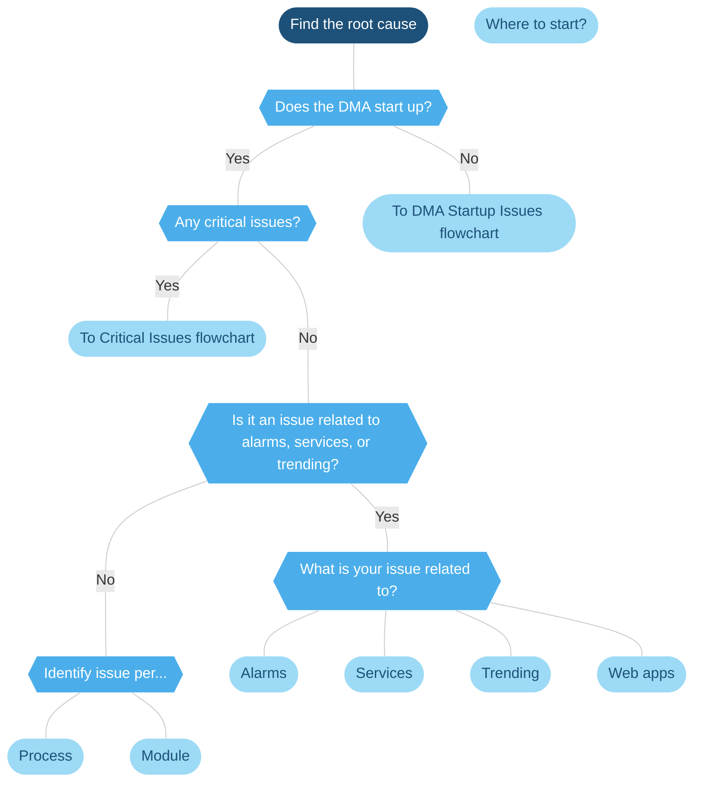

# Finding a root cause

## Examples of critical issues

| Critical issues | Why are these critical? |
|--|--|
| RTEs/Runtime Errors | RTEs may inhibit the flow of information in your DMS. |
| Process crashes | Process crashes may cause interaction of DataMiner internal processes to fail and cause a DataMiner restart. |
| Process disappearances | Process disappearances may cause interaction of DataMiner internal processes to fail and cause a DataMiner restart. |
