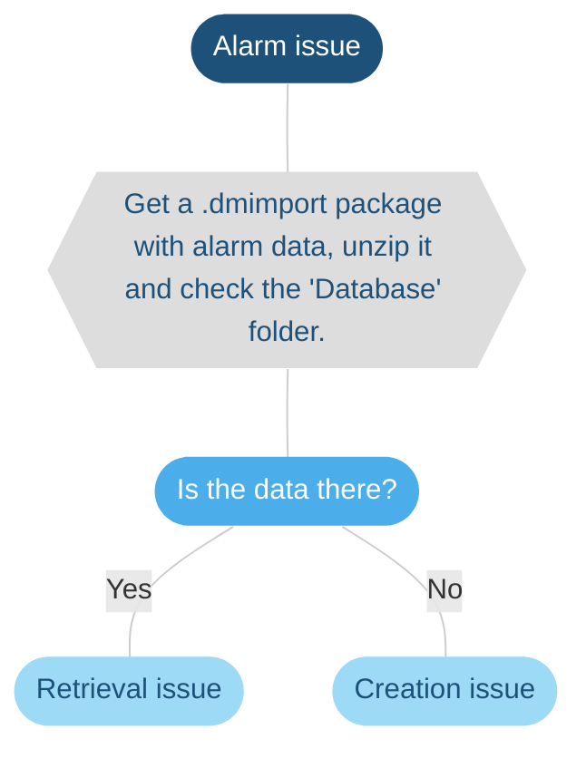
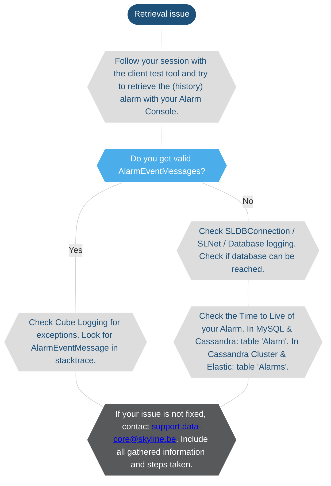
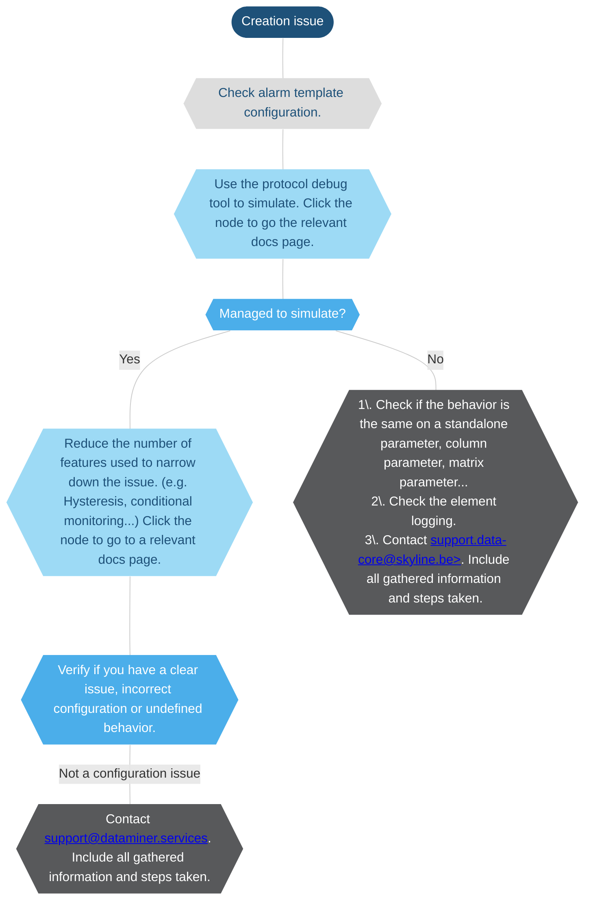

# Troubleshooting - alarms

> [!NOTE]
>
> - This page is currently still being developed. The content is not yet optimized and may not yet be fully accurate.
> - If you need more information on how to execute any of the steps below, feel free to reach out to [support.data-core@skyline.be](mailto:support.data-core@skyline.be).
> - You can leave feedback using the [*issues* feature](xref:CTB_Reporting_Issue), or [propose a change](xref:contributing).

## Alarms

### Overview

> [!NOTE]
>
> At any step of this flowchart:
>
> - your investigation may be complete.
> - you may need to check the log information in *SLErrors.txt*, *SLWatchDog2.txt*, *SLDBConnection.txt*, or the element logging.

### Retrieval Issue

> [!NOTE]
> To investigate an alarm retrieval issue, usually a LogCollector package is needed with memory dumps of SLDataGateway and SLNet.

### Creation Issue

> [!NOTE]
> To investigate an alarm creation issue, usually a LogCollector package is needed with memory dumps of SLProtocol, SLElement, and SLDataMiner.
