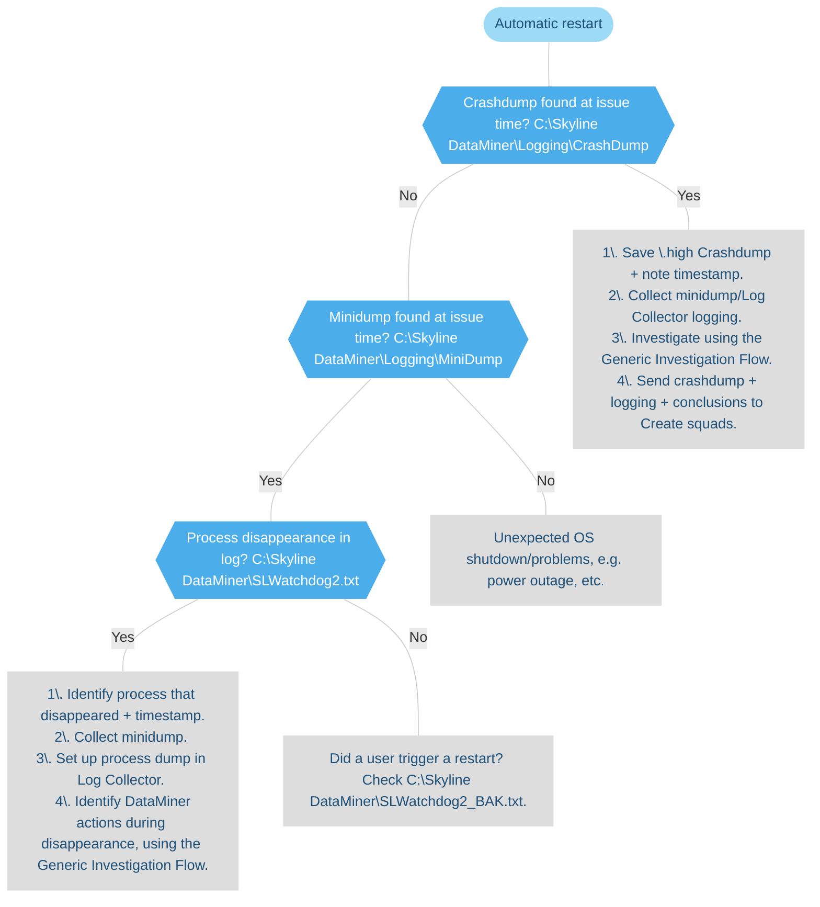

# Critical issues: automatic restart

## Automatic restart troubleshooting flowchart

```mermaid
flowchart TD
%% Define styles %%
linkStyle default stroke:#cccccc
classDef LightBlue fill:#9DDAF5,stroke:#000070,stroke-width:0px, color:#1E5179;
classDef Blue fill:#4BAEEA,stroke:#000070,stroke-width:0px, color:#FFFFFF;
classDef DarkBlue fill:#1E5179,stroke:#000070,stroke-width:0px, color:#FFFFFF;
classDef DarkGray fill:#58595B,stroke:#000070,stroke-width:0px, color:#FFFFFF;
classDef Gray fill:#999999,stroke:#000070,stroke-width:0px, color:#FFFFFF;
classDef LightGray fill:#DDDDDD,stroke:#000070,stroke-width:0px, color:#1E5179;
%% Define blocks %%
Start[Critical issue suspected]
Home([Start page])
SLLogCollector([Log collector usage guide])
Investigation([How to investigate])
DataNotUpdated([Data not updated])
ErrorAlarmConsole([Errors in Alarm Console])
Automaticrestart([Automatic restart])
MachineoutofResources([Insufficient resources])
%% Connect blocks %%
Start --- Automaticrestart
Start --- MachineoutofResources
Start --- DataNotUpdated
Start --- ErrorAlarmConsole
%% Define hyperlinks %%
click Home "/dataminer/Troubleshooting/Troubleshooting_Flowcharts/Finding_a_Root_Cause.html"
click SLLogCollector "/dataminer/Reference/DataMiner_Tools/SLLogCollector.html"
click Investigation "/dataminer/Troubleshooting/Troubleshooting_Flowcharts/Troubleshooting_Where_to_Start.html"
click DataNotUpdated "/dataminer/Troubleshooting/Troubleshooting_Flowcharts/Troubleshooting_Critical_Issues/Troubleshooting_Critical_Issues_Data_Not_Updated.html" "Data Not Updated"
click Automaticrestart "#automatic-restart" "Automatic Restart"
click ErrorAlarmConsole "/dataminer/Troubleshooting/Troubleshooting_Flowcharts/Troubleshooting_Critical_Issues/Troubleshooting_Critical_Issues_Alarm_Console.html" "Errors In Alarm Console"
click Start "/dataminer/Troubleshooting/Troubleshooting_Flowcharts/Troubleshooting_Critical_Issues/Troubleshooting_Critical_Issues_Overview.html" "Critical issue suspected"
click MachineoutofResources "/dataminer/Troubleshooting/Troubleshooting_Flowcharts/Troubleshooting_Critical_Issues/Troubleshooting_Critical_Issues_Resources.html" "Machine Out Of Resources"
%% Apply styles to blocks %%
class Start DarkBlue;
class Automaticrestart,DataNotUpdated,ErrorAlarmConsole,Automaticrestart,MachineoutofResources, LightBlue;
class UserActions,OSissues,ProcessCrash,ProcessDisappearance LightGray
class CrashdumpDetected,MinidumpDetected,CheckWatchdog Blue;
class Home,SLLogCollector,Investigation LightBlue;
```

## Automatic restart

```mermaid
flowchart TD
%% Define styles %%
%% Define styles %%
linkStyle default stroke:#cccccc
classDef LightBlue fill:#9DDAF5,stroke:#000070,stroke-width:0px, color:#1E5179;
classDef Blue fill:#4BAEEA,stroke:#000070,stroke-width:0px, color:#FFFFFF;
classDef DarkBlue fill:#1E5179,stroke:#000070,stroke-width:0px, color:#FFFFFF;
classDef DarkGray fill:#58595B,stroke:#000070,stroke-width:0px, color:#FFFFFF;
classDef Gray fill:#999999,stroke:#000070,stroke-width:0px, color:#FFFFFF;
classDef LightGray fill:#DDDDDD,stroke:#000070,stroke-width:0px, color:#1E5179;
%% Define blocks %%
Automaticrestart([Automatic restart])
CrashdumpDetected{{"Crashdump found at issue time? C:\Skyline DataMiner\Logging\CrashDump"}}
MinidumpDetected{{"Minidump found at issue time? C:\Skyline DataMiner\Logging\MiniDump"}}
CheckWatchdog{{"Process disappearance in log? C:\Skyline DataMiner\SLWatchdog2.txt"}}
UserActions["Did a user trigger a restart? Check C:\Skyline DataMiner\SLWatchdog2_BAK.txt. "]
OSissues["Unexpected OS shutdown/problems, e.g. power outage, etc."]
ProcessCrash["1\. Save \.high Crashdump + note timestamp. <br/>2\. Collect minidump/Log Collector logging. <br/>3\. Investigate using the Generic Investigation Flow. <br/>4\. Send crashdump + logging + conclusions to Create squads. "]
ProcessDisappearance["1\. Identify process that disappeared + timestamp.<br/>2\. Collect minidump. <br/>3\. Set up process dump in Log Collector. <br/> 4\. Identify DataMiner actions during disappearance, using the Generic Investigation Flow."]
%% Connect blocks %%
Automaticrestart --- CrashdumpDetected
CrashdumpDetected --- |Yes| ProcessCrash
CrashdumpDetected --- |No| MinidumpDetected
MinidumpDetected --- |Yes| CheckWatchdog
MinidumpDetected --- |No| OSissues
CheckWatchdog ---|Yes| ProcessDisappearance
CheckWatchdog ---|No| UserActions
%% Define hyperlinks %%
%% Apply styles to blocks %%
class Start DarkBlue;
class Automaticrestart,DataNotUpdated,ErrorAlarmConsole,Automaticrestart,MachineoutofResources, LightBlue;
class UserActions,OSissues,ProcessCrash,ProcessDisappearance LightGray
class CrashdumpDetected,MinidumpDetected,CheckWatchdog Blue;
class Home,SLLogCollector,Investigation LightBlue;
```
