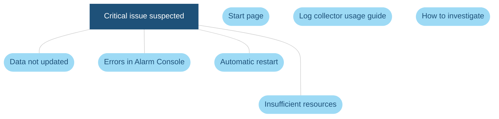

# Critical issues: overview

```mermaid
flowchart TD
%% Define styles %%
linkStyle default stroke:#cccccc
classDef LightBlue fill:#9DDAF5,stroke:#000070,stroke-width:0px, color:#1E5179;
classDef Blue fill:#4BAEEA,stroke:#000070,stroke-width:0px, color:#FFFFFF;
classDef DarkBlue fill:#1E5179,stroke:#000070,stroke-width:0px, color:#FFFFFF;
classDef DarkGray fill:#58595B,stroke:#000070,stroke-width:0px, color:#FFFFFF;
classDef Gray fill:#999999,stroke:#000070,stroke-width:0px, color:#FFFFFF;
classDef LightGray fill:#DDDDDD,stroke:#000070,stroke-width:0px, color:#1E5179;
%% Define blocks %%
Start[Critical issue suspected]
Home([Start page])
SLLogCollector([Log collector usage guide])
Investigation([How to investigate])
DataNotUpdated([Data not updated])
ErrorAlarmConsole([Errors in Alarm Console])
Automaticrestart([Automatic restart])
MachineoutofResources([Insufficient resources])
%% Connect blocks %%
Start ---- MachineoutofResources
Start --- Automaticrestart
Start --- DataNotUpdated
Start --- ErrorAlarmConsole
%% Define hyperlinks %%
click Home "/dataminer/Troubleshooting/Troubleshooting_Flowcharts/Finding_a_Root_Cause.html"
click SLLogCollector "/dataminer/Reference/DataMiner_Tools/SLLogCollector.html"
click Investigation "/dataminer/Troubleshooting/Troubleshooting_Flowcharts/Troubleshooting_Where_to_Start.html"
click DataNotUpdated "/dataminer/Troubleshooting/Troubleshooting_Flowcharts/Troubleshooting_Critical_Issues/Troubleshooting_Critical_Issues_Data_Not_Updated.html" "Data Not Updated"
click Automaticrestart "/dataminer/Troubleshooting/Troubleshooting_Flowcharts/Troubleshooting_Critical_Issues/Troubleshooting_Critical_Issues_Automatic_Restart.html" "Automatic Restart"
click ErrorAlarmConsole "/dataminer/Troubleshooting/Troubleshooting_Flowcharts/Troubleshooting_Critical_Issues/Troubleshooting_Critical_Issues_Alarm_Console.html" "Errors In Alarm Console"
click MachineoutofResources "/dataminer/Troubleshooting/Troubleshooting_Flowcharts/Troubleshooting_Critical_Issues/Troubleshooting_Critical_Issues_Resources.html" "Machine Out Of Resources"
%% Apply styles to blocks %%
class Start DarkBlue;
class CheckWatchdog classDecision;
class Automaticrestart,MachineoutofResources,DataNotUpdated,ErrorAlarmConsole, LightBlue;
class Home,SLLogCollector,Investigation LightBlue;
```
