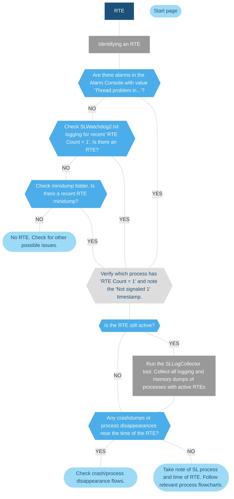

# Alarm Console - runtime errors (RTEs)

## About runtime errors

RTEs occur when a DataMiner process thread does not respond for 15 minutes. Half-open RTEs occur after 7.5 minutes.

These are notable exceptions to the 15-minute window:

- SLDataMiner DataMinerNotificationQueueThread: 45 minutes

- MySQL DatabaseOffloadThread: 30 minutes

- MySQL DBCleaningThread: 1 hour

When an RTE occurs, an alarm is generated in the Alarm Console, the RTE is logged in *SLWatchDog2.txt*, and all DataMiner log files are captured in a minidump.

### Identifying runtime errors

- RTEs are displayed with severity "Error" in the Alarm Console.

- RTEs have the value "Thread problem in x: y” in the Alarm Console, where x is the process, and y is the thread.

- You can identify RTEs by opening *SLWatchDog2.txt* (in `C:\Skyline DataMiner\Logging` or in minidumps) and searching for “RTE Count = 1” (spaces included).

- Minidumps are named based on the RTE timestamp and DataMiner process that encountered an RTE.

### Additional resources

- [Watchdog logging and runtime error examples](xref:Watchdog_logging)

- [Common "Thread problem in x" errors](xref:Thread_problem_in_x)

- [Investigating a protocol thread RTE](xref:Investigating_a_protocol_thread_RTE)

## Run-time error flowchart

