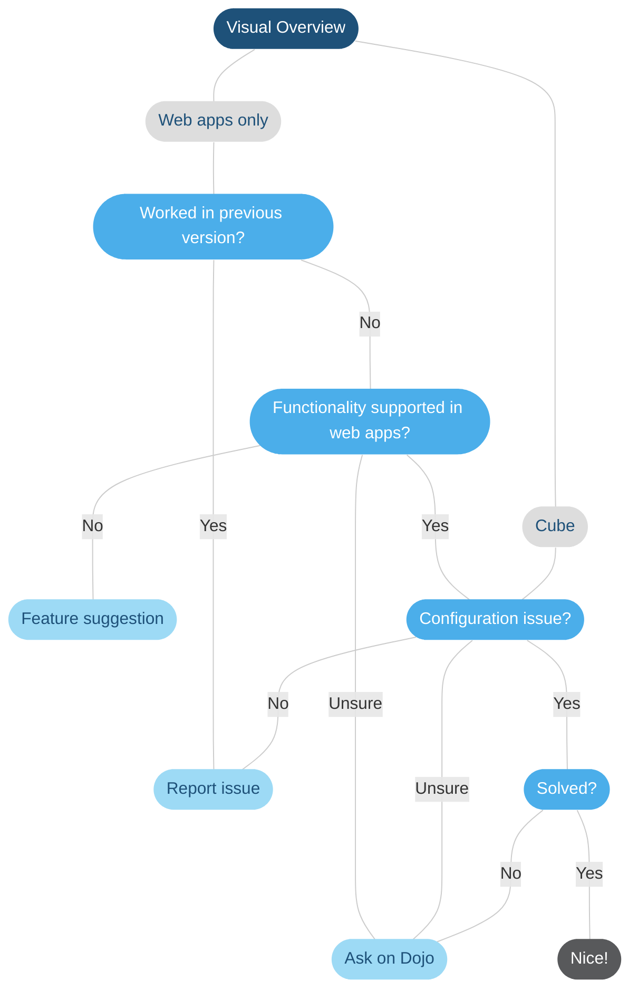

# Troubleshooting: Visual Overview

## Overview

| Flow item | Description |
|--|--|
| Cube | Issues you have encountered in DataMiner Cube or the web apps that also occur in DataMiner Cube. |
| Web apps only | Issues that **only** occur in DataMiner web apps. |
| Configuration issue? | Verify if your configuration is correct. Try to isolate the problem by changing placeholders to static values, removing added complexity like shape grouping, etc. For more tips, refer to the [Visual Overview Learning Course](https://community.dataminer.services/courses/visio/) or [DataMiner Dojo Questions](https://community.dataminer.services/questions/). |
| Functionality supported in web apps? | For more information on which Visual Overview capabilities are supported in web apps, see [Unsupported capabilities](xref:DashboardVisualOverview#unsupported-capabilities). |
| Feature suggestion | Visual Overview is still fully supported, but limited innovations are introduced for this functionality at the moment. However, [posting a feature suggestion or upvoting an existing one](https://community.dataminer.services/feature-suggestions) can still be useful to indicate your wishes as a user and possibly shift the priorities of the DataMiner development team. |
