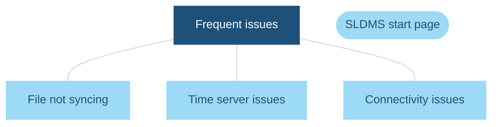
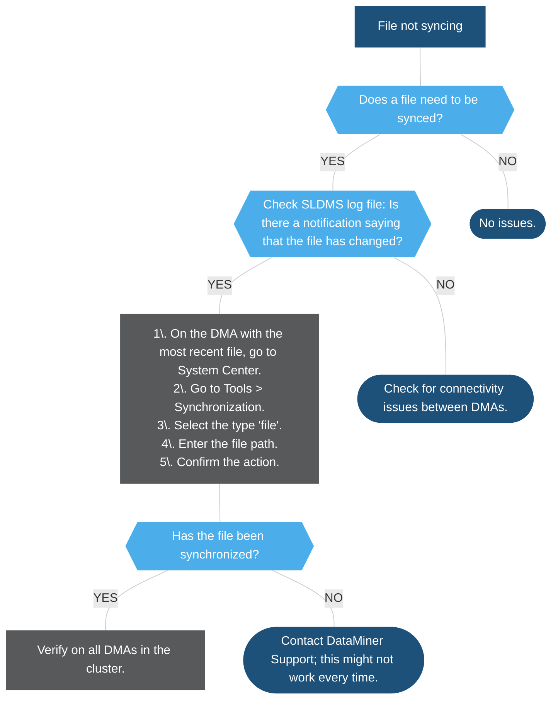
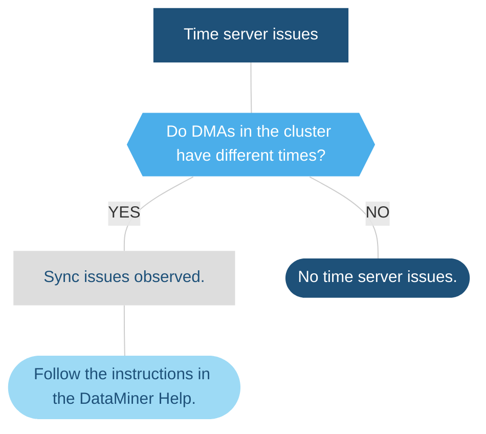
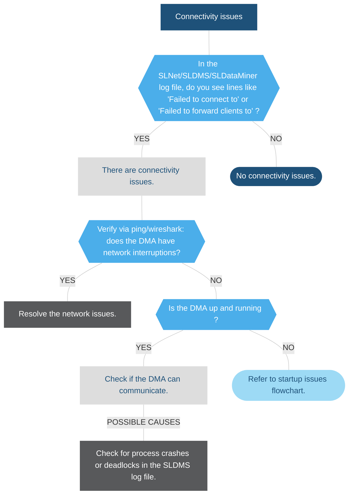

# SLDMS - frequent issues

## Option 1: file not syncing

> [!TIP]
> For more information on syncing files, see [Overview of the files found in the root folder](xref:Overview_of_the_files_found_in_the_root_folder).

## Option 2: time server issues

## Option 3: connectivity issues

## Connectivity issues

In the flowchart, "Connectivity issues" refers to DMAs not being able to contact each other. SLDMS itself does not contact other DMAs; all inter-machine traffic goes through SLNet.

These issues could lead to other complications such as files not syncing or elements (and their alarms) that are missing in the Surveyor.

## Checking for time server issues

While there is no easy way to check this, one possible approach is to compare log files.

When you compare log files, you could for instance see that when files are synced, a server appears to get notifications from the future. This indicates that DMAs in the cluster are not set to the same time or time zone.
