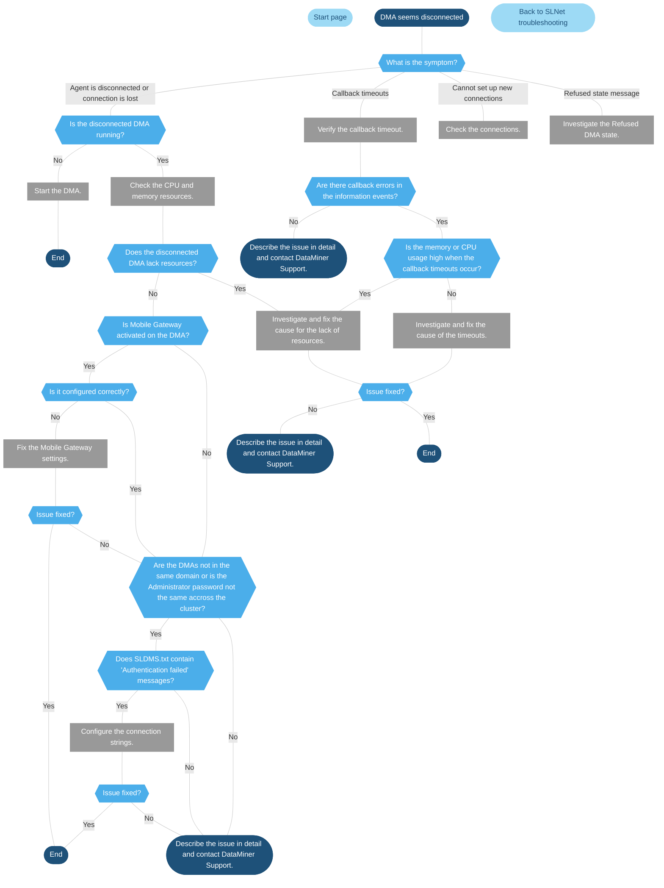

# SLNet - disconnects

> [!NOTE]
> This page is currently still being developed. The content is not yet optimized and may not yet be fully accurate.

## CPU and memory resources

Check the total processor load of the DMA in the Windows Task Manager and/or in the Microsoft Platform element monitoring the DMA. If there is a sudden increase and if it keeps running high, verify if a specific process is consuming most of the CPU load. Note that this could be any process, other than SLNet itself.

When a DMA in a cluster has a high CPU load, it can occur that the DMA appears to be disconnected from its peers. This is because the SLNet calls will be processed more slowly than expected.

For the same reason, also do this check for the total memory usage and the total available memory of the DMA. A low amount of free memory indicates that the DMA is struggling to cope with incoming requests.

Most of the time, such spikes in the CPU load and memory usage are just temporary. If you wait a while, usually a couple of minutes, they should return to their baseline values. If this does not happen, further investigation is needed.

## Callback timeouts

### About callback timeouts

When a client connects to a DataMiner Agent via eventing, and it takes longer than a particular number of seconds (by default 30) to send a packet of events to that client over the callback connection, the server can throw out the client.

In that case, a "callback timeout (waited 30 s)" type error is generated. This mechanism also applies to connections between DataMiner Agents.

Possible reasons for such callback timeouts could be:

- An unreachable destination (e.g., client was stopped or firewall intervened).

- The packet of forwarded data is too large.

### How to verify a callback timeout error

Check the information events to see if users are getting disconnected.

- Look in the information events around the time when the issue was reported to have occurred.

- Look for the message "callback timeout(waited 30 s)". This may be accompanied by users getting disconnected.

### How to debug a callback timeout error

- Verify if the server was lacking free virtual memory around the time the issue occurred. Do the errors clear when the virtual memory or physical memory increases? Then the issue is caused by lack of resources.

- Are there any network communication issues between the DMAs? Check in Windows Event Viewer or check for communication errors in SLDMS. If there are communication issues between DMAs, fix them.

- If you cannot link the issue to a lack of resources or a network communication issue, enable [debugging of callback timeouts](xref:SLNetClientTest_tool_diagnostic_procedures). This will result in the creation of a dump file the next time a callback timeout is generated.

- Increasing the callback timeout is also an option, because some packets might take longer than the default 30s.

## Cannot set up new connections

> [!NOTE]
> Incomplete: This section requires more information.

- Use `netstat -noq` in command prompt to see how many TCP ports are occupied and by which processes.

- Use `telnet 8004` to verify if the connection is possible (if telnet is installed). The same can be done with putty.

- If no more connections can be done:

## Refused state message

The "Refused" state is a protection mechanism to prevent connections between faulty DMAs and a non-faulty DMA. This can happen when:

- A DMA has had too many connections in the last hours as defined in the MaxAgentConnectsPerHour setting.

- A DMA is dropping events because the threshold in the QueuedStackOverflow is exceeded.

When a DMA enters the "Refused" state, other DMAs will refuse connections with it for a period of time (by default 10 minutes). The cause of the refusal is only displayed on the faulty DMA.

The SLNetClientTest tool allows you to view and adjust the mentioned thresholds, and clear the Refused state in case the underlying issue has been resolved. For more information, refer to [Checking or modifying the settings related to a Refused DMA state](xref:SLNetClientTest_tool_diagnostic_procedures).
