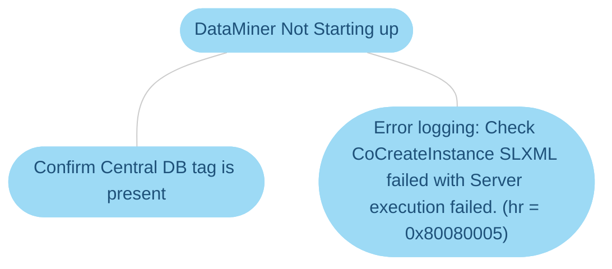
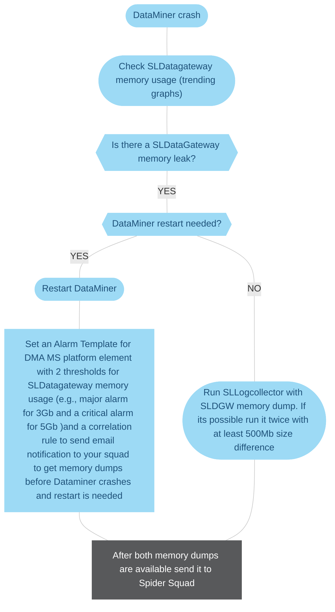
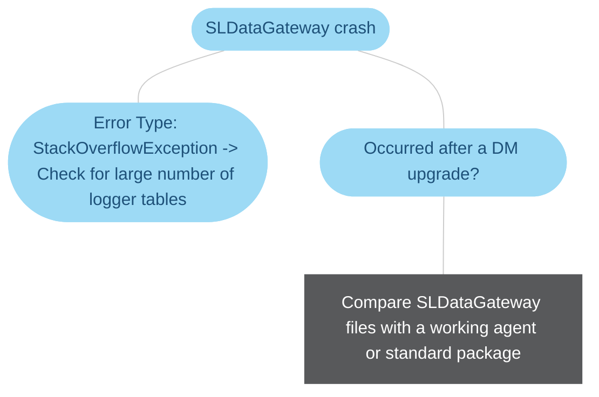

# SLDataGateway.exe

> [!NOTE]
> This page is currently still being developed. The content is not yet optimized and may not yet be fully accurate.

This process calculates the average trending information. If a Cassandra database is installed, this process also handles the following:

- All communication with Cassandra (communication with legacy databases happens via SLElement).

- The building of time traces, used for heat maps.

- Transfer of data to the SLAnalytics process.

```mermaid
flowchart TD
%% -------------------------------------------------------------------------
%% Cassandra flowchart - Nodetool Status
%% -------------------------------------------------------------------------
%% -------------------------------------------------------------------------
%% Define styles
%% -------------------------------------------------------------------------
linkStyle default stroke:#cccccc
classDef classAction fill:#dddddd,stroke:#dddddd,color:#1E5179,stroke-width:1px;
classDef classActionClickable fill:#999999,stroke:#999999,color:#ffffff,stroke-width:1px;
classDef classDecision fill:#4baeea,stroke:#4baeea,color:#ffffff,stroke-width:1px;
classDef classExternalRef fill:#9ddaf5,stroke:#9ddaf5,color:#1E5179,stroke-width:1px;
classDef classSolution fill:#58595b,stroke:#58595b,color:#ffffff,stroke-width:1px;
classDef classTerminal fill:#1e5179,stroke:#1e5179,color:#ffffff,stroke-width:1px;
%% -------------------------------------------------------------------------
%% flowchart structure
%% -------------------------------------------------------------------------
HOME([Start page]):::classExternalRef
START([SLDataGateway]):::classTerminal
Action_HighMemory([High Memory Consumption]):::classExternalRef
Action_DataMinerNotStarting([DataMiner Not Starting up]):::classExternalRef
Action_DataMinerCrash([DataMiner crash]):::classExternalRef
Action_SLDataGatewayCrash([SLDataGateway crash]):::classExternalRef
Action_HighCPUUtilization([High CPU Utilization]):::classExternalRef
    START --- Action_HighMemory
    START --- Action_DataMinerNotStarting
    START --- Action_DataMinerCrash
    START --- Action_SLDataGatewayCrash
    START --- Action_HighCPUUtilization
%% -------------------------------------------------------------------------
%% all blocks terminating at a common End?
%% -------------------------------------------------------------------------
%% -------------------------------------------------------------------------
%% Define hyperlinks %%
%% -------------------------------------------------------------------------
click HOME "/dataminer/Troubleshooting/Troubleshooting_Flowcharts/Finding_a_Root_Cause.html"
click Action_HighMemory "#option-1-high-memory-consumption"
click Action_DataMinerNotStarting "#option-2-dataminer-not-starting-up"
click Action_DataMinerCrash "#option-3-dataminer-crash"
click Action_SLDataGatewayCrash "#option-4-sldatagateway-crash"
%% -------------------------------------------------------------------------
%% Apply styles to blocks
%% -------------------------------------------------------------------------
```

### Option 1: high memory consumption

```mermaid
flowchart TD
%% -------------------------------------------------------------------------
%% Cassandra flowchart - Nodetool Status
%% -------------------------------------------------------------------------
%% -------------------------------------------------------------------------
%% Define styles
%% -------------------------------------------------------------------------
linkStyle default stroke:#cccccc
classDef classAction fill:#dddddd,stroke:#dddddd,color:#1E5179,stroke-width:1px;
classDef classActionClickable fill:#999999,stroke:#999999,color:#ffffff,stroke-width:1px;
classDef classDecision fill:#4baeea,stroke:#4baeea,color:#ffffff,stroke-width:1px;
classDef classExternalRef fill:#9ddaf5,stroke:#9ddaf5,color:#1E5179,stroke-width:1px;
classDef classSolution fill:#58595b,stroke:#58595b,color:#ffffff,stroke-width:1px;
classDef classTerminal fill:#1e5179,stroke:#1e5179,color:#ffffff,stroke-width:1px;
%% -------------------------------------------------------------------------
%% flowchart structure
%% -------------------------------------------------------------------------
Action_HighMemory([High Memory Consumption]):::classExternalRef
Action_OffloadFolder([Check if Offload folder contains files]):::classExternalRef
Action_ElementsBigAlarms([Check for elements using big alarm templates or trend templates]):::classExternalRef
Action_AlarmCondition[Lookup for Alarm condition]:::classSolution
Action_CheckAVGtrending([Check Avg trending on DVE elements while Central Database is enabled]):::classExternalRef
Action_TimetraceTable(["Confirm TimeTrace table creation/modification"]):::classExternalRef
Action_AlarmTemplates(["Check for Alarm templates with smart baselines (enabled) (from QandA)"]):::classExternalRef
    Action_HighMemory --- Action_OffloadFolder
    Action_HighMemory --- Action_ElementsBigAlarms --- Action_AlarmCondition
    Action_HighMemory --- Action_CheckAVGtrending
    Action_HighMemory --- Action_TimetraceTable
    Action_HighMemory --- Action_AlarmTemplates
%% -------------------------------------------------------------------------
%% all blocks terminating at a common End?
%% -------------------------------------------------------------------------
%% -------------------------------------------------------------------------
%% Define hyperlinks %%
%% -------------------------------------------------------------------------
click HOME "/dataminer/Troubleshooting/Troubleshooting_Flowcharts/Finding_a_Root_Cause.html"
%% -------------------------------------------------------------------------
```

### Option 2: DataMiner not starting up

### Option 3: DataMiner crash

### Option 4: SLDataGateway crash

