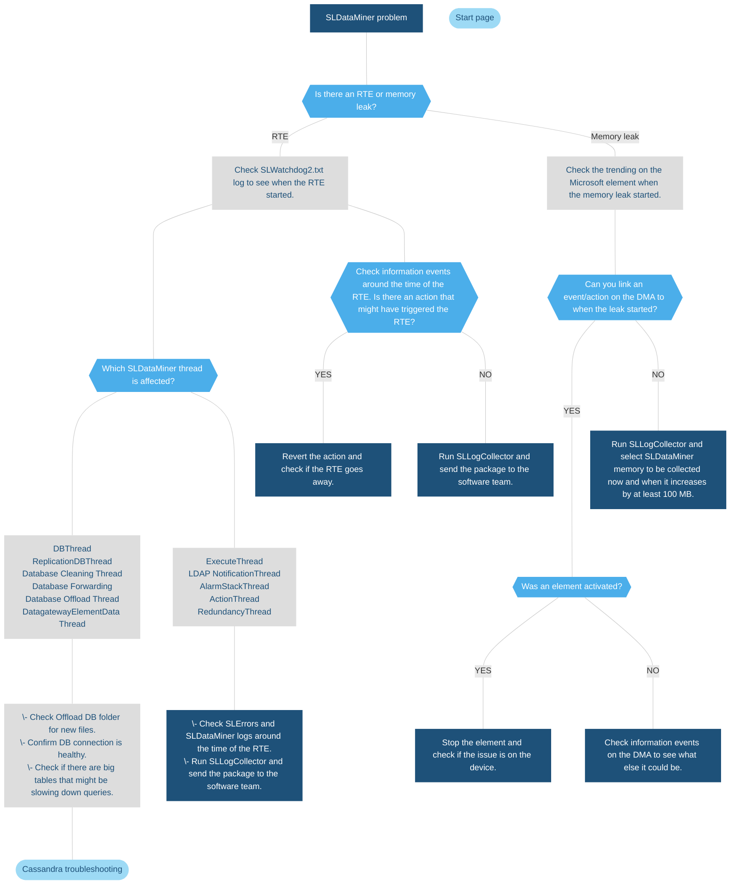

# SLDataMiner.exe

## About SLDataMiner

SLDataMiner is the central process of a DataMiner Agent. It handles the starting and stopping of elements, services and redundancy groups, and handles the processes that communicate data from and to those items.

SLDataMiner is also responsible for the offloading of data, if an offload database is available.

## SLDataMiner troubleshooting flowchart

> [!NOTE]
>
> - SLDataMiner is the main process of a DMA. Any issues in this process will therefore explicitly affect the user interface, element communication, and general functionality of the system.
> - The SLDataMiner process is a 32-bit process so it does have a 4GB memory usage limit. It will crash if it reaches that limit.
> - If the file *OffloadData.SQLite3* starts to grow in the folder `C:\Skyline DataMiner\Offload\`, this generally points to an issue with the database connection, and a restart of SLDataMiner is required to begin offloading this file to the database.
