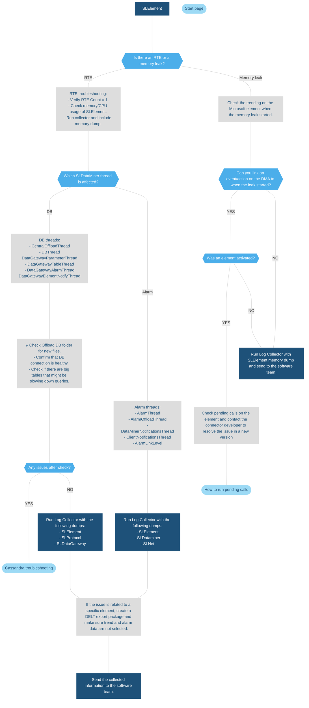

# SLElement.exe

## About SLElement

SLElement keeps track of parameter values that have to be shown to the user and also creates alarms.

This process is only aware of parameters that are being monitored and parameters that have to be displayed in the user interface.

## SLElement troubleshooting flowchart

> [!NOTE]
>
> - SLElement can consume quite a bit of memory if there are a lot of elements or if a lot of data is being monitored. As long as memory usage is stable, this is not a cause for concern.
> - SLElement also handles displayed parameters. However, not all errors related to parameters are strictly due to SLElement. Issues such as missing parameters, unavailable parameters, wrong units, or incorrect values can often be attributed to the connectors where the parameters originate. SLElement simply ensures that parameters are displayed, but it is not the source of the values.
