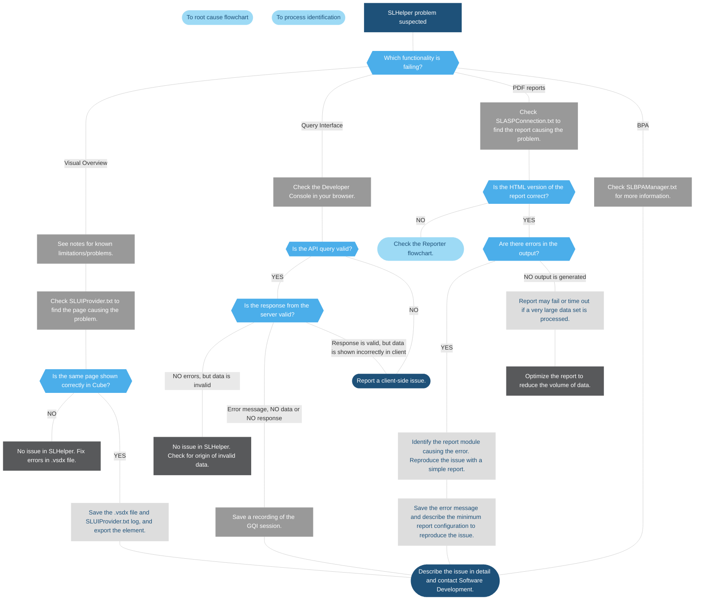

# SLHelper.exe

## About SLHelper

### Functions of SLHelper

These are the main functions of *SLHelper.exe*:

- Rendering Visual Overview pages for the Monitoring and Dashboards apps (see [Troubleshooting – web](xref:Investigating_Web_Issues)).

- Prior to DataMiner web 10.4.0 [CU20]/10.5.0 [CU8]/10.5.11, converting documents to PDF in the Reports, Dashboards, and Jobs apps (see [Troubleshooting – web](xref:Investigating_Web_Issues)).

- Executing queries for Dashboards via the Generic Query Interface (GQI) (see [Troubleshooting – web](xref:Investigating_Web_Issues)).

- Running Best Practice Analyzer (BPA) tests.

### General information

Unlike other DataMiner processes, SLHelper is not running constantly. An instance of the process is created when a certain task requires SLHelper. A separate instance is created for each type of the task, e.g. for rendering a Visual Overview page and running a GQI query. When all tasks are completed, the process is terminated after an inactivity timeout.

SLHelper is often updated in new DataMiner builds. Before you report an issue to software development teams, check if the issue is present in the latest DataMiner release.

### Typical problems

- High memory usage. This should be expected if large Visual Overview pages, queries, or reports are processed.

- Memory leaks are possible if Visual Overview pages are constantly used.

- Timeouts are possible when large queries, reports or Visual Overview pages are processed.

### Logging

The process does not have a dedicated log file. However, since SLHelper is started by SLNet, logging can be found in *SLHelperWrapper.txt*. Depending on your use case, you can check the following additional log files:

- *SLUIProvider.txt*: Check this log file to check for Visual Overview issues. Search for "Log:" and "visio" for relevant information.

- *SLASPConnection.txt*: Check this log file for issues with DataMiner reports.

- *SLBPAManager.txt*: Check this log file for BPA-related issues.

- *SLHelperCrash.txt*: Check this log file for information on crashes.

For the GQI, there is no dedicated log file, but you can find error information in API responses using the Developer Console of a browser (see [Investigating web issues](xref:Investigating_Web_Issues)).

> [!NOTE]
> To enable logging of information required for an investigation, make sure you set the log level to "Log Everything (5) ". For more information, see [DataMiner logging](xref:DataMiner_logging).

## SLHelper troubleshooting flowchart

