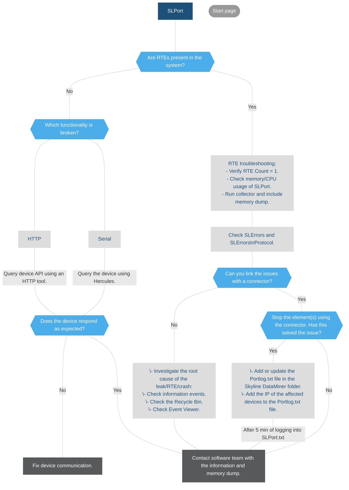

# SLPort.exe

## About SLPort

SLPort controls all communication from and to devices connected to either a serial or an IP port.

**Communication types**: HTTP, Web Socket, serial, smart-serial, GPIB, SSH and OPC.

## SLPort troubleshooting flowchart

> [!NOTE]
>
> - Multiple SLPort processes can run simultaneously. This can be configured in *DataMiner.xml*. (See [Setting the number of simultaneously running SLPort processes](xref:Configuration_of_DataMiner_processes#setting-the-number-of-simultaneously-running-slprotocol-processes) in the DataMiner Help).
> - Ensure that the device is **communicating as expected** and that all fields match the **expected data types and structure**.
