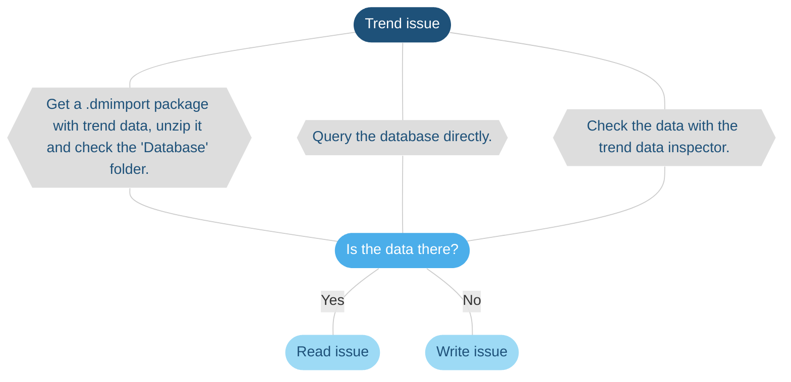
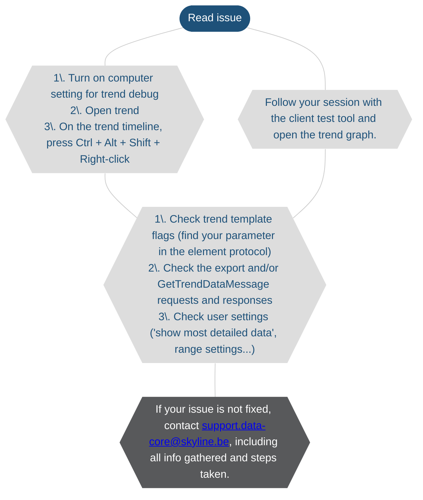
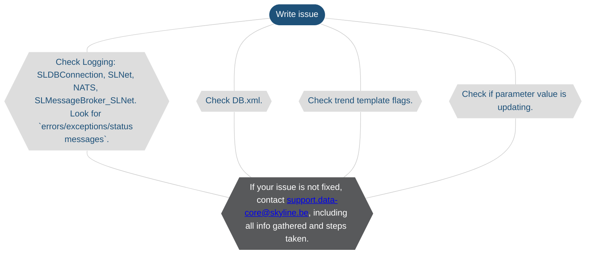

# Troubleshooting - trending

> [!NOTE]
>
> - This page is currently still being developed. The content is not yet optimized and may not yet be fully accurate.
> - If you need more information on how to execute any of the steps below, feel free to reach out to [support.data-core@skyline.be](mailto:support.data-core@skyline.be).
> - You can leave feedback using the [*issues* feature](xref:CTB_Reporting_Issue), or [propose a change](xref:contributing).

## Trending

### Overview

### Read Issue

> [!NOTE]
>
> - For more information on trend logging, see [Debug settings](xref:Computer_settings#debug-settings).
> - For more information on following a Cube session via the SLNetClientTest tool, see [Tracking DMA communication](xref:SLNetClientTest_tracking_dma_communication). Tracking the requests and responses should be sufficient.

### Write Issue

> [!NOTE]
> If the Windows setting "fast startup" is activated on the DataMiner server, trend graphs for the server will not show a gap when it is turned off. We recommend disabling this option to make sure trending is displayed correctly.
