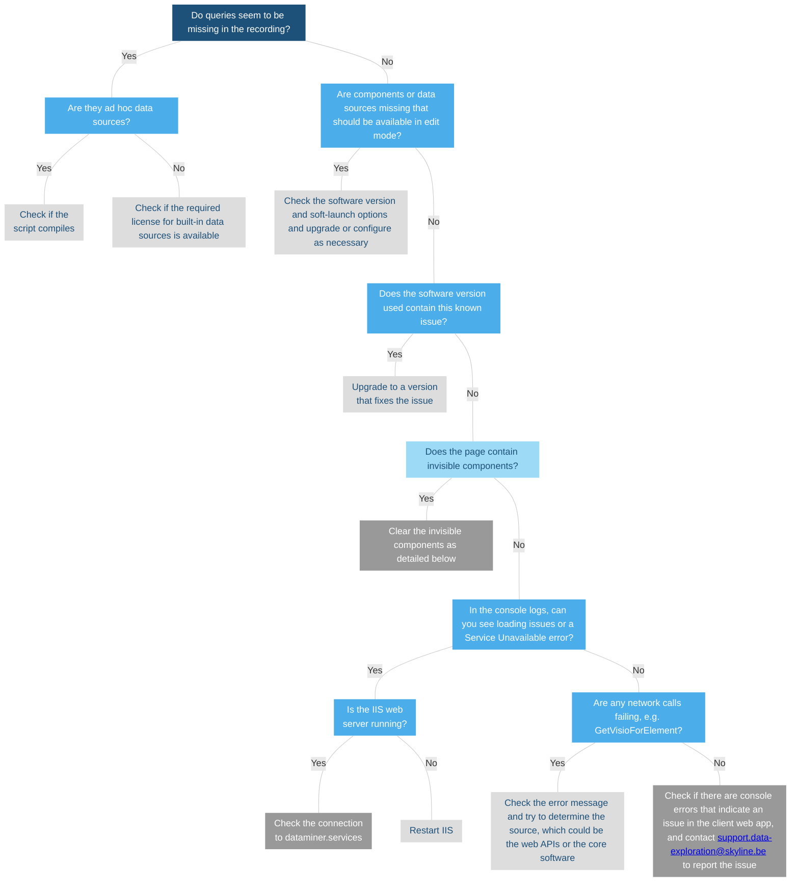

# Troubleshooting - web apps

When troubleshooting an issue in the DataMiner web apps, you should always [create a recording using the Web Support Assistant](xref:Web_Issues_Support_Assistant).

Once this has been done, you can then troubleshoot the issue as detailed below.

> [!TIP]
> For more troubleshooting information for DataMiner web apps, refer to [Troubleshooting - web](xref:Investigating_Web_Issues).

## Dealing with invisible components

In some cases, it can occur that a page in a low-code app or a dashboard contains components that are not shown but that do influence the page or dashboard, causing unexpected behavior.

To check if this is the case, do the following in the dashboard or on every page and panel of the low-code app:

1. Press Ctrl + A and then press Delete.

1. Count the components mentioned in the dialog to see if they match the shown components, and then click **Cancel**.

   If the count matches up, the page, panel, or dashboard does not contain invisible components.

1. If the count does not match up, clear the selection of the components you can see by clicking them while keeping Ctrl pressed, and then press Delete again to remove the invisible component.
