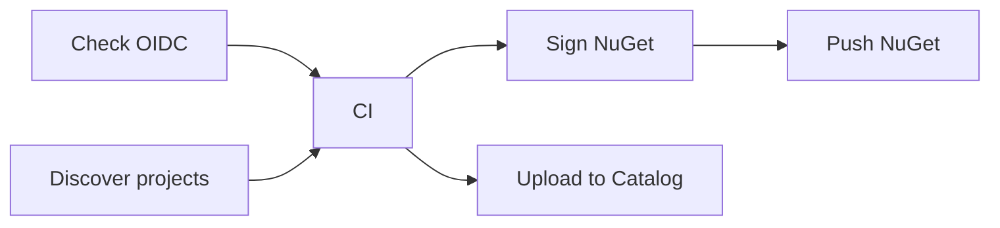

# Master Workflow

The Master Workflow is a unified, centralized CI/CD pipeline for .NET solutions. It provides an end-to-end quality gate with first-class support for both NuGet packages and DataMiner SDK packages (.dmapp/.dmtest). The workflow dynamically adapts its behavior based on the project types discovered in your repository.

> [!NOTE]
> The following wrapper workflows delegate to the Master Workflow internally and are still available for backward compatibility:
>
> - [DataMiner App Packages Master Workflow](xref:github_reusable_workflows_dataminer_app_packages_master_workflow)
> - [NuGet Solution Master Workflow](xref:github_reusable_workflows_nuget_solution_master_workflow)
>
> For new repositories, we recommend calling the Master Workflow directly.

## Prerequisites

- Part of our quality control involves static code analysis through [SonarCloud](https://www.sonarsource.com/products/sonarcloud/) as a mandatory step. You will need a **SonarCloud organization** linked to your GitHub organization as described in the [SonarCloud help files](https://docs.sonarsource.com/sonarcloud/getting-started/github/).

- Creating a GitHub release or tag will attempt to register your item as a private item in the Catalog. For this, the repository must have access to a *DATAMINER_TOKEN* stored as a GitHub secret. For more information, see [GitHub secrets and tokens](xref:GitHub_Secrets).

## Development and release cycles

This workflow can run for both development and release cycles:

- **Development cycle**: Any run triggered from a change to a branch. Only quality control actions (build, test, analysis) are performed. Artifacts are uploaded to the GitHub workflow run but not published externally. The version is automatically set to `0.0.<run_number>`.

- **Release cycle**: Any run triggered from adding a tag with format `A.B.C`, `A.B.C.D`, `A.B.C-text`, or `A.B.C.D-text`. During a release cycle, artifacts are created and published (NuGet packages to a registry, DataMiner packages to the Catalog). A pre-release version can be created by using a tag with a suffix (e.g., `1.0.1-alpha`).

## How to use

From within your own workflow .yml files, you can call the Master Workflow by adding a job that references its location on GitHub:

```yml
jobs:

  CI:
    uses: SkylineCommunications/_ReusableWorkflows/.github/workflows/Master Workflow.yml@main
```

For most reusable workflows, several arguments and secrets need to be provided. You can find out which arguments and secrets by opening the reusable workflow and looking at the "inputs:" and "secrets:" sections located at the top of the file.

For more information on secrets, see [GitHub secrets and tokens](xref:GitHub_Secrets).

For example:

```yml
name: Master Workflow

on:
  push:
    branches:
      - '**'
    tags:
      - "[0-9]+.[0-9]+.[0-9]+.[0-9]+"
      - "[0-9]+.[0-9]+.[0-9]+.[0-9]+-**"
      - "[0-9]+.[0-9]+.[0-9]+"
      - "[0-9]+.[0-9]+.[0-9]+-**"

  workflow_dispatch:

jobs:

  CI:
    uses: SkylineCommunications/_ReusableWorkflows/.github/workflows/Master Workflow.yml@main
    with:
      sonarcloud-project-name: ${{ vars.SONAR_NAME }}
      # configuration: Release
      # solution-filter-name: "MySpecificSolution.slnx"
      # override-catalog-identifiers: |
      #   PackageA.Install/CatalogInformation/manifest.yml=11111111-1111-1111-1111-111111111111
    secrets:
      SONAR_TOKEN: ${{ secrets.SONAR_TOKEN }}
      DATAMINER_TOKEN: ${{ secrets.DATAMINER_TOKEN }}
      # NUGET_API_KEY: ${{ secrets.NUGET_API_KEY }}
```

## Inputs

| Input | Required | Type | Default | Description |
|---|---|---|---|---|
| `sonarcloud-project-name` | Yes | string | | The SonarCloud project identifier. Create a project at <https://sonarcloud.io/projects/create> and use the ID from the project URL. |
| `configuration` | No | string | `Release` | The build configuration (e.g., `Release` or `Debug`). |
| `solution-filter-name` | No | string | | A filter to find a specific solution file (`.sln` or `.slnx`). If not provided, the workflow auto-discovers the solution. |
| `runs-on` | No | string | `ubuntu-latest` | The runner environment for the CI job. |
| `debug` | No | boolean | `false` | Enables debug output for the DataMiner SDK. |
| `override-catalog-identifiers` | No | string | | One or more lines mapping a manifest path to a Catalog identifier. See [Catalog identifier override](#catalog-identifier-override). |
| `nuget-push-source` | No | string | | The NuGet push destination URL. Defaults to the GitHub Packages registry of the repository owner. To push to nuget.org, use `https://api.nuget.org/v3/index.json`. |
| `oidc-client-id` | No | string | | Azure OIDC client ID. Only needed for organizations other than SkylineCommunications. |
| `oidc-tenant-id` | No | string | | Azure OIDC tenant ID. Only needed for organizations other than SkylineCommunications. |
| `oidc-subscription-id` | No | string | | Azure OIDC subscription ID. Only needed for organizations other than SkylineCommunications. |

### Catalog identifier override

Use the `override-catalog-identifiers` input to map one or more manifest files to specific Catalog identifiers. Each line should follow the format `<relative path to manifest.yml>=<catalog identifier GUID>`.

For example:

```text
PackageA.Install/CatalogInformation/manifest.yml=11111111-1111-1111-1111-111111111111
PackageB.Install/CatalogInformation/manifest.yml=22222222-2222-2222-2222-222222222222
```

## Secrets

| Secret | Required | Description |
|---|---|---|
| `SONAR_TOKEN` | No | The API key for SonarCloud access. For repositories in the *SkylineCommunications* organization, the secret is retrieved via OIDC. For repositories outside of the *SkylineCommunications* organization, create a repository secret. See [GitHub secrets and tokens](xref:GitHub_Secrets). |
| `DATAMINER_TOKEN` | No | The API key generated in the [dataminer.services Admin app](https://admin.dataminer.services/). Required when publishing to the Catalog on a release tag. |
| `AZURE_TOKEN` | No | An Azure token. Only needed in specific scenarios outside the *SkylineCommunications* organization. |
| `OVERRIDE_CATALOG_DOWNLOAD_TOKEN` | No | Overrides the `DATAMINER_TOKEN` specifically for downloading Catalog items during the build. |
| `NUGET_API_KEY` | No | The API key for pushing NuGet packages to the configured `nuget-push-source`. If not provided and OIDC is available, the workflow uses the OIDC token. |

## Jobs

The workflow consists of six jobs that run sequentially:



### Check OIDC

This job resolves Azure OIDC credentials. For the *SkylineCommunications* organization, default credentials are used automatically. For other organizations, you can provide the `oidc-client-id`, `oidc-tenant-id`, and `oidc-subscription-id` inputs. If no OIDC credentials are available, OIDC-dependent features (code signing, Azure Key Vault secret retrieval) are skipped.

### Discover project types

This job checks out the repository and determines which types of projects are present:

- Finds the `.sln` or `.slnx` solution file (filtered by `solution-filter-name` if provided).
- Detects DataMiner SDK projects by scanning `.csproj` files for the `DataMinerType` property.

### CI

This is the main quality gate job. Runs the build, tests, and static code analysis. See [CI job details](#ci-job-details) below.

### Sign NuGet packages

This job only runs during a release cycle (tag) and when NuGet packages were produced by the CI job. Signs `.nupkg` files using `dotnet sign` with Azure Key Vault credentials. If signing credentials are not available, the unsigned packages are passed through.

> [!NOTE]
> This job is skipped for Dependabot pull requests.

### Push NuGet packages

This job only runs during a release cycle (tag). It pushes the signed NuGet packages to the configured destination:

- **Default**: The [GitHub Packages registry](https://github.com/features/packages) of the repository owner.
- **Custom**: The URL specified in the `nuget-push-source` input (e.g., `https://api.nuget.org/v3/index.json` for nuget.org).

### Upload to Catalog

This job only runs during a release cycle (tag) and when DataMiner packages (`.dmapp`/`.dmtest`) were produced by the CI job. It includes the following actions:

1. Signing the DataMiner packages using Azure Key Vault credentials.
1. Generating an SBOM (Software Bill of Materials) for each package.
1. Extracting release notes from the GitHub release (if available) or falling back to the commit message.
1. Publishing the packages to the [DataMiner Catalog](https://catalog.dataminer.services/).

## CI job details

### Azure and secrets setup

If OIDC is available, the job logs in to Azure and retrieves secrets from Azure Key Vault. Repository-level secrets (provided via the workflow `secrets`) override Key Vault values when both are present.

For the *SkylineCommunications* organization, the job also configures private NuGet registries (Azure).

### Validation

Before proceeding with the build, the workflow validates several things:

- Whether the SonarCloud project name corresponds to an existing project.
- Whether `SONAR_TOKEN` is available when SonarCloud analysis is required.
- Whether `DATAMINER_TOKEN` is available when a release tag triggers the workflow and DataMiner packages need to be published.

### Build

The job compiles the Visual Studio solution after restoring all NuGet packages. The version is determined as follows:

- **Release cycle** (tag): The version is taken directly from the tag.
- **Development cycle** (branch): The version is set to `0.0.<run_number>`.

### Unit tests

The job searches for test projects in the solution and runs all unit tests found. The workflow supports two test runner modes:

- **VSTest** (default): The standard `dotnet test` runner with XPlat Code Coverage (cobertura and opencover formats).
- **Microsoft Testing Platform (MTP)**: Enabled when `global.json` contains `"test": { "runner": "Microsoft.Testing.Platform" }`. Uses built-in coverage and TRX reporting.

#### Test project discovery

Test projects are discovered automatically based on naming conventions. Be aware of the following rules:

- A project is **only included** if its path contains the word **tests** (case-insensitive). For example, `MyLibrary.Tests.csproj` and `MyLibraryUnitTests.csproj` are included, but `MyLibrary.Validation.csproj` is silently skipped.
- Projects containing **integrationtests** or **integration.tests** in their path are **excluded entirely**.
- Additionally, individual tests with `TestCategory` set to `IntegrationTest` or `IntegrationTests` are filtered out at runtime.

> [!IMPORTANT]
> If your test projects do not follow the naming convention above (i.e., they do not contain "tests" in their name), the workflow will not discover them, and your tests will not run. Rename your test projects accordingly, for example, `MyLibrary.Tests`, `MyFeatureTests`, or `MyLibrary.UnitTests`.

### Static code analysis

The job performs static code analysis using [SonarCloud](https://www.sonarsource.com/products/sonarcloud/). This checks for common errors and bugs in C# code, tracks code coverage, and enforces clean code guidelines. The results are evaluated against the SonarCloud quality gate.

> [!NOTE]
> SonarCloud analysis is skipped for Dependabot pull requests.

### Quality gate

The job combines the results of all previous steps into a single pass/fail result. The workflow fails if:

- Any unit test failed.
- The SonarCloud quality gate reported a failure (except for Dependabot PRs, where analysis is skipped).

### Artifact detection and upload

After a successful quality gate, the workflow detects and uploads any created artifacts:

- **NuGet packages** (`.nupkg`): Uploaded as a workflow artifact named *NugetPackages*.
- **DataMiner packages** (`.dmapp`/`.dmtest`): An SBOM is generated for each package, and they are uploaded as a workflow artifact.
