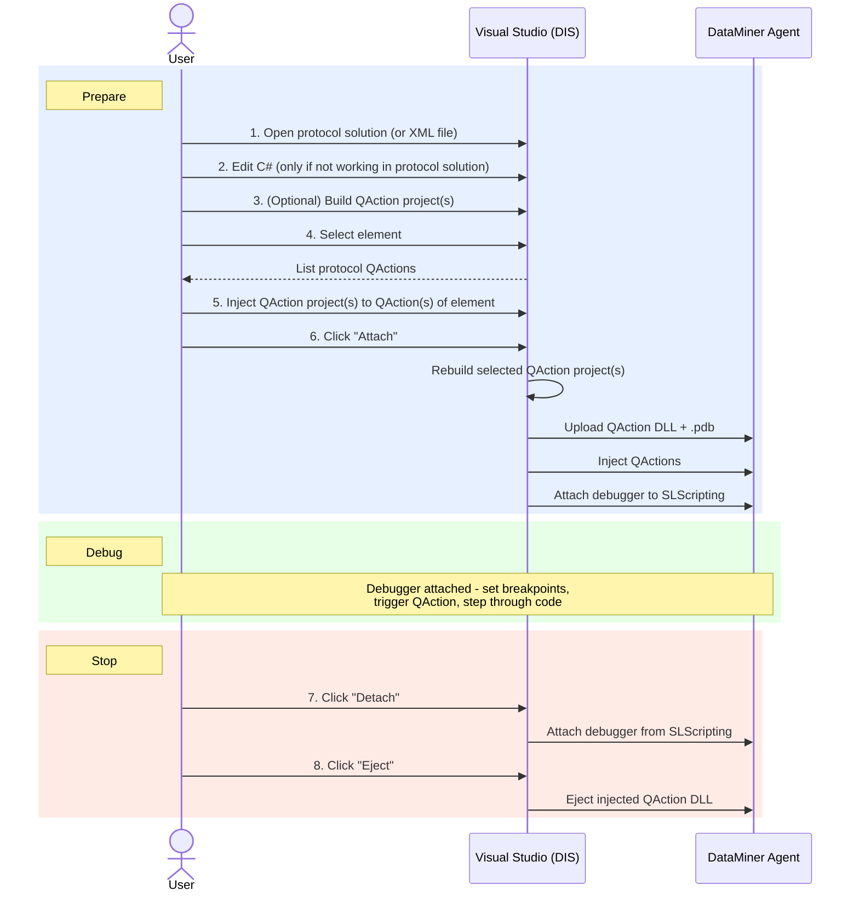

# Concept of debugging QActions and automation scripts

DataMiner Integration Studio allows you to debug connector QActions and automation script C# Exe blocks using the Microsoft Visual Studio Debugger.

> [!NOTE]
> You can only debug connector QActions that contain C# code.

## Graphical representation of the QAction debugging concept

Below, you can find a graphical representation of the way QActions are debugged. Automation scripts are debugged in a similar way.

The numbers in the drawing refer to the phases described in the table below.

## The QAction debugging process

| 
Phase
 | Description |
| --- | --- |
| 1. Open the protocol | You open the protocol solution (preferred) or protocol XML file. |
| 2. Edit the QAction | (Only applicable if you opened a protocol XML file instead of a protocol solution) In the protocol XML file, you locate the QAction(s) you want to debug, and click the *Edit C#* button in front of the QAction tag. Result: Temporary C# project(s) will be created. |
| 3. Build the QAction project | (Optional, a rebuild of the selected QActions is triggered when attaching) You build the C# projects. No errors should occur. |
| 4. Select an element | In the *DIS Inject* tool window, you select an element that uses the protocol you are currently debugging. Result: All QActions in the protocol of that element are listed in the *DIS Inject* window. |
| 5. Inject the *QAction.dll* | In the *DIS Inject* tool window, you link the QAction project to the corresponding QAction of the element (using the green + icon). |
| 6. Attach Debugger to SLScripting | In the *DIS Inject* tool window, you click *Attach* to attach the Microsoft Visual Studio Debugger to the DataMiner SLScripting process(es). Result: This will trigger a rebuild of the selected QAction projects, upload the resulting DLL and pdb file to the agent, inject these and finally attach the debugger to the SLScripting process. As soon as the Debugger is attached to the SLScripting process, you can set breakpoints, trigger the QAction manually (or set a parameter or wait for a timer to go off), step through your code, etc. |
| 7. Detach Debugger from SLScripting | In the *DIS Inject* tool window, you click *Detach* to detach the Microsoft Visual Studio Debugger from the DataMiner SLScripting process(es). |
| 8. Eject QAction(s) | In the *DIS Inject* tool window, you detach the injected QAction project(s) (using the red cross icon). This will now ensure the regular QAction is executed again instead of the injected one. |

For step-by-step instructions on how to debug QActions and automation scripts, see [Debugging connectors and automation scripts](xref:Debugging_connectors_and_Automation_scripts).
