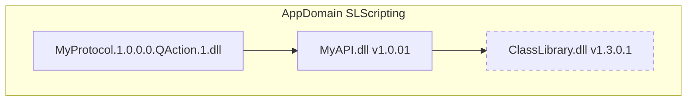

# Compilation-time assembly binding

In DataMiner, compilation of C# code is executed as follows:

- **Protocol C# QActions**: Right before the first execution of the QAction.

  If the [precompile](xref:Protocol.QActions.QAction-options#precompile) option is used, the QAction is compiled as soon as you create an element that uses this protocol for the first time.

- **Automation script C# exe blocks**: When an Automation script is uploaded or its library script changes.

To compile, the compiler only requires the directly referenced assemblies. The compiler does not know about transitive dependencies for that assembly.

To better understand this, imagine the following example: Suppose you have a custom solution (*MyAPI*) using the Class Library, and you are using that custom solution in a QAction of a protocol. In order to be able to compile the protocol, the compiler will need a reference to the assembly of the custom solution (*MyAPI.dll*). It does not require a reference to the *ClassLibrary.dll* assembly as this is a transitive reference. However, if you were to use types from the ClassLibrary assembly in QAction1, then you would also need to provide a reference to ClassLibrary. Otherwise, the compilation would fail.

In a protocol XML, you can add an assembly reference via the [dllImport](xref:Protocol.QActions.QAction-dllImport) attributes. In an Automation script XML, you can add a reference via the [Param type="ref"](xref:DMSScript.Script.Exe.Param-type) tag.

Note that in solution-based development you do not add these. Instead, you add references to the .csproj file, which are then converted by DIS to entries in the `dllImport` attribute or [Param type="ref"](xref:DMSScript.Script.Exe.Param-type) tags.

Also note that some assembly references are added by default. For more information, refer to the documentation of the [dllImport](xref:Protocol.QActions.QAction-dllImport) attribute (for protocol QActions) or to [Adding C# code to a script in Cube](xref:Adding_CSharp_code_to_an_Automation_script#adding-c-code-to-a-script-in-cube) for Automation script C# exe blocks.

> [!IMPORTANT]
> Although a reference might not be needed at compilation time, the assembly is needed at runtime. For more information, refer to [Runtime assembly binding](xref:Run_Time_Assembly_Binding).

The [assembly manifest](https://learn.microsoft.com/en-us/dotnet/standard/assembly/manifest) of the compiled assembly will contain information about the immediate referenced assemblies, where each reference includes, among other things, the name and version of the referenced assembly.
