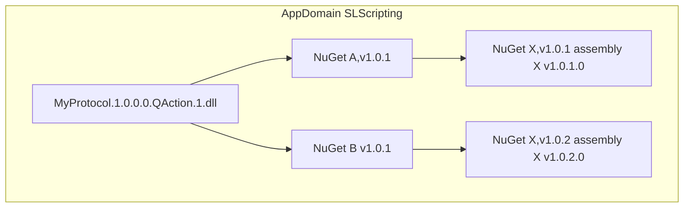
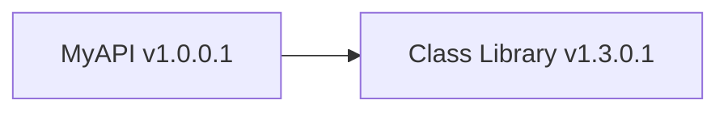
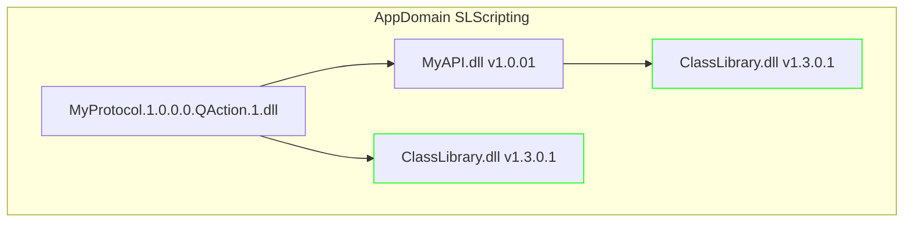
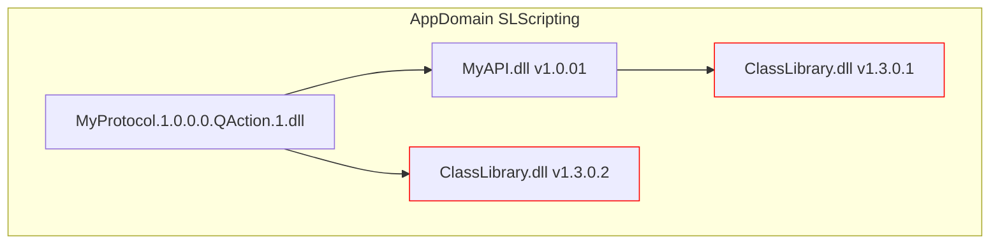

# Run-time assembly binding

At runtime, assemblies are loaded the moment they are needed by the executing code. When the Just-In-Time (JIT) compiler compiles the intermediate language (IL) into native code, it sees which types are referenced. The JIT compiler will then determine the assemblies that define these types, and these will be loaded.

The .NET Framework follows specific steps while trying to locate an assembly at runtime. For more information about the internals of assembly loading in the .NET Framework, see [How the Runtime Locates Assemblies](https://learn.microsoft.com/en-us/dotnet/framework/deployment/how-the-runtime-locates-assemblies). Custom paths to be searched for while locating an assembly can be specified via the [AssemblyResolve](https://learn.microsoft.com/en-us/dotnet/api/system.appdomain.assemblyresolve?view=netframework-4.8) event. This event is triggered on an AppDomain level and the event provides information about the assembly that the runtime is trying to resolve. This event is triggered when the runtime could not find the assembly in any of the previous steps the runtime executes during assembly resolving.

In the SLScripting process of DataMiner, this event is implemented in such a way that it will search in the `C:\Skyline DataMiner\ProtocolScripts\DllImport`, `C:\Skyline DataMiner\Files`, and `C:\Skyline DataMiner\ProtocolScripts` folders and also in any of the folders denoted by the [dllImport](xref:Protocol.QActions.QAction-dllImport) attribute of a QAction.

The folders will be searched in the following order:

1. `C:\Skyline DataMiner\ProtocolScripts\DllImport`

1. `C:\Skyline DataMiner\Files`

1. `C:\Skyline DataMiner\ProtocolScripts`

1. A subfolder of `C:\Skyline DataMiner\ProtocolScripts\DllImport` corresponding with the folders mentioned in the `dllImport` attribute

   Example: In case `dllImport` contains `newtonsoft.json\13.0.3\lib\net45\Newtonsoft.Json.dll`, the `C:\Skyline DataMiner\ProtocolScripts\DllImport\newtonsoft.json\13.0.3\lib\net45` folder is added as a hint path.

1. A subfolder of `C:\Skyline DataMiner\ProtocolScripts` corresponding with the folders mentioned in the `dllImport` attribute

   Example: In case `dllImport` contains `newtonsoft.json\13.0.3\lib\net45\Newtonsoft.Json.dll`, the `C:\Skyline DataMiner\ProtocolScripts\newtonsoft.json\13.0.3\lib\net45` folder is added as a hint path.

In case the `dllImport` mentions multiple entries, a hint path entry is added for each entry if it has not yet been added to the hint path list.

Note that because by default there is a single SLScripting process, the hint path list will contain all distinct directories of all the values encountered in the `dllImport` attribute of each QAction in all the protocols.

For Automation scripts (which get executed by the SLAutomation process), the following folders will be searched:

1. `C:\Skyline DataMiner\ProtocolScripts\DllImport`

1. `C:\Skyline DataMiner\Files`

1. `C:\Skyline DataMiner\ProtocolScripts`

1. The directory of an assembly mentioned in the [Param type="ref"](xref:DMSScript.Script.Exe.Param-type) tags of the Automation scripts.

As mentioned under [Compilation-time assembly binding](xref:Compilation_Time_Assembly_Binding), the manifest of a compiled assembly denotes the name and version of any assemblies it has a direct dependency on. At runtime, when the .NET runtime is about to execute code from such a referenced assembly, the runtime will try to find and load that assembly.

## Multiple versions of the same assembly

When developing, you can run into a situation where you reference different versions of the same assembly. For example, suppose you use NuGet A which depends on NuGet X version 1.0.1 (which contains assembly X version 1.0.1.0). Now suppose you also use another NuGet B which also references NuGet X but version 1.0.2 (which contains assembly X with version 1.0.2.0). Now when you compile the program in e.g. Visual Studio, the `bin` folder will only contain one version of NuGet X (e.g. assembly X with version 1.0.2.0). The runtime, on the other hand, will search for the specific version that is mentioned in the assembly manifest, so at some point it could look for version 1.0.1.0 (because assembly A that executes was compiled against that version), which it will not be able to find as only the 1.0.2.0 version is present in the `bin` folder.



For strong-named assemblies, this problem is typically alleviated by making use of [BindingRedirect](https://learn.microsoft.com/en-us/dotnet/framework/configure-apps/file-schema/runtime/bindingredirect-element) elements in the [configuration file](https://learn.microsoft.com/en-us/dotnet/framework/configure-apps/). A binding redirect could then for example state that assembly X version 1.0.1.0 should be redirected to version 1.0.2.0. For non-strong-named assemblies, the version is disregarded when the assembly is located next to the executable.

In DataMiner, the binding redirect approach is not feasible, as by default there is only one SLScripting process and therefore a binding redirect that would be needed for a specific connector could have an impact on another connector. Also, for non-strong-named assemblies, the referenced assemblies are typically not stored in the same folder as the SLScripting executable (which is located in the `C:\Skyline DataMiner\Files` folder), and the QAction assemblies and their references are stored in the `C:\Skyline DataMiner\ProtocolScripts` folder (or one of its subfolders).

Because of this, no unification is performed. Instead of providing a single version, all used versions of the required assemblies are provided. This has the downside that it could lead to versioning issues (see also [Best Practices for Assembly Loading](https://learn.microsoft.com/en-us/dotnet/framework/deployment/best-practices-for-assembly-loading#avoid_loading_multiple_versions)). To avoid issues at runtime, you should therefore make sure to follow the following rule:

**In scenarios where all of the following is applicable, make sure that the version of package "B" you installed is the same version as the version of package "B" that package "A" depends on:**

- You installed a NuGet package "A" that has a dependency on another NuGet package "B".
- You also installed NuGet package "B".
- NuGet package "A" exposes types from NuGet package "B".
- You use types from package "B" through package "A" (e.g. calling a method defined in package "A" that has as argument a type from package "B", or using a method from package "A" that returns a type of package "B").

If you do not follow this rule, you can experience runtime issues as explained in more detail below.

## Example

Suppose you are creating a NuGet package that contains an API (*MyApi*) that can be used in a protocol. Also, suppose your API NuGet uses the Class Library NuGet package version 1.3.0.1. In other words, the API has a dependency on version 1.3.0.1 of the Class Library:



The assembly manifest of the compiled assembly *MyAPI* will therefore contain an entry denoting the Class Library v1.3.0.1 reference.

Let us also assume that the API defines the following method in a public class named *Example*:

```csharp
public void Install(IDms dms);
```

Now the *Install* method has an argument of type *IDms*, which is defined in the Class Library package version 1.3.0.1. In other words, the API exposes a type used from the Class Library v1.3.0.1.

When this API is used from a protocol QAction that uses Class Library NuGet version 1.3.0.1, everything will work fine. I.e. the created *dms* object is of type ClassLibrary v1.3.0.1, which is the type that is expected by the *Install* method of the API.

```csharp
IDms dms = protocol.GetDms();
Example example = new Example();
example.Install(dms);
```



However, if the Class Library version used in the QAction is different, this will lead to issues. Suppose the QAction in the protocol references Class Library version 1.3.0.2:

```csharp
IDms dms = protocol.GetDms(); // An instance of IDms from 1.3.0.2 is created.
Example example = new Example();
example.Install(dms); // An instance of IDms v1.3.0.1 is expected, but v1.3.0.2 is provided.
```

This will result in a *MissingMethodException* being thrown: `System.MissingMethodException: Method not found: 'Void Example.Install(IDms)'`

Even though the signature of the method gives the impression that this method is actually present, the exception gets thrown because the versions of the assemblies in which the types are defined are different: The *protocol.GetDms* method in the connecter constructs an *IDms* instance from assembly v1.3.0.2, while the *Install* method expects an instance of assembly v1.3.0.1 and therefore throws a *MissingMethodException*.



Another type of exception you could observe when mixing different versions is an *InvalidCastException*. The element log would then contain a message as follows:

```txt
System.InvalidCastException: [A]<namespace>.<type> cannot be cast to [B]<namespace>.<type>. Type A originates from '<assemblyName>, Version=<assemblyVersion>, Culture=neutral, PublicKeyToken=null' in the context 'LoadNeither' in a byte array. Type B originates from '<assemblyName>, Version=<assemblyVersion>, Culture=neutral, PublicKeyToken=null' in the context 'LoadNeither' in a byte array.
   at QAction.Run(SLProtocol protocol)
```

It is important to be aware of this when developing e.g. APIs, as otherwise the exceptions above could occur at runtime.
