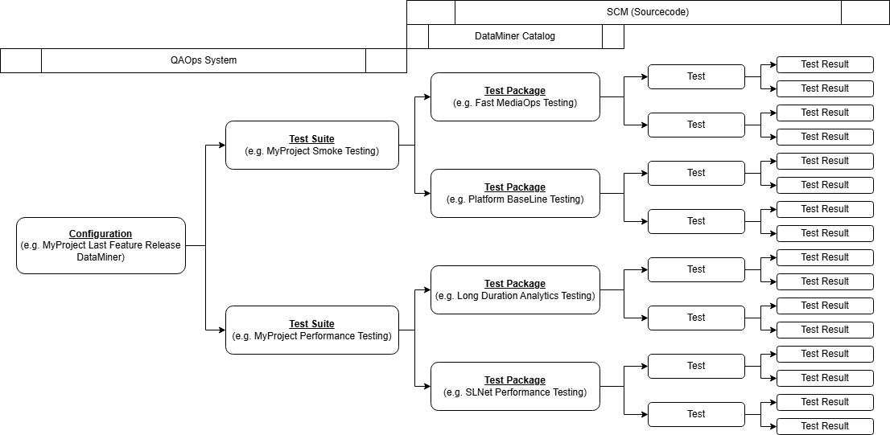

    

# Qaops

> [!IMPORTANT]
> This section contains information intended only for Skyline employees.

## What is Qaops

Qaops (Quality Assurance and Operations) is a regression test orchestration platform built on DataMiner. It enables you and your automation pipelines to run DataMiner test packages on DaaS setups, visualize results, and store them for future reference.

You can use these results to create quality gates, automatically blocking releases within automation pipelines if issues are detected.

The main goal of Qaops is to automatically deliver a more robust product within a DataMiner environment and to improve interoperability between different modules and solutions. This is achieved by sharing and combining test packages for various solutions and DataMiner features.

## Why use Qaops

With the increasing prevalence of collaborative development and community-driven pull requests, often assisted by large language models, automated quality assurance is becoming a critical part of any ecosystem.

Qaops allows you to create your own test packages and, if needed, request that new DataMiner releases are blocked if your test package detects a breaking change. More commonly, you can test changes made to your solution in a repeatable, automated, and consistent way using the Qaops platform.

Qaops also provisions clean DataMiner (DaaS) servers, ensuring your tests always start from a fresh setup.

## How to use Qaops

For Skyline Communications, you can access the Qaops system at:

- [Qaops production](https://qaops-skyline.on.dataminer.services/root/)

- [Qaops staging](https://qaopsstaging-skyline.on.dataminer.services/root/)

There are three ways to interact with Qaops:

1. Several Low-Code Apps handle most access. These are described in the [Qaops main UI](QAOps_Main_UI).

1. The Qaops .NET tool is intended for command-line access. This is described in [Qaops tool](QAOps_Tool).

1. You can create test packages, intended to run on the Qaops system, using Visual Studio projects. This is described in [Qaops test package](QAOps_Test_Package).

## Overview

The Qaops system consists of the following components:

- [Qaops configurations](QAOps_Configuration), which define what kind of DataMiner Agents to run, how many servers to use, and for which project. Each configuration includes one or more test suites.

- [Qaops test suites](QAOps_Test_Suite), which specify the type of testing to execute. Each test suite includes one or more test packages.

- [Qaops test packages](QAOps_Test_Package), which contain collections of tests. Each test can send one or more test results.

## Starting a test

To start a test, select the test suite from the specific configuration you want to execute.

Qaops receives the test run and waits for an available server for the selected configuration. Once a server is available, it begins running all test packages of the test suite on that server. Results will appear in the user Low-Code App of the Qaops setup.

