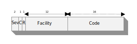

# DataMiner error codes

Values are 32 bit values structured as follows:

- Sev - is the severity code
  - 00 (0x0) - STATUS_SEVERITY_SUCCESS
  - 01 (0x1) - STATUS_SEVERITY_INFORMATIONAL
  - 10 (0x2) - STATUS_SEVERITY_WARNING
  - 11 (0x3) - STATUS_SEVERITY_ERROR
- C - is the Customer code flag
- R - is a reserved bit
- Facility - is the facility code
- Code - is the facility's status code
