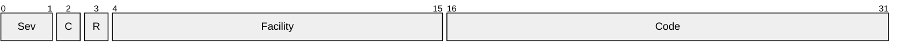

# DataMiner error codes

Values are 32-bit values structured as follows:

```mermaid
packet-beta
  0-1: "Sev"
  2: "C"
  3: "R"
  4-15: "Facility"
  16-31: "Code"
```

- **Sev**: Severity code (2 bits)
  - 00 (0x0) - STATUS_SEVERITY_SUCCESS
  - 01 (0x1) - STATUS_SEVERITY_INFORMATIONAL
  - 10 (0x2) - STATUS_SEVERITY_WARNING
  - 11 (0x3) - STATUS_SEVERITY_ERROR
- **C**: Customer code flag (1 bit)
- **R**: A reserved bit (1 bit)
- **Facility**: Facility code (12 bits)
- **Code**: Facility status code (16 bits)
