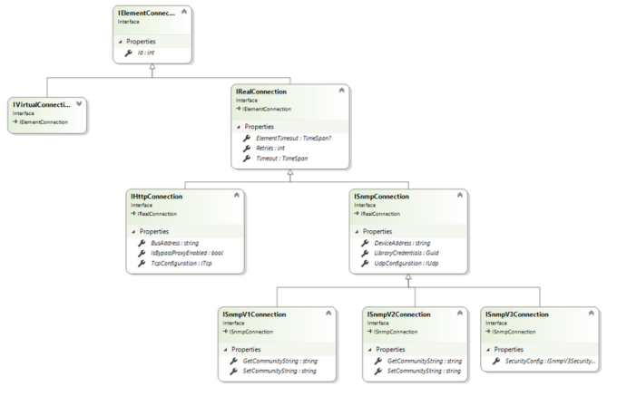

# Element creation

This section provides more information on how to create elements using the class library.

To create an element, use the [CreateElement](xref:Skyline.DataMiner.Core.DataMinerSystem.Common.IDma.CreateElement(Skyline.DataMiner.Core.DataMinerSystem.Common.ElementConfiguration)) method of the [IDma](xref:Skyline.DataMiner.Core.DataMinerSystem.Common.IDma) interface.
This method takes an [ElementConfiguration](xref:Skyline.DataMiner.Core.DataMinerSystem.Common.ElementConfiguration) object as parameter, where you can configure the element settings for the element.

The ElementConfiguration constructors require the element name and the protocol to be specified.
Other configuration settings can be specified via the properties of the ElementConfiguration object:

- [AdvancedSettings](xref:Skyline.DataMiner.Core.DataMinerSystem.Common.ElementConfiguration.AdvancedSettings): Allows you to configure advanced element settings such as the timeout, whether the element is hidden, etc.
- [AlarmTemplate](xref:Skyline.DataMiner.Core.DataMinerSystem.Common.ElementConfiguration.AlarmTemplate): Allows you to specify an alarm template to be used.
- [Connections](xref:Skyline.DataMiner.Core.DataMinerSystem.Common.ElementConfiguration.Connections): Allows you to specify the connections, if any. See [Creating an element with connections](xref:ClassLibraryElementCreation#creating-an-element-with-connections).
- [Description](xref:Skyline.DataMiner.Core.DataMinerSystem.Common.ElementConfiguration.Description): Allows you to provide a description for the element.
- [DveSettings](xref:Skyline.DataMiner.Core.DataMinerSystem.Common.ElementConfiguration.DveSettings): Allows you to configure DVE-related settings such as whether DVE creation is enabled or disabled.
- [Properties](xref:Skyline.DataMiner.Core.DataMinerSystem.Common.ElementConfiguration.Properties): Allows you to configure element properties. See [Creating an element with properties](xref:ClassLibraryElementCreation#creating-an-element-with-properties).
- [State](xref:Skyline.DataMiner.Core.DataMinerSystem.Common.ElementConfiguration.State): Allows you to configure the state. Must be either Active, Paused or Stopped.
- [TrendTemplate](xref:Skyline.DataMiner.Core.DataMinerSystem.Common.ElementConfiguration.TrendTemplate): Allows you to specify a trend template to be used.
- [Type](xref:Skyline.DataMiner.Core.DataMinerSystem.Common.ElementConfiguration.Type): Allows you to specify the type.
- [Views](xref:Skyline.DataMiner.Core.DataMinerSystem.Common.ElementConfiguration.Views): Allows you to specify the views the created element should be part of. See [Creating an element in specific views](xref:ClassLibraryElementCreation#creating-an-element-in-specific-views).

## Creating an element with properties

The following example illustrates how to create an element with some element properties:

```csharp
IDms dms = protocol.GetDms();
var agent = dms.GetAgent(1000);

IDmsProtocol elementProtocol = dms.GetProtocol("<ProtocolName>", "1.0.0.1");
string elementName = "<ElementName>";

ElementConfiguration configuration = new ElementConfiguration(dms, elementName, elementProtocol);
configuration.Properties["Manufacturer"].Value = "<manufacturerValue>";
configuration.Properties["Model"].Value = "<modelValue>";

DmsElementId id = agent.CreateElement(configuration);
```

## Creating an element in specific views

The following example illustrates how to create an element that should be included in the specified views:

```csharp
IDms dms = protocol.GetDms();
var agent = dms.GetAgent(1000);

IDmsProtocol elementProtocol = dms.GetProtocol("<ProtocolName>", "1.0.0.1");
string elementName = "<ElementName>";

ElementConfiguration configuration = new ElementConfiguration(dms, elementName, elementProtocol);

configuration.Views.Add(dms.GetView(7));
configuration.Views.Add(dms.GetView(9));

DmsElementId id = agent.CreateElement(configuration);
```

## Creating an element with connections

The following diagram gives an overview of the provided interfaces:



### Creating an SNMPv1 element

```csharp
IDms dms = protocol.GetDms();
IDma agent = dms.GetAgent(1000); // Obtain Agent where the element should be created.
IDmsProtocol protocol = dms.GetProtocol("<ProtocolName>", "1.0.0.1"); // Specify the protocol the element will run.

IUdp port = new Udp("127.0.0.1", 161); // Configure the SNMP connection.

ISnmpV1Connection mySnmpV1Connection = new SnmpV1Connection(port);

ElementConfiguration configuration = new ElementConfiguration(dms, "<ElementName>", protocol, new List<IElementConnection> { mySnmpV1Connection });

DmsElementId id = agent.CreateElement(configuration);
```

### Creating an SNMPv2c element

```csharp
IDms dms = protocol.GetDms();
IDma agent = dms.GetAgent(1000); // Obtain Agent where the element should be created.
IDmsProtocol protocol = dms.GetProtocol("<ProtocolName>", "1.0.0.1"); // Specify the protocol
IUdp port = new Udp("127.0.0.1", 161);

ISnmpV2Connection mySnmpV2Connection = new SnmpV2Connection(port);

ElementConfiguration configuration = new ElementConfiguration(dms, "<ElementName>", protocol, new List<IElementConnection> { mySnmpV2Connection });

DmsElementId id = agent.CreateElement(configuration);
```

### Creating an SNMPv3 element

```csharp
IDms dms = protocol.GetDms();
IDma agent = dms.GetAgent(1000); // Obtain Agent where the element should be created.
IDmsProtocol protocol = dms.GetProtocol("<ProtocolName>", "1.0.0.1");
IUdp port = new Udp("127.0.0.1", 161);

SnmpV3SecurityConfig secConfig = new SnmpV3SecurityConfig("myUserName", "myAuthKey", SnmpV3AuthenticationAlgorithm.Md5, "myEncryptionKey", SnmpV3EncryptionAlgorithm.Aes128);
ISnmpV3Connection mySnmpV3Connection = new SnmpV3Connection(port, secConfig);

ElementConfiguration configuration = new ElementConfiguration(dms, randomizedElementName, protocol, new List<IElementConnection> { mySnmpV3Connection });

DmsElementId id = agent.CreateElement(configuration);
```

### Creating an HTTP element

The following example illustrates how to create an element with an HTTP connection:

```csharp
private static void CreateElement(SLProtocol protocol)
{
    IDms dms = protocol.GetDms();
    IDma agent = dms.GetAgent(protocol.DataMinerID);
    
    IDmsProtocol elementProtocol = dms.GetProtocol("<ProtocolName>", "1.0.0.1");
    
    ITcp port = new Tcp("127.0.0.1", 8888);
    IHttpConnection myHttpConnection = new HttpConnection(port);
    
    var configuration = new ElementConfiguration(
        dms,
        "<ElementName>",
        elementProtocol,
        new List<IElementConnection> { myHttpConnection });
    
    DmsElementId createdElementId = agent.CreateElement(configuration);
}
```
