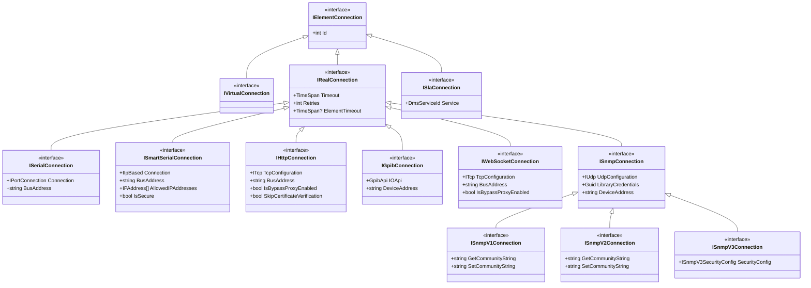

# Element creation

This section provides more information on how to create elements using the DataMinerSystem library.

To create an element, use the [CreateElement](xref:Skyline.DataMiner.Core.DataMinerSystem.Common.IDma.CreateElement(Skyline.DataMiner.Core.DataMinerSystem.Common.ElementConfiguration)) method of the [IDma](xref:Skyline.DataMiner.Core.DataMinerSystem.Common.IDma) interface.

This method takes an [ElementConfiguration](xref:Skyline.DataMiner.Core.DataMinerSystem.Common.ElementConfiguration) object as parameter, where you can configure the element settings for the element.

The ElementConfiguration constructors require the element name and the protocol to be specified.
Other configuration settings can be specified via the properties of the ElementConfiguration object:

- [AdvancedSettings](xref:Skyline.DataMiner.Core.DataMinerSystem.Common.ElementConfiguration.AdvancedSettings): Allows you to configure advanced element settings such as the timeout, whether the element is hidden, etc.
- [AlarmTemplate](xref:Skyline.DataMiner.Core.DataMinerSystem.Common.ElementConfiguration.AlarmTemplate): Allows you to specify an alarm template to be used.
- [Connections](xref:Skyline.DataMiner.Core.DataMinerSystem.Common.ElementConfiguration.Connections): Allows you to specify the connections, if any. See [Creating an element with connections](xref:ClassLibraryElementCreation#creating-an-element-with-connections).
- [Description](xref:Skyline.DataMiner.Core.DataMinerSystem.Common.ElementConfiguration.Description): Allows you to provide a description for the element.
- [DveSettings](xref:Skyline.DataMiner.Core.DataMinerSystem.Common.ElementConfiguration.DveSettings): Allows you to configure DVE-related settings such as whether DVE creation is enabled or disabled.
- [Properties](xref:Skyline.DataMiner.Core.DataMinerSystem.Common.ElementConfiguration.Properties): Allows you to configure element properties. See [Creating an element with properties](xref:ClassLibraryElementCreation#creating-an-element-with-properties).
- [State](xref:Skyline.DataMiner.Core.DataMinerSystem.Common.ElementConfiguration.State): Allows you to configure the state. Must be either Active, Paused or Stopped.
- [TrendTemplate](xref:Skyline.DataMiner.Core.DataMinerSystem.Common.ElementConfiguration.TrendTemplate): Allows you to specify a trend template to be used.
- [Type](xref:Skyline.DataMiner.Core.DataMinerSystem.Common.ElementConfiguration.Type): Allows you to specify the type.
- [Views](xref:Skyline.DataMiner.Core.DataMinerSystem.Common.ElementConfiguration.Views): Allows you to specify the views the created element should be part of. See [Creating an element in specific views](xref:ClassLibraryElementCreation#creating-an-element-in-specific-views).

## Creating an element with properties

The following example illustrates how to create an element with some element properties:

```csharp
IDms dms = protocol.GetDms();
var agent = dms.GetAgent(1000);

IDmsProtocol elementProtocol = dms.GetProtocol("<ProtocolName>", "1.0.0.1");
string elementName = "<ElementName>";

ElementConfiguration configuration = new ElementConfiguration(dms, elementName, elementProtocol);
configuration.Properties["Manufacturer"].Value = "<manufacturerValue>";
configuration.Properties["Model"].Value = "<modelValue>";

DmsElementId id = agent.CreateElement(configuration);
```

## Creating an element in specific views

The following example illustrates how to create an element that should be included in the specified views:

```csharp
IDms dms = protocol.GetDms();
var agent = dms.GetAgent(1000);

IDmsProtocol elementProtocol = dms.GetProtocol("<ProtocolName>", "1.0.0.1");
string elementName = "<ElementName>";

ElementConfiguration configuration = new ElementConfiguration(dms, elementName, elementProtocol);

configuration.Views.Add(dms.GetView(7));
configuration.Views.Add(dms.GetView(9));

DmsElementId id = agent.CreateElement(configuration);
```

## Creating an element with connections

When creating an element, the connection details need to specified. The only exception is for elements running a protocol that only has a virtual connection. For each type of connection supported by DataMiner, a corresponding interface is defined in the DataMinerSystem library. The following diagram gives an overview of the provided interfaces:


```mermaid
classDiagram
    direction TB

    class IElementConnection {
        <<interface>>
        +int Id
    }

    class IVirtualConnection {
        <<interface>>
    }

    class IRealConnection {
        <<interface>>
        +TimeSpan Timeout
        +int Retries
        +TimeSpan? ElementTimeout
    }

    class ISlaConnection {
        <<interface>>
        +DmsServiceId Service
    }

    IElementConnection <|-- IVirtualConnection
    IElementConnection <|-- IRealConnection
    IElementConnection <|-- ISlaConnection

    class ISerialConnection {
        <<interface>>
        +IPortConnection Connection
        +string BusAddress
    }

    class ISmartSerialConnection {
        <<interface>>
        +IIpBased Connection
        +string BusAddress
        +IPAddress[] AllowedIPAddresses
        +bool IsSecure
    }

    class IHttpConnection {
        <<interface>>
        +ITcp TcpConfiguration
        +string BusAddress
        +bool IsBypassProxyEnabled
        +bool SkipCertificateVerification
    }

    class IGpibConnection {
        <<interface>>
        +GpibApi IOApi
        +string DeviceAddress
    }

    class IWebSocketConnection {
        <<interface>>
        +ITcp TcpConfiguration
        +string BusAddress
        +bool IsBypassProxyEnabled
    }

    class ISnmpConnection {
        <<interface>>
        +IUdp UdpConfiguration
        +Guid LibraryCredentials
        +string DeviceAddress
    }

    class ISnmpV1Connection {
        <<interface>>
        +string GetCommunityString
        +string SetCommunityString
    }

    class ISnmpV2Connection {
        <<interface>>
        +string GetCommunityString
        +string SetCommunityString
    }

    class ISnmpV3Connection {
        <<interface>>
        +ISnmpV3SecurityConfig SecurityConfig
    }

    IRealConnection <|-- ISerialConnection
    IRealConnection <|-- ISmartSerialConnection
    IRealConnection <|-- IHttpConnection
    IRealConnection <|-- IGpibConnection
    IRealConnection <|-- IWebSocketConnection
    IRealConnection <|-- ISnmpConnection

    ISnmpConnection <|-- ISnmpV1Connection
    ISnmpConnection <|-- ISnmpV2Connection
    ISnmpConnection <|-- ISnmpV3Connection
```

The following examples show how to create an element for these connection types:

# [SNMP](#tab/snmp)

## SNMPv1

To create an element for a protocol with an SNMPv1 connection, provide an instance of the [SnmpV1Connection](xref:Skyline.DataMiner.Core.DataMinerSystem.Common.SnmpV1Connection) class (which implements [ISnmpV1Connection](xref:Skyline.DataMiner.Core.DataMinerSystem.Common.ISnmpV1Connection)) in the connections of the element configuration:

```csharp
IDms dms = protocol.GetDms();
IDma agent = dms.GetAgent(1000); // Obtain Agent where the element should be created.
IDmsProtocol protocol = dms.GetProtocol("<ProtocolName>", "1.0.0.1"); // Specify the protocol the element will run.

IUdp port = new Udp("127.0.0.1", 161); // Configure the SNMP connection.

ISnmpV1Connection mySnmpV1Connection = new SnmpV1Connection(port);

ElementConfiguration configuration = new ElementConfiguration(
                                                    dms,
                                                     "<ElementName>", 
                                                    protocol,
                                                    new List<IElementConnection> { mySnmpV1Connection });

DmsElementId id = agent.CreateElement(configuration);
```

## SNMPv2c

To create an element for a protocol with an SNMPv2c connection, provide an instance of the [SnmpV2Connection](xref:Skyline.DataMiner.Core.DataMinerSystem.Common.SnmpV2Connection) class (which implements [ISnmpV2Connection](xref:Skyline.DataMiner.Core.DataMinerSystem.Common.ISnmpV2Connection)) in the connections of the element configuration:

```csharp
IDms dms = protocol.GetDms();
IDma agent = dms.GetAgent(1000); // Obtain Agent where the element should be created.
IDmsProtocol protocol = dms.GetProtocol("<ProtocolName>", "1.0.0.1"); // Specify the protocol
IUdp port = new Udp("127.0.0.1", 161);

ISnmpV2Connection mySnmpV2Connection = new SnmpV2Connection(port);

ElementConfiguration configuration = new ElementConfiguration(dms, "<ElementName>", protocol, new List<IElementConnection> { mySnmpV2Connection });

DmsElementId id = agent.CreateElement(configuration);
```

## SNMPv3

To create an element for a protocol with an SNMPv3 connection, provide an instance of the [SnmpV3Connection](xref:Skyline.DataMiner.Core.DataMinerSystem.Common.SnmpV3Connection) class (which implements [ISnmpV3Connection](xref:Skyline.DataMiner.Core.DataMinerSystem.Common.ISnmpV3Connection)) in the connections of the element configuration:

```csharp
IDms dms = protocol.GetDms();
IDma agent = dms.GetAgent(1000); // Obtain Agent where the element should be created.
IDmsProtocol protocol = dms.GetProtocol("<ProtocolName>", "1.0.0.1");
IUdp port = new Udp("127.0.0.1", 161);

SnmpV3SecurityConfig secConfig = new SnmpV3SecurityConfig(
                                    "myUserName",
                                    "myAuthKey", 
                                    SnmpV3AuthenticationAlgorithm.Md5,
                                    "myEncryptionKey",
                                    SnmpV3EncryptionAlgorithm.Aes128);

ISnmpV3Connection mySnmpV3Connection = new SnmpV3Connection(port, secConfig);

ElementConfiguration configuration = new ElementConfiguration(
                                        dms, 
                                        randomizedElementName,
                                        protocol,
                                        new List<IElementConnection> { mySnmpV3Connection });

DmsElementId id = agent.CreateElement(configuration);
```

# [HTTP](#tab/http)

To create an element for a protocol with an HTTP connection, provide an instance of the [HttpConnection](xref:Skyline.DataMiner.Core.DataMinerSystem.Common.HttpConnection) class (which implements [IHttpConnection](xref:Skyline.DataMiner.Core.DataMinerSystem.Common.IHttpConnection)) in the connections of the element configuration:

```csharp
private static void CreateElement(SLProtocol protocol)
{
    IDms dms = protocol.GetDms();
    IDma agent = dms.GetAgent(protocol.DataMinerID);
    
    IDmsProtocol elementProtocol = dms.GetProtocol("<ProtocolName>", "1.0.0.1");
    
    ITcp port = new Tcp("127.0.0.1", 8888);
    IHttpConnection myHttpConnection = new HttpConnection(port);
    
    var configuration = new ElementConfiguration(
        dms,
        "<ElementName>",
        elementProtocol,
        new List<IElementConnection> { myHttpConnection });
    
    DmsElementId createdElementId = agent.CreateElement(configuration);
}
```

# [Serial](#tab/serial)

To create an element for a protocol with a serial connection, provide an instance of the [SerialConnection](xref:Skyline.DataMiner.Core.DataMinerSystem.Common.SerialConnection) class (which implements [ISerialConnection](xref:Skyline.DataMiner.Core.DataMinerSystem.Common.ISerialConnection)) in the connections of the element configuration:

## Serial TCP connection

```csharp
IDms dms = protocol.GetDms();
IDma agent = dms.GetAgent(agentId);

IDmsProtocol connector = dms.GetProtocol(connectorName, connectorVersion);

ITcp port = new Tcp("127.0.0.1", 8888);
ISerialConnection connection = new SerialConnection(port);

var configuration = new ElementConfiguration(
    dms,
    elementName,
    connector,
    new IElementConnection[] { connection });

agent.CreateElement(configuration);
```

## Serial UDP connection

```csharp
IDms dms = protocol.GetDms();
IDma agent = dms.GetAgent(agentId);

IDmsProtocol connector = dms.GetProtocol(connectorName, connectorVersion);

IUdp port = new Udp("localhost", 4321);
ISerialConnection connection = new SerialConnection(port);

var configuration = new ElementConfiguration(
    dms,
    elementName,
    connector,
    new IElementConnection[] { connection });

agent.CreateElement(configuration);
```

> [!NOTE]
> The DataMinerSystem library currently only supports creating serial connections that use either TCP or UDP.

# [Smart serial](#tab/smartserial)

To create an element for a protocol with a smart serial connection, provide an instance of the [SmartSerialConnection](xref:Skyline.DataMiner.Core.DataMinerSystem.Common.SmartSerialConnection) class (which implements [ISmartSerialConnection](xref:Skyline.DataMiner.Core.DataMinerSystem.Common.ISmartSerialConnection)) in the connections of the element configuration:

## Smart serial TCP connection

```csharp
IDms dms = protocol.GetDms();
IDma agent = dms.GetAgent(agentId);

IDmsProtocol connector = dms.GetProtocol(connectorName, connectorVersion);

ITcp port = new Tcp("localhost", 4321);
var connection = new SmartSerialConnection(port);

var configuration = new ElementConfiguration(
    dms,
    elementName,
    connector,
    new IElementConnection[] { connection });

agent.CreateElement(configuration);
```

## Smart serial UDP connection

```csharp
IDms dms = protocol.GetDms();
IDma agent = dms.GetAgent(agentId);

IDmsProtocol connector = dms.GetProtocol(connectorName, connectorVersion);

IUdp port = new Udp("localhost", 4321);
var connection = new SmartSerialConnection(port);

var configuration = new ElementConfiguration(
    dms,
    elementName,
    connector,
    new IElementConnection[] { connection });

agent.CreateElement(configuration);
```

# [WebSocket](#tab/websocket)

To create an element for a protocol with a WebSocket connection, provide an instance of the [WebSocketConnection](xref:Skyline.DataMiner.Core.DataMinerSystem.Common.WebSocketConnection) class (which implements [IWebSocketConnection](xref:Skyline.DataMiner.Core.DataMinerSystem.Common.IWebSocketConnection)) in the connections of the element configuration:

```csharp
IDms dms = protocol.GetDms();
IDma agent = dms.GetAgent(agentId);

IDmsProtocol connector = dms.GetProtocol(connectorName, connectorVersion);

ITcp port = new Tcp("localhost", 1235);
IWebSocketConnection connection = new WebSocketConnection(port);

var configuration = new ElementConfiguration(
    dms,
    elementName,
    connector,
    new IElementConnection[] { connection });

agent.CreateElement(configuration);
```

# [GPIB](#tab/gpib)

To create an element for a protocol with a GPIB connection, provide an instance of the [GpibConnection](xref:Skyline.DataMiner.Core.DataMinerSystem.Common.GpibConnection) class (which implements [IGpibConnection](xref:Skyline.DataMiner.Core.DataMinerSystem.Common.IGpibConnection)) in the connections of the element configuration:

```csharp
IDms dms = protocol.GetDms();
IDma agent = dms.GetAgent(agentId);

IDmsProtocol connector = dms.GetProtocol(connectorName, connectorVersion);

IGpibConnection gpibConnection = new GpibConnection(GpibApi.Visa, "<deviceAddress>");

var configuration = new ElementConfiguration(
    dms,
    elementName,
    connector,
    new IElementConnection[] { gpibConnection });

agent.CreateElement(configuration);
```

# [SLA](#tab/sla)

To create an element for an SLA protocol, provide an instance of the [SlaConnection](xref:Skyline.DataMiner.Core.DataMinerSystem.Common.SlaConnection) class (which implements [ISlaConnection](xref:Skyline.DataMiner.Core.DataMinerSystem.Common.ISlaConnection)) in the connections of the element configuration:

The SLA connection specifies the service that is monitored.

```csharp
IDms dms = protocol.GetDms();
IDma agent = dms.GetAgent(agentId);

IDmsProtocol connector = dms.GetProtocol(connectorName, connectorVersion);

ISlaConnection connection = new SlaConnection(new DmsServiceId(346, 452));

var configuration = new ElementConfiguration(
    dms,
    elementName,
    connector,
    new IElementConnection[] { connection });

agent.CreateElement(configuration);
```

---
