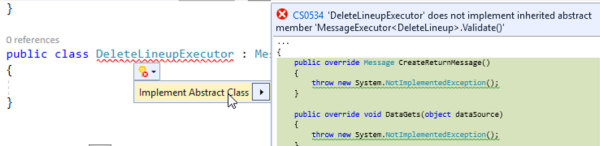

# InterApp classes

The InterApp classes, available through the NuGet package [Skyline.DataMiner.Core.InterAppCalls.Common](https://www.nuget.org/packages/Skyline.DataMiner.Core.InterAppCalls.Common), provide a C# message and response architecture that can be used:

- From element to element and back.
- From Automation script to element and back.
- From external application to element and back.

Its main features are:

- The ability to send a message to a parameter ID.
- The ability to wait for a return message on a different parameter ID.
- The ability to bulk send many messages in a single call.
- The full encapsulation of how this is achieved (SLNet and JSON).
- The ability to adjust to future improvements concerning SLNet without impacting driver code.
- A user-friendly and flexible way to define any class you want as a message.
- The ability to balance maintainability versus messaging speed as needed for your project.

Its main purpose is for use within large projects where inter-element or inter-automation communication is required, where you can adjust source and destination code to create and parse the messages.

## Requirements

### DataMiner requirements

- The InterApp classes require DataMiner 9.6.3 or higher to function correctly.

### Automation script requirements

- DataMiner version 9.6.13.0-8706 or higher is required.

### Protocol requirements

- Two parameters were reserved to be used in every protocol that wants to communicate with the InterApp classes. However, you can add additional different custom parameters within their own project if you have control over every protocol and Automation script used in it. This can be efficient in situations where there are many external sources requiring responses from a single element. A few extra receiver-return parameters can reduce traffic in the DataMiner system.

    The following two parameters must always be added and processed by the developer:

    ```xml
    <Param id="9000000" trending="false">
       <Name>clp_interApp_receive</Name>
       <Description>Inter App Receiver</Description>
       <Information>
          <Subtext>Contains the raw serialized InterApp Command (InterAppCall or Message) sent from an external source.</Subtext>
       </Information>
       <Type>read</Type>
       <Interprete>
          <RawType>other</RawType>
          <LengthType>next param</LengthType>
          <Type>string</Type>
       </Interprete>
       <Display>
         <!--Used for Inter App communication.-->
          <RTDisplay onAppLevel="true">true</RTDisplay>
       </Display>
       <Measurement>
          <Type>string</Type>
       </Measurement>
    </Param>
    <Param id="9000001" trending="false">
       <Name>clp_interApp_return</Name>
       <Description>Inter App Return</Description>
       <Information>
          <Subtext>Contains the raw serialized Message that serves as a response to an external source.</Subtext>
       </Information>
       <Type>read</Type>
       <Interprete>
          <RawType>other</RawType>
          <LengthType>next param</LengthType>
          <Type>string</Type>
       </Interprete>
       <Display>
         <!--Used for Inter App communication.-->
          <RTDisplay onAppLevel="true">true</RTDisplay>
       </Display>
       <Measurement>
          <Type>string</Type>
       </Measurement>
    </Param>
    ```

## Getting started

> [!NOTE]
> An example protocol "SLC SDF Inter App Calls" is available in the Protocol Development Guide Companion Files.

Begin by checking and applying everything to meet the DataMiner, DIS, protocol and optional Automation script requirements.

Now there are 4 steps for development:

1. Creating an API with messages that define the data you want to share.
1. Creating executors that define how to process a message.
1. Parsing a received call.
1. Sending a call.

### Creating an API

The first step is to create your API, with the classes that will represent your known messages. The namespace you make here needs to be present on both the source and destination of your communication channel. You can achieve this by:

- Creating the API in a new solution and adding it as a community branch in the class library, or
- Creating the API in a precompile QAction and copying it to where you need it.

> [!NOTE]
> Namespaces you use have to be the same in the source and destination. We strongly recommend creating the API in a separate custom solution and using NuGet DLLs or class library code generation.

The InterApp framework allows a lot of freedom in the creation of the message classes. The default internal serializer was created to be able to handle almost anything: custom classes, inheritance, abstraction, interfaces, private fields, public properties, objects, etc. There is no need to worry about any JSON properties, or anything to do with how it serializes in the background. Just create the classes as you see fit. Any class that you want to define as a possible message you simply inherit from the InterAppCalls.CallSingle.Message class.

For example:

```csharp
public class DeleteLineup : Message
{
      public string LineupId { get; set; }
}
```

A few key things to keep in mind:

- Classes in API should not contain any methods and logic. They should only contain the data you want to transfer. (For information on how to parse the message, see Creating an executor.)
- Do not pass along SLProtocol. The SLProtocol object should always be taken from the Run method of the QAction that your code is working in.
- Do not pass along the Engine instance from an Automation script.
- You are free to choose how you organize your API, but we recommend to add a comment with versioning at the top of the API.

### Creating an executor

Where the API describes the different messages and their content, the executor will define how it should parse an incoming message and handle it.

The executor is never shared between protocols or Automation scripts. You create it at the destination of a message and it is unique to that driver. It will hold all the methods that can access the content of the message and do something with it.

A few common examples:

- The methods in the executor could be used to translate the content of your InterApp message into a serial, SNMP, HTTP, etc. command to be sent to the device.
- The methods could be used to perform protocol gets and sets based on the message content.
- An executor could be created in an Automation script to simply create an information message to indicate that a message was received.
- etc.

You create it by making a new class that inherits from the MessageExecutor\<T\>, where T is a class from your messages defined in the API.

> [!NOTE]
> The API with classes of type Executor must be inside a precompile QAction.

```csharp
public class DeleteLineupExecutor : MessageExecutor<DeleteLineup>
```

The Visual Studio IDE will then assist you in correctly implementing your executor.



The executor has several methods that will by default be called when a message is executed (in the specified order):

1. DataGets (always)
1. Parse (always)
1. Validate (always)
1. Modify (if validate was true)
1. DataSets (if validate was true)
1. CreateReturnMessage (always)

Default execute code (happens in background):

```csharp
executor.DataGets(dataSource);
executor.Parse();

bool result = executor.Validate();

if (result)
{
   executor.Modify();
   executor.DataSets(dataDestination);
}

optionalReturnMessage = executor.CreateReturnMessage();

return result;
```

You now have an executor that can do what you want. It can access your received message by calling the "Message" property.

```csharp
public override bool Validate ()
{
    if (String.IsNullOrWhiteSpace(Message.LineupId))
    {
        return false;
    }
    
    return true;
}
```

Some methods, like DataSets and DataGets, have an object argument. This can be a custom class with data, a database object, SLProtocol, Engine, etc.

```csharp
public override void DataSets(object dataDestination)
{
    SLProtocol protocol = (SLProtocol)dataDestination;
    protocol.DeleteRow(100, Message.LineupId);
}
```

Lastly, you will also find one method that has a return type, the CreateReturnMessage. This is optional. It can be used to create a message to return and have it bubble up to the calling methods. If you do not need this, you can just return null. You could consider it as the "return" for the entire executor.

```csharp
public override Message CreateReturnMessage()
{
    return null;
}
```

In other cases, you want to immediately create a message that will eventually need to be returned to the sender.

```csharp
public override Message CreateReturnMessage()
{
    return new DeleteLineupResult { Guid = Message.Guid, Success = true };
}
```

> [!IMPORTANT]
> The return message must always have the same GUID as the received message that triggered the return in this case.

> [!NOTE]
> A return message does not necessarily need to be something to send to an external destination. A message could also be part of an internal API used to move data between classes, methods or QActions within your own protocol. This can also be returned.

### Parsing a received call

You can create a QAction that triggers on parameter clp_interApp_receive. This QAction will handle any incoming call. The code here will be easy as it uses a combination of the factory and command design patterns.

You get the raw value from the parameter and you use the InterAppCallFactory to turn it into an IInterAppCall.

```csharp
string raw = Convert.ToString(protocol.GetParameter(protocol.GetTriggerParameter()));
List<Type> knownTypes = new List<Type> {typeof(Chain), typeof(Product)};
IInterAppCall receivedCall = InterAppCallFactory.CreateFromRaw(raw, knownTypes);
```

> [!IMPORTANT]
> It is not possible to receive both single messages and InterApp calls on the same parameter. We recommend just sticking to the InterApp call.

Internal reflection code is removed to support the use of NuGets. This makes the use of "knownTypes" mandatory.

```csharp
List<Type> knownTypes = new List<Type> { typeof(DeleteLineup),typeof(DeleteLineupResult)};
```

> [!IMPORTANT]
> The list must be the same at the sender and the receiver side, and it should contain every single class in your API.

It is for example not supported to have protocol A with (Type1, Type2, Type3) as knownTypes members while Automation script B only has the members (Type1, Type2). If this rule is broken, it can lead to situations where the serialization will define "ChildClass" as the Type whereas the deserialization expects "NameSpace.ChildClass".

> [!NOTE]
> We recommend that you add the knownTypes as a public static list in a custom solution where all your messages are written. This way you avoid having to copy/paste and maintain them from several locations.

You can use the class library SerializerFactory to create the InterAppSerializer with the list of types.

```csharp
var customSerializer = SerializerFactory.CreateInterAppSerializer(typeof(Message), knownTypes);
```

Pass this serializer along to all your methods that need it (see [Custom serializer](#custom-serializer)).

### Executor triggering

Internal reflection code is removed to support the use of NuGets. This makes the use of a message to executor dictionary mandatory.

The Execute methods take a dictionary where you provide the mapping. The key of the dictionary is the message type. The value of the dictionary is the executor type.

```csharp
Dictionary<Type, Type> msgToExecutor = new Dictionary<Type, Type>
{
    {typeof(DeleteLineup),typeof(DeleteLineupExecutor)}
};

List<Message> returnMessages = new List<Message>();

foreach (var message in receivedCall.Messages)
{
    Message returnMessage;
    
    message.TryExecute (protocol, protocol, msgToExecutor, out returnMessage);

    if (returnMessage != null)
    {
        returnMessages.Add(returnMessage);
    }
}
```

This will look in the background for the executor matching the received response and then perform the following methods (in the specified order):

1. DataGets (always)
1. Parse (always)
1. Validate (always)
1. Modify (if validate was true)
1. DataSets (if validate was true)

> [!IMPORTANT]
> Any changes to the API and added executors need to be synced with the message to executor dictionary.

### Sending a call without expected return

To send an InterApp call you first create a new empty InterAppCall. This can be done by using the InterAppCallFactory.

```csharp
IInterAppCall myCommands = InterAppCallFactory.CreateNew();
```

Now you create messages from your API.

```csharp
DeleteLineup deleteCmd = new DeleteLineup { LineupId = "tableKey" };
```

Add this message to your InterApp call.

```csharp
myCommands.Messages.Add(deleteCmd);
```

Then send the call to the right parameter in the system.

```csharp
myCommands.Send(protocol.SLNet.RawConnection, 152, 22, 9000000, knownTypes);
```

You pass along the SLNet RawConnection, the DataMiner ID, the element ID and the receiver parameter ID, which should by default be 9 million.

The full code is therefore:

```csharp
IInterAppCall myCommands = InterAppCallFactory.CreateNew();
DeleteLineup deleteCmd = new DeleteLineup { LineupId = "tableKey" };
myCommands.Messages.Add(deleteCmd);
myCommands.Send(protocol.SLNet.RawConnection, 152, 22, 9000000, knownTypes);
```

### Sending a call with expected return

To send an InterApp call, you first create a new empty InterAppCall. This can be done by using the InterAppCallFactory.

```csharp
IInterAppCall myCommands = InterAppCallFactory.CreateNew();
```

You then specify the parameter that you are expecting the return message to arrive in.

```csharp
myCommands.ReturnAddress = new ReturnAddress(152, 22, 9000001);
```

Now you create messages from your API.

```csharp
DeleteLineup deleteCmd = new DeleteLineup { LineupId = "tableKey" };
```

Add this message to your InterApp call.

```csharp
myCommands.Messages.Add(deleteCmd);
```

Then send the call to the right parameter in the system and include a timeout timespan. Note that this now returns an IEnumerable\<Message\> that will provide you with the returned message of each command you sent in the InterApp as they come back.

```csharp
var responses = myCommands.Send(protocol.SLNet.RawConnection, 152, 22, 9000000, new TimeSpan(0, 1, 0), knownTypes);
```

You pass along the SLNet RawConnection, the DataMiner ID, the element ID and the receiver parameter ID, which should by default be 9 million.

Now you also provide a timespan with a timeout time. In this example, if it takes longer than 1 minute to get any reaction from the destination, this will trigger a timeout and throw an exception.

You can now start parsing the returned messages.

```csharp
foreach (Message returnedMsg in responses)
{
    Message optionalReturn;

    returnedMsg.TryExecute(protocol, protocol, msgToExecutor, out optionalReturn);
}
```

The full code is therefore:

```csharp
IInterAppCall myCommands = InterAppCallFactory.CreateNew();
myCommands.ReturnAddress = new ReturnAddress(152, 22, 9000001);
DeleteLineup deleteCmd = new DeleteLineup { LineupId = "tableKey" };
myCommands.Messages.Add(deleteCmd);

var responses = myCommands.Send(protocol.SLNet.RawConnection, 152, 22, 9000000, new TimeSpan(0, 1, 0), knownTypes);

foreach (Message returnedMsg in responses)
{
    Message optionalReturn;
    returnedMsg.TryExecute(protocol, protocol, msgToExecutor, out optionalReturn);
}
```

> [!IMPORTANT]
> The InterApp call will expect a return message with the same GUID for every message that was sent in the call. It is currently not possible to only expect a return message for specific sent messages.

### Sending a return message

To send a reply, make sure the message has the same GUID as the received message.

```csharp
Message deleteReply = new DeleteLineupResult { Guid = Message.Guid, Success = true };
```

Then you send the message to the ReturnAddress that was specified in the received message.

```csharp
deleteReply.Send(
  protocol.SLNet.RawConnection,
  receivedMessage.ReturnAddress.AgentId,
  receivedMessage.ReturnAddress.ElementId,
  receivedMessage.ReturnAddress.ParameterId,
  knownTypes);
```

## Tweaking the system

The current recommendation is to use the default functionality and only look into the tweaks below if they are a specific requirement of your project.

### Custom serializer

The InterAppCall library uses a special serializer that was deliberately tweaked, adjusted and heavily tested to work with almost any possible scenario. However, it also supports developers writing their own serializers and using those.

Any factory method that creates an InterApp call or Message, and any method to send the InterApp or message has an overload that takes a class implementing the Library.Common.Serializing.ISerializer interface.

This interface requires one method to serialize and one method to deserialize. You can create your own logic to do this and provide this to your methods and it will override the internal serializer with your own logic.
