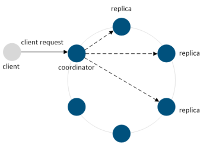
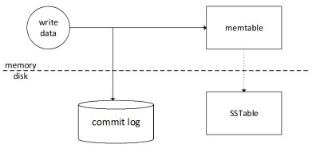

# DataMiner general database - NoSQL Database - Cassandra

DataMiner uses Cassandra as its NoSQL ("Not only SQL") database (supported since DataMiner version 9.0.0). The Apache Cassandra database is a distributed NoSQL database, designed to provide high availability, scalability and performance, allowing it to handle large amounts of data.

## Cassandra architecture

The Cassandra architecture consists of a cluster of nodes that form a masterless ring. This means that all nodes in the ring are equal, i.e. there is no concept of a master node or slave nodes. Because of this architecture and data replication, there is no single point of failure. Additional nodes can easily be added for increased performance (allowing linear scale performance).

### Data distribution

Cassandra automatically distributes data across the nodes of the cluster. This is achieved by the so-called "partitioner", a hash function that calculates a numerical token for a row based on its primary key. This token then determines the node in the cluster that will own the row. Cassandra also automatically takes care of properly distributing the data across the nodes when nodes are added or removed.

### Data replication

Data is typically replicated on multiple nodes allowing high availability and reliability. Cassandra performs data replication automatically according to the configured replication factor and strategy. For example, when a replication factor of three is defined, three copies of the data will exist in three different nodes in the cluster.

The replication factor is a setting that is configured at keyspace level (See Keyspace). Next to the replication factor, the replication strategy can be defined for a keyspace. The replication strategy determines the selection of the replica nodes, i.e. the nodes other than the one that owns the row.

## Data model

### Columns

A column is the basic data structure in Cassandra. It consists of a name and a value of a specific type. In addition, a timestamp is stored for every updated column value.

### Time to live

In Cassandra, it is possible to state that data should expire after a given time. This is done via the TTL (time to live), which is a per-column value setting. The value is provided in seconds, and after the provided TTL has passed, the column value will be set to null. The TTL can only be set when a value is provided for the column.

### Column family

A column family can be considered the equivalent of a table in a regular RDBMS. A column family is part of a keyspace and contains a number of rows, where each row contains a number of ordered columns.

### Row key

The row key, also referred to as the primary key, can be considered the equivalent of a primary key in a regular RDMS. The primary key can consist of a single column or multiple columns.

The primary key always consists of a partition key, which can consist of one or more columns (the latter is referred to as a composite partition key). The partition key determines on which node (and replicates) the row will be saved. When a row is added, a hashing algorithm is executed on the partition key resulting in a token value, which is owned by a node.

Composite partition keys are used when otherwise the data in a single partition would be too large.

In addition to the partition key, the primary key can have one or more clustering columns (in this case, the primary key is said to be a composite primary key). The clustering columns determine the order of the data on a partition.

It should be clear that the definition of the primary key is a very important aspect, as it affects:

- The size of the partitions.
- The order of the data within partitions.
- The distribution of the partitions among the nodes of the cluster.
- The queries that can be executed (see Performing SELECT statements).

> [!NOTE]
> When a row is added to a table, not all columns have to be filled in (except for columns that are part of the row key). This is different from a row in an RDBMS, where a null value is typically provided for empty cells.

### Keyspace

A keyspace can be considered the equivalent of a database in a regular RDBMS. A keyspace contains the column families (also referred to as a table in CQL) and indexes. A keyspace also defines some keyspace-wide attributes, such as its replication factor and replica strategy.

### Data model repercussions

The Cassandra data model has some important differences with the regular RDBMS data model. For example, a join cannot be performed in Cassandra. Therefore, when data will need to be joined, you typically create a denormalized table holding the joined data. This is a major difference with the data model of a regular RDBMS, where normalization is considered important (although denormalization also sometimes occurs in a RDBMS data model, e.g. to improve performance).

In RDBMS database design, you typically introduce different tables for the different entities in the domain you want to model. Additionally, join tables are introduced for modeling many-to-many relationships. Once the tables have been defined and populated, queries are performed to obtain the data.

In Cassandra, however, it is important to think about the possible queries that will need to be performed when defining the data model. This is referred to as query-first design: the model is designed around the queries that will be performed.

Also note that data is spread over different nodes based on the partition key. Therefore, limit the number of partitions that will need to be read when performing queries for optimal performance.

In addition, the available sort order is fixed as specified by the clustering columns when creating the table.

## Cassandra query language

The Cassandra Query Language (CQL) is the main API used for interaction with a Cassandra cluster. CQL was designed to resemble SQL. For example, operations to create, drop and select data can be very similar (or equal) to their SQL counterparts.

However, as the Cassandra data model is very different from a regular relational database, there are important restrictions. CQL does not support joins and does not support queries with OR clauses, wildcards, unions, intersections, group by, having and aggregation queries such as max, min and avg. A column cannot be filtered without an index being created for the column. Moreover, less than and greater than constructs in a query are only supported on clustering columns

> [!NOTE]
> Cassandra supports greater than and less than comparisons, but for a given partition key, the conditions on the clustering column are restricted to the filters that allow Cassandra to select a contiguous ordering of rows (https://docs.datastax.com/en/cql/3.1/cql/cql_reference/select_r.html).

### Performing SELECT statements

There are a number of WHERE clause restrictions for SELECT statements in Cassandra. A select query must include the partition key columns. This is because Cassandra uses the partition key to determine on which node the data resides. If you did not need to provide the partition key, Cassandra would not know on which node to look for the data and therefore the query would be inefficient. Cassandra prevents such inefficient queries by not allowing them.

In addition, queries require data to be retrieved sequentially. This relates to the clustering columns, which define the order in which the rows are stored. For example, if you define two clustering columns, you can perform a query that includes the first clustering column and optionally the second clustering column. However, you cannot perform a query including the second clustering column without including the first clustering column.

There is one approach to avoid having to specify the partition key when performing a SELECT query, i.e. by using secondary indexes. In DataMiner, a secondary index is created for foreign key columns. However, this will have an impact on performance, as in this case all nodes need to be searched.

For more in-depth information, refer to https://www.datastax.com/dev/blog/a-deep-look-to-the-cql-where-clause.

Also note that a CQL SELECT query does not support OR clauses (which is different from SQL queries). This is again to allow sequential data retrieval.

For a complete overview of CQL, refer to http://docs.datastax.com/en/cql/3.3/.

## Inner workings

### Write requests

A client can send write requests to any node in the cluster. A node receiving a client request is called the coordinator node, and the coordinator is responsible for handling the client request. When a write request is received, the coordinator will send a write request to all replica nodes for a given row key. However, the specified consistency level (specified as part of the write request) defines the number of nodes that need to respond back with an indication that the write is completed. For example, in case the consistency level is one, and the replication factor is 3, only one replica will respond.

In a node, when a write operation is performed, it is recorded in a commit log (used for crash recovery) and afterwards in a memory-based structure, the so-called memtable. There is one memTable per column family. Once the memTable grows beyond a configurable size, this data is written to a file on the disk (a so-called SSTable).

> [!NOTE]
>
> - The commit log files can be found in the following directory: $CASSANDRA_HOME/data/commitlog. The SSTable files can be found in $CASSANDRA_HOME/data/data. In this folder, a directory is present of every defined keyspace (the name of the directory is the name of the keyspace). The keyspace folder contains a subdirectory for each table defined in the keyspace (the name of the directory is the name of the table and a UUID to enable support for different table schema versions).
> - Multiple SSTables can exist for a single logical data table. During an operation called compaction, a single SSTable is generated for a logical data table which further improves performance.

### Read requests

A client can send a read request to any node in the cluster.

It is possible that the node receiving the client request is not one of the replica nodes holding the requested data. The coordinator node uses the partitioner to determine the replica nodes. If the coordinator node is not a replica node, it sends a read request to the fastest replica node (determined via the snitch protocol).

For the other replica nodes, a digest request is sent. The number of other replica nodes to which a digest request is sent depends on the specified consistency level in the read request.

This means that the other replica nodes are requested to respond with a digest of the requested data. Once the fastest replica responds with the requested data, a digest is calculated on this data and compared with the other received digests.

## Database structure

The following sections describe the main tables of the DataMiner Cassandra general database:

- [Element data](#element-data)
- [Information events](#information-events)
- [Alarm data](#alarm-data)
- [Trend data](#trend-data)
- [Ticketing data](#ticketing-data)
- [Analytics data](#analytics-data)

> [!WARNING]
> The tables and their structure are subject to change. Therefore, it is not supported to directly communicate with the database.

### Element data

The elementdata table contains the values of persisting parameters (standalone and table parameters). This table is defined as follows:

|Name|Type|Primary Key|Static|Description|
|--- |--- |--- |--- |--- |
|d|int|Yes (partitioning)|No|DataMiner Agent ID|
|e|int|Yes (partitioning)|No|Element ID|
|p|int|Yes (clustering)|No|Parameter ID|
|i|text|Yes (clustering)|No|Primary key|
|v|text|No|No|Parameter value (ASCII)|
|vu|text|No|No|Parameter value (Unicode)|

#### DVE Element Info

|Name|Type|Primary Key|Null|Description|
|--- |--- |--- |--- |--- |
|pd|Int|Yes (partitioning)|No|Parent DataMiner Agent ID|
|pe|int|Yes (partitioning)|No|Parent Element ID|
|d|int|Yes (clustering)|No|DataMiner Agent ID|
|e|int|Yes (clustering)|No|Element ID|
|atn|Text|No||Alarm Template Name|
|ds|Text|No||Description|
|en|Int|No|||
|h|Int|No||Hidden|
|lsp|List\<dveproperty\>|No||Properties|
|n|Text|No||Name|
|pr|Text|No||Protocol|
|ro|Int|No||Read-only|
|sa|Int|No||SNMP Agent|
|t|Int|No||Telnet|
|ttn|Text|No||Trend Template Name|
|vi|Text|No||Virtual IP|
|vim|Text|No||Virtual IP Mask|

### Information events

Data for information events is kept in the following tables:

- [infotrace table](#infotrace-table)
- [info table](#info-table)

#### infotrace table

The infotrace table stores all keys and timestamps of information events and is used for history queries.

The partitioning key (i) has the following structure:

- DataminerId_ElementId_ParameterId_Index: a specific information event
- DataminerId_ElementId_-1_-1: all information events of a specific element
- -1_-1_-1_-1: all information events

An information event will appear three times in this table, allowing it to be queried in different situations.

|Name|Type|Primary Key|Static|Description|
|--- |--- |--- |--- |--- |
|tti|text|Yes (partitioning)|No|Timetrace Info ID|
|at|timestamp|Yes (clustering)|No|Time Of Arrival|
|a|text|No|No|DMAID_AID|
|ai|bigint|No|No|Alarm ID|
|ap|list\<alarmproperty\>|No|No|Alarm Properties|
|c|list\<correlationreference\>|No|No|Correlations|
|ca|text|No|No|Corrective Action|
|ce|text|No|No|Category|
|ci|text|No|No|Component Info|
|ct|timestamp|No|No|Creation Time|
|d|text|No|No|Display Key|
|de|text|No|No|Description|
|di|int|No|No|DataMiner Agent ID|
|dv|text|No|No|Display Value|
|ei|int|No|No|Element ID|
|en|text|No|No|Element Name|
|et|text|No|No|Element Type|
|h|list\<hyperlink\>|No|No|Hyperlinks|
|i|text|No|No|Instance|
|it|boolean|No|No|Interpret Table Idx|
|kp|text|No|No|Key Point|
|l|int|No|No|Severity Range ID|
|o|text|No|No|Owner|
|oi|boolean|No|No|Offline Impact|
|p|bigint|No|No|Previous Alarm ID|
|pi|int|No|No|Parameter ID|
|pn|text|No|No|Parameter Name|
|r|text|No|No|DMAID_RID|
|rc|timestamp|No|No|Root Creation Time|
|ri|bigint|No|No|Root Alarm ID|
|rl|int|No|No|RCA Level|
|rt|timestamp|No|No|Root Time|
|s|int|No|No|Severity ID|
|si|int|No|No|Source ID|
|st|int|No|No|Status ID|
|sv|list\<servicereference\>|No|No|Services|
|t|int|No|No|Type ID|
|u|text|No|No|Comments|
|us|int|No|No|User Status ID|
|v|text|No|No|Value|
|vf|list\<virtualfuntionreference\>|No|No|Functions|

#### info table

|Name|Type|Primary Key|Static|Description|
|--- |--- |--- |--- |--- |
|r|text|Yes (partitioning)|No|Root key of the alarm. Refers to the 'a' of the first alarm.|
|a|text|Yes (clustering)|No|\[di\]_\[ai\]|
|ai|bigint|No|No|Alarm ID|
|ap|list\<alarmproperty\>|No|No|Alarm properties. Each property contains 'name', 'value', 'type', 'owner' and 'access type'.|
|at|timestamp|No|No|Time Of Arrival|
|c|list\<correlationreference\>|No|No|Correlations|
|ca|text|No|No|Corrective action (Param/Information/CorrectiveAction).|
|ce|text|No|No|Category (Param/Information/Category).|
|ci|text|No|No|Component Info|
|ct|timestamp|No|No|Creation Time|
|d|text|No|No|Display key.|
|de|text|No|No|Alarm description (Param/Information/AlarmDescription).|
|di|int|No|No|DataMiner Agent ID.|
|dv|text|No|No|Display value of the alarm.|
|ei|int|No|No|Element ID.|
|en|text|No|No|Element name.|
|et|text|No|No|Element type.|
|h|list\<hyperlink\>|No|No|Hyperlinks.|
|i|text|No|No|Primary key.|
|it|boolean|No|No|Interpret Table Idx|
|kp|text|No|No|Key Point|
|l|int|No|No|Severity Range ID|
|o|text|No|No|Owner. User who has taken ownership of the alarm.|
|oi|boolean|No|No|Alarm ID|
|p|bigint|No|No|Previous Alarm ID|
|pi|int|No|No|Parameter ID.|
|pn|text|No|No|Parameter description.|
|rc|timestamp|No|No|Root Creation Time|
|ri|bigint|No|No|Root Alarm ID|
|rl|int|No|No|RCA Level|
|rt|timestamp|No|No|Timestamp of the root alarm.|
|s|int|No|No|Severity level.|
|si|int|No|No|Source ID (16=DataMiner System).|
|st|int|No|No|Status ID|
|sv|list\<servicereference\>|No|No|Services|
|t|int|No|No|Alarm type (10 = new alarm).|
|u|text|No|No|User comment.|
|us|int|No|No|User status (18 = not assigned).|
|v|text|No|No|Parameter value.|
|vf|list\<virtualfunctionreference\>|No|No|Functions|

#### Alarm data

Alarm data is kept in the following tables:

- [activealarms table](#activealarms-table)
- [alarm table](#alarm-table)
- [timetrace table](#timetrace-table)

#### activealarms table

This table is used to keep track of the active alarms per element (RN 12536).

The rows in this table do not have a TTL. They are automatically deleted when the alarm is cleared or when the element is deleted.

|Name|Type|Primary Key|Static|Description|
|--- |--- |--- |--- |--- |
|di|int|Yes (partitioning)|No|DataMiner Agent ID|
|ei|int|Yes (partitioning)|No|Element ID|
|r|text|Yes (clustering)|No|Root key of the alarm. Refers to the 'a' of the first alarm.|
|a|text|Yes (clustering)|No|\[di\]_\[ai\]|
|ai|bigint|No|No|Alarm ID|
|ap|list\<alarmproperty\>|No|No|Alarm properties.|
|at|timestamp|No|No|Timestamp|
|c|list\<correlationreference\>|No|No|Correlations|
|ca|text|No|No|Corrective action (Param/Information/CorrectiveAction).|
|ce|text|No|No|Category (Param/Information/Category).|
|ci|text|No|No|Component Info|
|ct|timestamp|No|No|Date/time when the alarm was created.|
|d|text|No|No|Display key.|
|de|text|No|No|Alarm description (Param/Information/AlarmDescription).|
|dv|text|No|No|Display value of the alarm.|
|en|text|No|No|Element name.|
|et|text|No|No|Element type.|
|h|list\<hyperlink\>|No|No|Hyperlinks.|
|i|text|No|No|Primary key.|
|ir|list\<interfacereference\>|No|No|Interfaces|
|it|boolean|No|No|Interpret Table Idx (true for table parameters, false for standalone)|
|kp|text|No|No|Key Point|
|l|int|No|No|Severity Range ID. See [slenumvalues table](xref:Structure_of_the_offload_database#slenumvalues-table).|
|o|text|No|No|Owner. User who has taken ownership of the alarm.|
|oi|boolean|No|No|Offline Impact|
|p|bigint|No|No|Previous Alarm ID. If the alarm is first in the tree, the value is 0.|
|pi|int|No|No|Parameter ID.|
|pn|text|No|No|Parameter description.|
|rc|timestamp|No|No|Root Creation Time|
|ri|bigint|No|No|Root Alarm ID|
|rl|int|No|No|RCA Level|
|rt|timestamp|No|No|Timestamp of the root alarm.|
|s|int|No|No|Severity ID. See [slenumvalues table](xref:Structure_of_the_offload_database#slenumvalues-table).|
|si|int|No|No|Source ID (16=DataMiner System). See [slenumvalues table](xref:Structure_of_the_offload_database#slenumvalues-table).|
|st|int|No|No|Status ID. See [slenumvalues table](xref:Structure_of_the_offload_database#slenumvalues-table).|
|sv|list\<servicereference\>|No|No|Services|
|t|int|No|No|Alarm type ID (10 = new alarm). See [slenumvalues table](xref:Structure_of_the_offload_database#slenumvalues-table).|
|u|text|No|No|User comment.|
|us|int|No|No|User status ID (18 = not assigned). See [slenumvalues table](xref:Structure_of_the_offload_database#slenumvalues-table).|
|v|text|No|No|Parameter value. Different from Display value for discrete and exception values.|
|vf|list\<virtualfunctionreference\>|No|No|Functions|

#### alarm table

This table contains all the alarms, including the active alarms.

|Name|Type|Primary Key|Static|Description|
|--- |--- |--- |--- |--- |
|r|text|Yes (partitioning)|No|Root key of the alarm. Refers to the 'a' of the first alarm.|
|ai|bigint|Yes (clustering)|No|Alarm ID|
|a|text|No|No|\[di\]_\[ai\]|
|ap|list\<alarmproperty\>|No|No|List with alarm properties. Each property contains 'name', 'value', 'type', 'owner' and 'access type'.|
|at|timestamp|No|No|Timestamp|
|c|list\<correlationreference\>|No|No|Correlations|
|ca|text|No|No|Corrective action (Param/Information/CorrectiveAction).|
|ce|text|No|No|Category (Param/Information/Category).|
|ci|text|No|No|Component Info|
|ct|timestamp|No|No|Date/time when the alarm was created.|
|d|text|No|No|Display key.|
|de|text|No|No|Alarm description (Param/Information/AlarmDescription).|
|di|int|No|No|DataMiner agent ID.|
|dv|text|No|No|Display value of the alarm.|
|ei|int|No|No|Element ID.|
|en|text|No|No|Element name.|
|et|text|No|No|Element type.|
|h|list\<hyperlink\>|No|No|Hyperlinks.|
|i|text|No|No|Primary key.|
|ir|list\<interfacereference\>|No|No|Interfaces|
|it|boolean|No|No|Interpret Table Idx (true for table parameters, false for standalone)|
|kp|text|No|No|Key Point|
|l|int|No|No|Severity Range ID. See [slenumvalues table](xref:Structure_of_the_offload_database#slenumvalues-table).|
|o|text|No|No|Owner. User who has taken ownership of the alarm.|
|oi|boolean|No|No|Offline Impact|
|p|bigint|No|No|Previous Alarm ID. If the alarm is first in the tree, the value is 0.|
|pi|int|No|No|Parameter ID.|
|pn|text|No|No|Parameter description.|
|rc|timestamp|No|No|Root Creation Time|
|ri|bigint|No|No|Root Alarm ID|
|rl|int|No|No|RCA Level|
|rt|timestamp|No|No|Timestamp of the root alarm.|
|s|int|No|No|Severity ID. See [slenumvalues table](xref:Structure_of_the_offload_database#slenumvalues-table).|
|si|int|No|No|Source ID (16=DataMiner System). See [slenumvalues table](xref:Structure_of_the_offload_database#slenumvalues-table).|
|st|int|No|No|Status ID. See [slenumvalues table](xref:Structure_of_the_offload_database#slenumvalues-table).|
|sv|list\<servicereference\>|No|No|Services|
|t|int|No|No|Alarm type ID (10 = new alarm). See [slenumvalues table](xref:Structure_of_the_offload_database#slenumvalues-table).|
|u|text|No|No|User comment.|
|us|int|No|No|User status ID (18 = not assigned). See [slenumvalues table](xref:Structure_of_the_offload_database#slenumvalues-table).|
|v|text|No|No|Parameter value. Different from Display value for discrete and exception values.|
|vf|list\<virtualfunctionreference\>|No|No|Functions|

#### timetrace table

This table stores all alarm keys and timestamps and is used for history queries.

The partitioning key (i) has the following structure:

- DataminerAgentID_ElementID_ParameterID_Index: a specific alarm.
- DataminerAgentID_ElementID_-1_-1: all alarms of a specific element
- DataminerAgentID_ServiceID_-1_-1: all alarms of a specific service
- -1_-1_-1_-1: all alarms

An alarm will therefore appear at least three times in this table (one entry using partitioning key for a specific alarm, one for specific element, one for all alarms) with additional occurrences per service it is associated with (e.g. in case an element is associated with 2 services, the table will have 5 entries for that alarm.). This allows it to be queried in different situations.

|Name|Type|Primary Key|Description|
|--- |--- |--- |--- |
|i|Text|Yes (partitioning)|Key|
|t|timestamp|Yes (clustering)|Timestamp|
|u|timeuuid|Yes (clustering)|TimeUUID|
|a|frozen\<alarmid\>|No|Alarm ID|
|d|int|No|DataMiner Agent ID|
|e|int|No|Element ID|
|na|boolean|No|New Alarm State: true for new alarms (AlarmID == RootID), otherwiser false.|
|p|int|No|Parameter ID|
|s|int|No|Severity. See [slenumvalues table](xref:Structure_of_the_offload_database#slenumvalues-table).|
|ss|list\<int\>|No|Severities|
|st|int|No|State. See [slenumvalues table](xref:Structure_of_the_offload_database#slenumvalues-table).|
|ta|list\<alarmid\>|No|Trace Alarms|
|ts|int|No|Total Severity|
|tta|text|No|Alarm ID|
|ttai|bigint|No||
|ttap|list\<alarmproperty\>|No|Alarm Properties|
|ttat|timestamp|No|Time Of Arrival|
|ttc|list\<correlationreference\>|No|Correlations|
|ttca|text|No|Corrective Action|
|ttce|text|No|Category|
|ttci|text|No|Component Info|
|ttct|timestamp|No|Creation Time|
|ttd|text|No|Display Key|
|ttde|text|No|Alarm Description|
|ttdi|int|No|DataMiner Agent ID|
|ttdv|text|No|Display Value|
|ttei|int|No|Element ID|
|tten|text|No|Element Name|
|ttet|text|No|Element Type|
|tth|list\<hyperlink\>|No|Hyperlinks|
|tti|text|No|Instance|
|ttir|list\<interfacereference\>|No|Interfaces|
|ttit|boolean|No|Interpret Table Idx (true for table parameters, false for standalone)|
|ttkp|text|No|Key Point|
|ttl|int|No|Severity Range ID. See [slenumvalues table](xref:Structure_of_the_offload_database#slenumvalues-table).|
|tto|text|No|Owner|
|ttoi|boolean|No|Offline Impact|
|ttp|bigint|No|Previous Alarm ID. If the alarm is first in the tree, the value is 0.|
|ttpi|int|No|Parameter ID|
|ttpn|text|No|Parameter Description|
|ttr|text|No|Root Alarm ID|
|ttrc|timestamp|No|Root Creation Time|
|ttri|bigint|No|Root Alarm ID|
|ttrl|int|No|RCA Level|
|ttrt|timestamp|No|Root Time|
|tts|int|No|Severity ID. See [slenumvalues table](xref:Structure_of_the_offload_database#slenumvalues-table).|
|ttsi|int|No|Source ID. See [slenumvalues table](xref:Structure_of_the_offload_database#slenumvalues-table).|
|ttst|int|No|Status ID. See [slenumvalues table](xref:Structure_of_the_offload_database#slenumvalues-table)|
|ttsv|list\<servicereference\>|No|Services|
|ttt|int|No|Alarm Type ID. See [slenumvalues table](xref:Structure_of_the_offload_database#slenumvalues-table).|
|ttu|text|No|Comments|
|ttus|int|No|User Status ID. See [slenumvalues table](xref:Structure_of_the_offload_database#slenumvalues-table).|
|ttv|text|No|Value. Different from Display value for discretes and exceptions.|
|ttvf|list\<virtualfunctionreference\>|No|Functions|
|x|text|No|Instance|

### Trend data

Trend data is kept in the following tables:

- [data table](#data-table)
- [datapoints table](#datapoints-table)

#### data table

Real-time and average trend data is stored in the data table. This table is defined as follows:

|Name|Type|Primary Key|Description|
|--- |--- |--- |--- |
|d|int|Yes (partitioning)|DataMiner Agent ID.|
|ei|int|Yes (partitioning)|Element ID.|
|p|int|Yes (partitioning)|Parameter ID.|
|i|text|Yes (partitioning)|If the trended parameter is a dynamic table parameter, this field will contain the display key of the table row. **IMPORTANT**: For a dynamic table with "advanced naming" enabled, this field will contain the primary key instead of the display key.|
|w|int|Yes (partitioning)|Window|
|t|timestamp|Yes (clustering)|Timestamp.|
|u|timeuuid|Yes (clustering)|Timestamp UUID.|
|e|int|No|Severity|
|m|double|No|Min value|
|md|text|No|Min value discreet|
|s|int|No|Status|
|v|double|No|Value|
|vd|text|No|Value discreet|
|x|double|No|Max value|
|xd|text|No|Max value discreet|

Status:

- 120: Average trending: Average/max/min values calculated based on the parameter values measured during the last day.
- 60: Average trending: Average/max/min values calculated based on parameter values measured during the last 60 minutes.
- 5: Average trending: Average/max/min values calculated based on parameter values measured during the last 5 minutes.
- 0: Real-time trending: Normal real-time trend data without additional information.
- -1: Element is starting up.
- -2: Element is being paused.
- -3: Element is being activated.
- -4: Element is going into a timeout state.
- -5: Element is coming out of a timeout state.
- -6: Element is being stopped.
- -7: A state and a display value (e.g. "No signal") was received (separated by a semicolon).
- -8: A normal value was received following a "-7".
- -9: Trending was started for the specified parameter.
- -10: Trending was stopped for the specified parameter
- -11: The parameter value was cleared.
- -12: The parameter again received a value following a "-11".
- -13: The parameter value is the first value received for the parameter in question since the element was started.
- -14: The parameter value is the first value received for the parameter in question since the element was started. However, that value is an exception value.
- -15: A new row has been added to the dynamic table in question.
- -16: A row has been deleted from the dynamic table in question.
- -17: Monitoring has been activated.
- -18: Monitoring has been deactivated.

Window:

- 120: Day average
- 60: 1-hour average
- 5: 5-minute average
- 0: real time
- -1: any

#### datapoints table

This table does not contain actual trend data but keeps track of which indices are trended per parameter. As such, this table can be used to determine whether trend data is available (real-time, average) for a specific parameter.

|Name|Type|Primary Key|Description|
|--- |--- |--- |--- |
|d|int|Yes (partitioning)|DataMiner Agent ID.|
|e|int|Yes (partitioning)|Element ID.|
|p|int|Yes (clustering)|Parameter ID.|
|w|int|Yes (clustering)|Window|
|i|text|Yes (clustering)|If the trended parameter is a dynamic table parameter, this field will contain the display key of the table row. **IMPORTANT**: For a dynamic table with "advanced naming" enabled, this field will contain the primary key instead of the display key.|

Window:

- 120: Day average
- 60: 1-hour average
- 5: 5-minute average
- 0: real time
- -1: any

### Ticketing data

Ticketing data is kept in a separate keyspace named "[config]_sldmadb_ticketing" and contains the following tables:

- [history](#history)
- [linkertable](#linkertable)
- [maxticketid](#maxticketid)
- [tickets](#tickets)
- [ticketstates](#ticketstates)

#### history

A history of ticket changes can be found in the history table. This table is defined as follows:

|Name|Type|Primary Key|Description|
|--- |--- |--- |--- |
|d|int|Yes (Partitioning)|DataMiner Agent ID|
|t|int|Yes (Clustering)|Ticket ID|
|h|text|No|History (stored as a JSON string).|

#### linkertable

Stores the link between DataMinerID objects and tickets. This table is defined as follows:

|Name|Type|Primary Key|Description|
|--- |--- |--- |--- |
|c|text|Yes (Partitioning)|Type (e.g. "Skyline.DataMiner.Net.ElementID")|
|k|text|Yes (Clustering)|Key (e.g. "{ \"DataMinerID\": 337, \"EID\": 5 }")|
|d|int|Yes (Clustering)|DataMiner Agent ID (e.g. 337).|
|t|int|Yes (Clustering)|Ticket ID (e.g. 10).|

#### maxticketid

To make sure no duplicate Ticket IDs are created, a Ticket ID counter is stored in the database. Every time a new ticket is created, the counter is incremented and the resulting ID is used for the new ticket ID.

This table is defined as follows:

|Name|Type|Primary Key|Description|
|--- |--- |--- |--- |
|d|int|Yes (Partitioning)|DataMiner Agent ID (e.g. 337).|
|c|counter|No|Counter (e.g. 1234).|

#### tickets

This table is defined as follows:

|Name|Type|Primary Key|Description|
|--- |--- |--- |--- |
|d|int|Yes (Partitioning)|DataMiner Agent ID (e.g. 337).|
|t|int|Yes (Clustering)|Ticket ID (e.g. 10).|
|v|text|No|Ticket (JSON).|

#### ticketstates

The ticketstates table is used to quickly retrieve tickets with a certain state (Open/Closed).

This table is defined as follows:

|Name|Type|Primary Key|Description|
|--- |--- |--- |--- |
|s|int|Yes (Partitioning)|State (0: Open, 1: Closed).|
|c|timestamp|Yes (Clustering)|Timestamp|
|d|int|Yes (Partitioning)|DataMiner Agent ID (e.g. 337).|
|t|int|Yes (Clustering)|Ticket ID (e.g. 10).|

### Analytics data

The DataMiner Analytics features store and maintain model data and extracted insights data in the following tables:

- [analytics_alarmfocus](#analytics_alarmfocus)
- [analytics_arrowwindows](#analytics_arrowwindows)
- [analytics_changepoints](#analytics_changepoints)
- [ai_cpalarms](#ai_cpalarms) (or *analytics_changepointalarmentries* prior to DataMiner 10.3.0 [CU5]/10.3.8)
- [analytics_parameterinfo](#analytics_parameterinfo)
- [analytics_trendalarms](#analytics_trendalarms)
- [analytics_wavestream](#analytics_wavestream)

#### analytics_alarmfocus

This table stores one model for [alarm focus](xref:ApplyingAlarmFiltersInTheAlarmConsole#filtering-alarms-on-alarm-focus) for each monitored parameter or monitored table cell that has had an alarm in the past two weeks. The amount of data in the table should be more or less stable after two weeks.

The table is defined as follows:

|Name|Type|Primary Key|Description|
|--- |--- |--- |--- |
|di|int|Yes (Partitioning)|DataMiner Agent ID|
|ei|int|Yes (Partitioning)|Element ID|
|pi|int|Yes (Clustering)|Parameter ID|
|i|text|Yes (Clustering)|Primary key for table parameter|
|dn|text|No|Display key for table parameter|
|fd|test|No|Model|

#### analytics_arrowwindows

This table is used by the trend icons feature in DataMiner versions prior to DataMiner 10.2.4. See [Accessing trend information from a card](xref:Accessing_trend_information_from_a_card).

The table is defined as follows:

|Name|Type|Primary Key|Description|
|--- |--- |--- |--- |
|di|int|Yes (Partitioning)|DataMiner Agent ID|
|ei|int|Yes (Partitioning)|Element ID|
|f|int|Yes (Clustering) DESC|Parameter partial table feature|
|pi|int|Yes (Clustering)|Parameter ID|
|i|text|Yes (Clustering)|Primary key for table parameter|
|dn|text|No|Display key for table parameter|
|et|timestamp|No|Timestamp|
|fw|int|No|Window size|
|lp|double|No|Model data|
|ts|int|No|Time granularity|
|v|List of double|No|Model data|

#### analytics_changepoints

This table contains a one-year history of behavioral change points. See [Behavioral anomaly detection](xref:Working_with_behavioral_anomaly_detection).

From DataMiner 10.2.12 onwards, the partitioning of the table is optimized into table version *analytics_changepoints_v2*. In earlier versions, large and heavily trended elements can cause larger partition sizes of the version *analytics_changepoints_v1* tables.

The analytics_changepoints table is defined as follows:

|Name|Type|Primary Key|Description|
|--- |--- |--- |--- |
|di|int|Yes (Partitioning)|DataMiner Agent ID|
|ei|int|Yes (Partitioning)|Element ID|
|pi|int|Yes (Partitioning since 10.2.12.0, Clustering in earlier versions)|Parameter ID|
|i|text|Yes (Partitioning since 10.2.12.0, Clustering in earlier versions)|Primary key for table parameter|
|ct|timestamp|Yes (Clustering) DESC|Creation time|
|f|int|Yes (Clustering) DESC|Parameter partial table feature|
|so|int|Yes (Clustering)|Change point source ID|
|id|int|Yes (Clustering)|Change point ID|
|a|boolean|No|Anomalous|
|as|int|No|Alarm severity ID|
|dn|text|No|Display key for table parameter|
|et|timestamp|No|End change point time range|
|ev|double|No|Change point end value|
|ht|int|No|Change point type ID|
|lu|timestamp|No|Last update|
|s|double|No|Change point severity|
|st|timestamp|No|Start change point time range|
|sv|double|No|Change point start value|

#### ai_cpalarms

This table is used to keep track of the open suggestion events and alarm events created by [behavioral anomaly detection](xref:Behavioral_anomaly_detection). From DataMiner 10.3.0 [CU5]/10.3.8 onwards, the table is named *ai_cpalarms* to comply with the restrictions on table name lengths. In older versions, the name *analytics_changepointalarmentries* is used.

This table is defined as follows:

|Name|Type|Primary Key|Description|
|--- |--- |--- |--- |
|di|int|Yes (Partitioning)|DataMiner Agent ID|
|ei|int|Yes (Partitioning)|Element ID|
|pi|int|Yes (Clustering)|Parameter ID|
|i|text|Yes (Clustering)|Primary key for table parameter|
|id|int|Yes (Clustering)|Change point ID|
|s|int|Yes (Clustering)|Change point source ID|
|a|big int|No|Alarm ID|
|cr|int|No|State|
|ct|timestamp|No|Creation time|
|dn|text|No|Display key for table parameter|
|hs|boolean|No|History set yes/no|
|lu|timestamp|No|Change point timestamp|
|r|big int|No|Root alarm ID|

#### analytics_parameterinfo

This table contains data for each trended parameter that is tracked by one of the proactive advanced analytics features: trend icons, [behavioral anomaly detection](xref:Working_with_behavioral_anomaly_detection), [proactive cap detection](xref:Proactive_cap_detection) and [monitoring of trend patterns](xref:Monitoring_of_trend_patterns). This data is required for the real-time updating of the model information stored in the other analytics tables upon incoming new data values.

This table is defined as follows:

|Name|Type|Primary Key|Description|
|--- |--- |--- |--- |
|di|int|Yes (Partitioning)|DataMiner Agent ID|
|ei|int|Yes (Partitioning)|Element ID|
|pi|int|Yes (Clustering)|Parameter ID|
|i|text|Yes (Clustering)|Primary key for table parameter|
|cr|int|No|Change rate model|
|ct|timestamp|No|Model timestamp|
|dn|text|No|Display key for table parameter|
|it|boolean|No|Missing data|
|lt|timestamp|No|Timestamp of last processed parameter value|
|lv|double|No|Last processed parameter value|
|pl|int|No|Polling time step (or estimation)|

#### analytics_trendalarms

This table is used to keep track of open suggestion events and alarm events created by [proactive cap detection](xref:Proactive_cap_detection).

This table is defined as follows:

|Name|Type|Primary Key|Description|
|--- |--- |--- |--- |
|di|int|Yes (Partitioning)|DataMiner Agent ID|
|ei|int|Yes (Partitioning)|Element ID|
|pi|int|Yes (Clustering)|Parameter ID|
|i|text|Yes (Clustering)|Primary key for table parameter|
|cs|timestamp|No|Start of confidence interval|
|ce|timestamp|No|End of confidence interval|
|dn|text|No|Display key for table parameter|
|r|big int|No|Root alarm ID|
|s|int|No|Severity ID|
|t|timestamp|No|Timestamp|
|ts|int|No|Time scale|

#### analytics_wavestream

The table stores a model per trended parameter or table cell for [proactive cap detection](xref:Proactive_cap_detection) and [behavioral anomaly detection](xref:Working_with_behavioral_anomaly_detection). The amount of data in the table is related to the number of tracked parameters.

This table is defined as follows:

|Name|Type|Primary Key|Description|
|--- |--- |--- |--- |
|di|int|Yes (Partitioning)|DataMiner Agent ID|
|ei|int|Yes (Partitioning)|Element ID|
|pi|int|Yes (Clustering)|Parameter ID|
|i|text|Yes (Clustering)|Primary key for table parameter|
|l|int|Yes (Clustering)|Modeling level (value between 0 and 10)|
|am|text|No|Behavioral anomaly detection model|
|aw|list of double|No|Model data|
|dn|text|No|Display key for table parameter|
|f|boolean|No|Model data|
|m|text|No|Behavioral anomaly detection model|
|s|text|No|Proactive cap detection model|
|t|timestamp|No|Timestamp|
|w|list of double|No|Model data|
