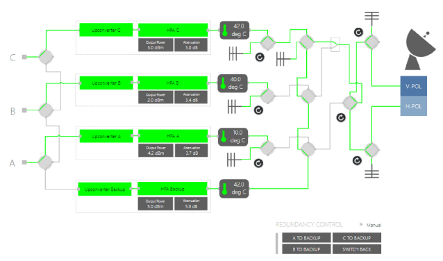

# DataMiner Connectivity Framework

The DataMiner Connectivity Framework (DCF) was introduced in DataMiner 8.0 and standardizes the way device connectivity is provisioned and managed within DataMiner.

DCF makes it possible to set up element connectivity, allowing the visualization (and modification) of signal paths throughout an infrastructure.

The connections are then typically visualized in a Visio drawing.

In this section:

- <xref:AdvancedDcfInterfacesAndConnections>
- <xref:AdvancedDcfDefiningInterfaces>
- <xref:AdvancedDcfMatrices>
- <xref:AdvancedDcfTables>
- <xref:AdvancedDcfDataMinerClassLibrary>
- <xref:AdvancedDcfHelper>
- <xref:AdvancedDcfBestPractices>
