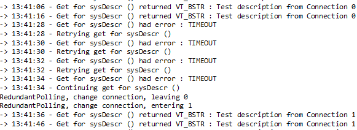

# Redundant polling

It is possible to create an element that is configured with a redundant connection. When the primary connection is no longer responding (i.e. a timeout occurs on this connection), DataMiner will automatically switch to the secondary connection (and vice versa).

In the protocol, you need to define the 2 connections and specify that redundant polling has to be used:

```xml
<Type communicationOptions="redundantPolling" relativeTimers="true" advanced="snmp:Secondary">snmp</Type>
```

The option "redundantPolling" in the communicationOptions attribute is required to activate the redundant polling mechanism.

> [!NOTE]
> Redundant polling is supported with protocols that define exactly two connections of the same type. The following is supported: two SNMP, two serial, two smart-serial or two HTTP connections.
>
> Note that for smart-serial connections, in order to get a timeout (enabling the redundant polling connections to switch) the pair must contain a response. Alternatively, you can implement logic to set the communication state using the <xref:NT_CHANGE_COMMUNICATION_STATE> Notify call.

## Switching implementation

This section describes the situations which would trigger Dataminer to switch between polling interfaces during an element's runtime.

### On timeout after retries of a single group

When a polling for a group goes into timeout, Dataminer would retry polling that group on the same connection. The wait time for a timeout to be called and the number of retries are based on the configurations in the element settings. After all retries are exhausted, Dataminer would switch to the other interface and poll for the *next* group in the queue.




> [!NOTE]
> During an interface switch the element will *not* go into timeout. It will only do so when both interfaces are inaccessible and no data has been retrieved for an extended period of time as defined in the element settings.


### On polling invalid parameters

#### SNMP

If the SNMP parameter polled returns an error such as *NO SUCH NAME*, Dataminer would trigger the switching of polling interfaces and poll the next group in the queue. In such corner cases Dataminer would switch back and forth between interfaces depending on how frequently these invalid parameters are being polled.

## Other Polling Scenarios
### SNMP
#### Polling specific interfaces using the [ipid attribute](xref:Protocol.Params.Param.SNMP.OID-ipid)
Switching of interfaces is **triggered** on *timeout after retries on that specific group/parameter*. After which, Dataminer will proceed to poll for the next group in the queue.
#### On [SNMP Get through QActions - NT Notify Type 295](xref:NT_SNMP_GET)
Switching of interfaces is **not triggered**.
#### Polling specific interfaces through the [connection attribute in a Group](xref:Protocol.Groups.Group-connection)
Switching of interfaces is **not triggered**. When the group goes into timeout on a specific connection, Dataminer will retry polling the group until all retries are exhausted. After which, Dataminer will proceed to poll for the next group in the queue.

## See also

DataMiner Protocol Markup Language:

- [Protocol.Type@communicationOptions: redundantPolling](xref:Protocol.Type-communicationOptions#redundantpolling)
