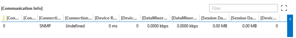

# Bit rate calculations

DataMiner communicates with devices asynchronously. This makes it difficult to accurately calculate bit rates in a QAction. In a protocol, however, you can access raw communication cycle information (including a collection of exact timestamps). This allows bit rates to be calculated even more accurately.

> [!NOTE]
>
> - The extra communication cycle information is only available for SNMP devices.
> - An example protocol "SLC SDF Rates - SNMP" is available in the [Protocol Development Guide Companion Files](https://community.dataminer.services/documentation/protocol-development-guide-companion-files/).

## Counters tracked by SLSNMPManager

SNMP communication from the SLProtocol process to the SLSNMPManager process is initiated by triggering a group. A group can contain a list of OIDs or a table. Per group, SLSNMPManager tracks a number of counters, and then forwards all counter information to the SLProtocol process.

The following table gives an overview of the counters tracked in the SLSNMPManager process:

|Idx|Counter|Type|Description|
|--- |--- |--- |--- |
|0|dwStartManagerTime|int|When the request enters SLSNMPManager|
|1|dwStopManagerTime|int|When the request leaves SLSNMPManager|
|2|dwSNMPStartTime|int|When the first SNMP request was sent|
|3|dwSNMPLastReceivedTime|int|When the last SNMP packet was received|
|4|dwAvgMsgDelay|uint|Average RTT* between packets|
|5|dwMinMsgDelay|uint|Min RTT* between Send/Response|
|6|dwMaxMsgDelay|uint|Max RTT* between Send/Response|
|7|dwIteration|uint|Number of device iterations|
|8|dwSendDataSize|uint|Number of bytes sent|
|9|dwReceivedDataSize|uint|Number of bytes received|
|10|dwTotalSNMPRTT|uint|Total RTT* of SNMP packets|
|11|dwTimeoutCount|uint|Total number of timeouts|

\* RTT = Round-trip Time

## How counters are stored

The SLProtocol process stores the counter information received from the SLSNMPManager process.

The SLProtocol process does the following:

- It keeps counter information per connection. (If the protocol connects to more than one SNMP device, there will be counter information for each device to which the protocol connects.)
  
  By default, this counter information can be found on the General Parameters page of the element. See Figure 60.



- It keeps counter information per group.

## Retrieving the delta between two consecutive group executions (in ms) from within a QAction

((currentSnmpStartTime+currentSnmpEndTime)/2) - ((previousSnmpStart-Time+previousSnmpEndTime)/2)

> [!NOTE]
> At the time the group is executed, the delta value is -1.

Example:

```csharp
Int32 delta = Convert.ToInt32(protocol.NotifyProtocol(269/*NT_GET_BITRATE_DELTA*/, 1500, null));

protocol.Log(8, 5, string.Format("Delta on group 1500:{0}", delta));
```

## Retrieving the raw counter information of the last two iterations from within a QAction

```csharp
object[] rawData = (object[])protocol.NotifyProtocol(270/*NT_GET_BITRATE_DATA*/, 1500, null);
object[] previousData = (object[])rawData[0];
protocol.Log(8, 5, String.Format(
@"
Previous raw data:
Ticks when request enters SLSNMPManager: {0} ms
Ticks when request leaves SLSNMPManager: {1} ms
Ticks when first SNMP Request is sent: {2} ms
Ticks when last SNMP Response is received: {3} ms
Avg RTT between packets: {4} ms
Min RTT between packets: {5} ms
Max RTT between packets: {6} ms
Number of iterations: {7}
Bytes sent: {8} B
Bytes received: {9} B
Total RTT: {10} ms
Number of timeouts: {11}
", previousData[0], previousData[1], previousData[2],
previousData[3], previousData[4], previousData[5],
previousData[6], previousData[7], previousData[8],
previousData[9], previousData[10], previousData[11]
));

object[] currentData = (object[])rawData[1];

protocol.Log(8, 5, String.Format(
@"
Current raw data:
Ticks when request enters SLSNMPManager: {0} ms
Ticks when request leaves SLSNMPManager: {1} ms
Ticks when first SNMP Request is sent: {2} ms
Ticks when last SNMP Response is received: {3} ms
Avg RTT between packets: {4} ms
Min RTT between packets: {5} ms
Max RTT between packets: {6} ms
Number of iterations: {7}
Bytes sent: {8} B
Bytes received: {9} B
Total RTT: {10} ms
Number of timeouts: {11}
", currentData[0], currentData[1], currentData[2],
currentData[3], currentData[4], currentData[5],
currentData[6], currentData[7], currentData[8],
currentData[9], currentData[10], currentData[11]
));
```

## Rate calculations in SNMP connectors

We recommend using the [Skyline.DataMiner.Utils.SNMP](https://www.nuget.org/packages/Skyline.DataMiner.Utils.SNMP), [Skyline.DataMiner.Utils.Rates.Protocol](https://www.nuget.org/packages/Skyline.DataMiner.Utils.Rates.Protocol), and [Skyline.DataMiner.Utils.SafeConverters](https://www.nuget.org/packages/Skyline.DataMiner.Utils.SafeConverters) NuGet packages, which support the calculation of rate values in SNMP connectors. For more information on available classes, methods, etc., refer to Skyline.DataMiner.Utils.Rates.Protocol namespace.

- Calculated rate is provided in bps or counter unit per second using the following formula.
  - (current counter value - previous counter value) / delta
  - To define whether a conversion for bps needs to happen, define the DataConversionType in the RateCalculator constructor.
- The rate at which values are updated/calculated depends entirely on the polling strategy used in the driver and defined via timers. An SNMP group can be retrieved every 5 seconds, 5 minutes or every 1 hour, etc.
- The delta used in the rate calculation should be the time between group executions and e.g. not obtained manually in a QAction using DateTime.
  - The GetSnmpGroupExecutionDelta method is available to obtain the delta between executions of a SNMP Poll Group. See RateCalculator.GetSnmpGroupExecutionDelta method.
  - The delta retrieval between groups by default does not take into account if a timeout happened on a group and therefore could not update its values.
  - The TimeoutOrError method should be used to make sure delta values are buffered in event of a timeout, to guarantee a correct delta will be used once data retrieval is successful again. See RateCalculator.TimeoutOrError method
- The CalculateAndSetTable method takes the following conditions into account.
  - In the event an SNMP agent restart causes counters to be reset, the exception value N/A (-1) is returned as Rate value.
  - Support for Counter32 and Counter64 values. The decision on which type is used is based on selecting the SpeedType.Low or SpeedType.High enum value in the RateCalculator constructor.

    It is recommended to base this selection on the interface speed when possible.

    - \>20Mbps => Counter64 (when available)
    - <20Mbps => Counter32

    e.g. Selection of IF table or IFX table in MiB2.

  - Counters may wrap around, and a correct rate value will still be calculated.
  - It is important to make sure the method is triggered in event no change occurred on the counters in order to obtain a rate value of zero.
  - In the event there is discontinuity occurrence on an interface, this can be taken into account using the Discontinuity property of the RateCalculator class. In the presence of a discontinuity, Exceptional value -2 will be returned as Rate value.
