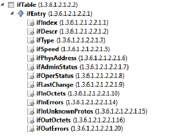

# Exercise

1. Create a protocol that retrieves the following OIDs (RFC1213-MIB):

    - sysDescr (1.3.6.1.2.1.1.1.0)
    - sysObjectID (1.3.6.1.2.1.1.2.0)
    - sysUptime (1.3.6.1.2.1.1.3.0)
    - sysContact (1.3.6.1.2.1.1.4.0)
    - sysName (1.3.6.1.2.1.1.5.0)
    - sysLocation (1.3.6.1.2.1.1.6.0)
    - sysService (1.3.6.1.2.1.1.7.0)

    > [!NOTE]
    > For more information on how system uptime can be displayed in Time Format, see [Protocol.Params.Param.Measurement.Type](xref:Protocol.Params.Param.Measurement.Type) and [Protocol.Params.Param.Interprete.Sequence](xref:Protocol.Params.Param.Interprete.Sequence).

1. Alter the "sysContact" (OID 1.3.6.1.2.1.1.4.0) variable via SNMP and check the result.
1. Create a protocol that polls the following columns of the interface table ("ifTable", OID "1.3.6.1.2.1.2.2" defined in IF-MIB (RFC 2863)) using the different table retrieval methods described previously.

