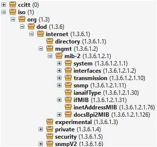
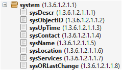
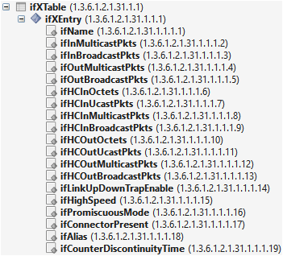
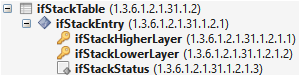

# OIDs

An object identifier (OID) is a unique identifier used to reference variables exposed by an SNMP device.
For example, `1.3.6.1.2.1.1.1.0` is an OID.
Each number in the sequence represents a node in a hierarchical tree structure.
A MIB (Management Information Base) defines OIDs and the data they represent.
MIBs can be explored using tool like [DIS MIB Browser](xref:DisMibBrowserToolWindow) or [ManageEngine MIB Browser](xref:ManageEngine_MIB_Browser).

The upper levels in the hierarchy groups different scopes of authority or organizations together.
A commonly used subtree is `1.3.6.1.2` which contains objects related to network management standards developed by the 
IETF (Internet Engineering Task Force) such as system information and network interfaces.
Another commonly used subtree is `1.3.6.1.4.1` which is reserved for organizations to define their own objects for proprietary or custom device management purposes. 
For example, `1.3.6.1.4.1.8813` is reserved by Skyline Communications to allow the monitoring of a DataMiner agent via SNMP.

> [!NOTE]
> For detailed information about the contents of the default DataMiner notifications,
> see [DataMiner SNMP notification definition](xref:Default_DataMiner_notification).

This OID subtree also hosts protocol specific branches to monitor and control DataMiner elements.

> [!TIP]
> See: [Generating a protocol-specific MIB](xref:Advanced_protocol_functionality#generating-a-protocol-specific-mib)

## OIDs for Scalar Variables

In the context of SNMP, a "scalar" is a type of variable that holds a single value.
When working with scalar variables,
there are specific conventions for OIDs that are important to understand.

### Base OID

The base OID represents the identifier for a scalar object but does not specify an instance or value.
It is used to identify the object within the MIB.

Example: `1.3.6.1.2.1.1.1` is the base OID for the sysDescr object.
This OID identifies the sysDescr object but does not refer to its specific value.

### Instance OID

To access the actual value of a scalar variable, .0 is appended to the base OID.
This appended OID, known as the instance OID, specifies the single instance of the scalar variable.

Example: `1.3.6.1.2.1.1.1.0` is the instance OID for the sysDescr object.
This OID accesses the value of the sysDescr scalar variable.

> [!IMPORTANT]
> A connector must use Instance OIDs to poll a scalar variable.
> See [Retrieving a variable](xref:ConnectionsSnmpRetrievingAVariable).
> Specifying a base OID will not work and will result in `Get xxx had error : NO SUCH NAME` being shown in the
> [Stream Viewer](xref:Connecting_to_an_element_using_Stream_Viewer).

## OIDs for Tabular Variables

Tables in SNMP provide a structured way to group and represent multiple instances of similar objects,
such as network interface statistics, routing tables, or device configurations.
The following sections will explain the OID structure for tables.

### Table OID

The Table OID identifies the entire table.
This OID does not specify individual rows or columns but represents the table as a whole.

Example: `1.3.6.1.2.1.2.2` is the Table OID for the ifTable object.
This OID signifies the entire interface table but does not specify any particular entry or column.

### Entry OID

The Entry OID serves as a conceptual placeholder for the rows within the table.
It is used to identify the structure of entries (rows) in the table without pointing to a specific row.

Example: `1.3.6.1.2.1.2.2.1` is the Entry OID for the ifTable. This OID represents the rows in the table,
defining the structure but not specifying individual entries.

### Column OID

Column OIDs identify specific columns within a table.

Example:
`1.3.6.1.2.1.2.2.1.1` refers to the ifIndex column in the ifTable,
which represents the index of each interface,
while `1.3.6.1.2.1.2.2.1.2` refers to the ifDescr column in the ifTable,
which contains the descriptions of the interfaces.

### Instance OID

To access a specific cell within a table, you combine the Column OID with the row index.
This specifies a particular attribute of a specific entry.

Example: `1.3.6.1.2.1.2.2.1.2.9` refers to the value in the ifDescr column for the interface with index 9.

> [!IMPORTANT]
> A connector must use Table OIDs and Column OIDs to poll a table.
> See [Retrieving tables](xref:ConnectionsSnmpRetrievingTables).
> Individual cell values can still be polled using Instance OIDs in case you are only interested in a few specific cells.

## Table Row Indexing

Tables in SNMP can define row indexes in various ways,
each suited to different data structures and needs.
These can involve single keys, external references, multiple key combinations, or can different data types than integer.

### Single Key Column

When a table has one key column, each row is uniquely identified by the value of this key column.
This value is appended to the base OID of the table to access a specific row.

Example: In the ifTable (interfaces table), the key is the interface id.  
IfAdminStatus Column OID: `1.3.6.1.2.1.2.2.1.7`  
First interface Instance OID: `1.3.6.1.2.1.2.2.1.7.1`  
Second interface Instance OID: `1.3.6.1.2.1.2.2.1.7.2`

### External Key Columns

Sometimes, the index for a table is derived from a key column in another table. The table will have the same number of
rows and use the same row indexes. Notice the missing key icon in the image below.

Example, ifXTable uses ifIndex from ifTable as the index:

### Multiple Key Columns

Some tables might have multiple key columns, where a combination of values uniquely identifies each row.
These values are concatenated to form the index. Notice the two key icons in the image below.

Example, ifStackTable uses both ifStackHigherLayer and ifStackLowerLayer column as key:  
ifStackStatusColumn OID: `1.3.6.1.2.1.31.1.2.1.3`  
Layer 3 and Layer 1 Instance OID : `1.3.6.1.2.1.31.1.2.1.3.3.1`  
Layer 4 and Layer 2 Instance OID : `1.3.6.1.2.1.31.1.2.1.3.4.2`

> [!TIP]
> To retrieve the concatenated row index as the first column,
> See [instance option](xref:ConnectionsSnmpRetrievingTables#instance-option).

### Indexing with Different Data Types

When a table index is based on a data type other than an integer, such as binary data or complex types,
the binary value is often directly used or encoded in a specific way to build the OID.

For example, if the index is represented by an octetstring, each byte of the value is included in the OID sequence.
This ensures that the index can uniquely identify each row in the table, regardless of the data type.

Example index "eth0":  
Column OID: `1.3.6.1.2.1.31.1.2.1.3`  
Instance OID: `1.3.6.1.2.1.31.1.2.1.3.101.116.104.48`