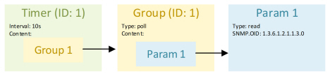
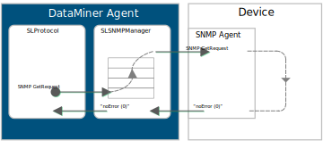

# Retrieving a variable

Once the protocol defines a SNMP connection, logic can be implemented in the protocol to communicate with a device via SNMP. This section describes what needs to be implemented in a protocol to periodically retrieve a variable exposed by the MIB from the SNMP Agent running on a device via SNMP.

First, a parameter must be defined in the protocol that will hold the received value.

```xml
<Param id="1" trending="false">
   <Name>sysUptime</Name>
   <Description>System Uptime</Description>
   <Information>
      <Text>System Uptime</Text>
      <Subtext>Displays the time since the network management portion of the system was last re-initialized.</Subtext>
      <Includes>
         <Include>range</Include>
         <Include>units</Include>
         <Include>steps</Include>
         <Include>time</Include>
      </Includes>
   </Information>
   <Type>read</Type>
   <Interprete>
      <RawType>numeric text</RawType>
      <LengthType>next param</LengthType>
      <Type>double</Type>
      <Sequence noset="true">div:100</Sequence>
   </Interprete>
   <SNMP>
      <Enabled>true</Enabled>
      <OID type="complete">1.3.6.1.2.1.1.3.0</OID>
      <Type>timeticks</Type>
   </SNMP>
   <Measurement>
      <Type options="time">number</Type>
   </Measurement>
</Param>
```

The parameter with ID 1 represents the variable that needs to be retrieved. Note the SNMP tag that is part of the parameter definition. The OID child tag of the SNMP tag defines the OID to be retrieved. In this example, a scalar object is retrieved.

> [!NOTE]
>
> - For more information about the meaning of all tags and attributes, see [Protocol.Params.Param](xref:Protocol.Params.Param).
> - An example protocol "SLC SDF SNMP - Stand Alone" is available in the [Protocol Development Guide Companion Files](https://community.dataminer.services/documentation/protocol-development-guide-companion-files/).

Next, a group is defined which has the defined parameter as content.

```xml
<Group id="1">
   <Name>System Uptime</Name>
   <Description>System Uptime</Description>
   <Content>
      <Param>1</Param>
   </Content>
</Group>
```

Finally, a timer is defined which has the defined group as its content. This timer will periodically (every 10 seconds) add group 1 to the group execution queue of the main protocol thread.

```xml
<Timer id="1">
  <Name>Fast timer</Name>
  <Time>10000</Time>
  <Interval>75</Interval>
  <Content>
     <Group>1</Group>
  </Content>
</Timer>
```

In conclusion, periodically polling an SNMP parameter can be implemented using the following protocol building blocks:



The following illustration shows what happens when an SNMP GET request is issued by a protocol.



When a protocol issues an SNMP request (a Get request in this case), the SLProtocol process sends this request to the SLSNMPManager process. This is done by a blocking call, which adds the SNMP request to a queue. The call blocks until the SNMP request has been added to the queue.

After all other requests that preceded this request in the queue have been handled, the SLSNMPManager process will send the SNMP request to the SNMP agent running on the device.

It is important to note that this queue is a priority queue. An SNMP Set request will always receive a higher priority than SNMP Get requests (e.g. get request, get next request). Therefore, SNMP Get requests will only be processed by the SLSNMPManager once no SNMP Set requests are present on the queue.