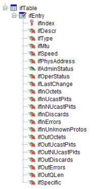
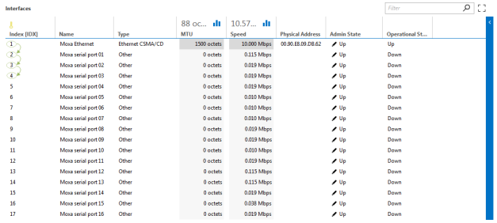
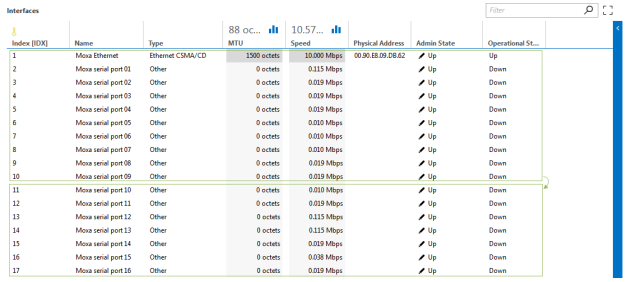
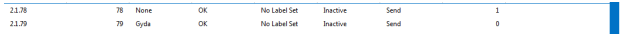

# Retrieving tables

Tables in a MIB are structured as illustrated below. There is always a table folder, followed by an entry folder containing the column parameters.



In a protocol, a table is implemented using a parameter representing the table (of type "array") and additional parameters for each column in the table. Depending on the table retrieval method (discussed in Retrieval methods), SNMP tags need to be provided for the table parameter and/or the column parameters.

## Retrieval methods

Multiple methods are available for retrieving tables via SNMP in a protocol. The following sections describe the different available methods:

- GetNext
- GetNext + MultipleGet
- GetNext + MultipleGet by row
- MultipleGetNext
- MultipleGetBulk
- Comparison

> [!NOTE]
> The Protocol Development Guide Companion Files include the following [Wireshark](xref:Wireshark) captures to help understand the different retrieval methods:
>
> - GetNext.pcap
> - GetNext+MultipleGet.pcap
> - MultipleGetNext.pcap
> - MultipleGetBulk.pcap
> - MultipleGetBulkMaxRep2.pcap.
> - Additionally, the companion files also include example protocols for each table retrieval method.
>
> An example protocol "SLC SDF SNMP - Tables" is also available in the companion files.

### GetNext

Gets the table contents, retrieving one cell at a time.



Protocol implementation:

- **Table parameter:**

  Define an SNMP tag on the Array parameter, specifying the OID.

  ```xml
  <SNMP>
      <Enabled>true</Enabled>
      <OID type="complete">1.3.6.1.2.1.2.2</OID>
  </SNMP>
  ```

- **Column parameter:**

  Define column parameters for every column defined in the MIB for this table. Do not define SNMP tags for the column parameters.

  > [!NOTE]
  > It is possible to define a table in the protocol that only contains the first columns. In the example above, the protocol table only defines column parameters for the first eight columns of the ifTable.
  >
  > Note, however, that once you include a column, all preceding columns must be included as well.
  > Note also that all columns will still be retrieved from the agent, even though these are not visualized. This is a consequence of the way tables are structured in SNMP and the GetNext operation.

  ```xml
  <SNMP>
      <Enabled>true</Enabled>
      <OID type="complete">1.3.6.1.2.1.2.2</OID>
  </SNMP>
  ```

Capture observation:

- The initial request is an SNMP get next request with the OID of ifEntry (1.3.6.1.2.1.2.2.1). This returns the content of 1.3.6.1.2.1.2.2.1.1 (first row, first column).
- Additional get next requests are performed until the OID in the response exceeds the table OID range.

### GetNext + MultipleGet

Gets the table contents, retrieving instances one by one, getting multiple values at once.


Protocol implementation:

- **Table parameter:**

  Define an SNMP tag on the Array parameter (OID value in OID tag is optional).

  ```xml
  <SNMP>
      <Enabled>true</Enabled>
      <OID type="complete" options=";instance;bulk:3"></OID>
  </SNMP>
  ```

- **Column parameter:**

  Define an SNMP tag on the column parameters, specifying the OID.

  > [!NOTE]
  > Not all columns defined in the MIB table need to be defined in the protocol.
With this approach, you can specify the columns that are of interest, so that only these columns will be retrieved.

> [!NOTE]
>
> - By default, 50 cells are retrieved in one request. In order to change this, use the "bulk" option.
> - In case the optional OID is specified in the table parameter, be aware that GetNext requests will be executed using the OID defined on the table parameter until the OID of the next column is found. In other words, GetNext requests are performed on the first SNMP column in the device.
From the GetNext responses, the values will be placed in the first column of the protocol table. The OID defined on the first column parameter will be ignored.
This means that when the OID is specified on the table parameter, the first column defined in the protocol table should correspond with the first column in the SNMP table.

Capture observation:

- Get next requests are performed to obtain the number of rows using the instance, starting with the OID of ifEntry (1.3.6.1.2.1.2.2.1). Once the number of rows is known, one or more get requests (with multiple variable bindings) are performed to obtain all the cells in the table.
- Rows can disappear while the table is being retrieved. If this happens, the retrieved table can get mixed up because the data was retrieved block by block. If a row was deleted during a retrieval process, it is possible that, for example, the first block contains 5 rows, while the second block only contains 4 rows.

### GetNext + MultipleGet by Row

From DataMiner 10.1.10 (RN 30780) onwards, it is possible to retrieve the values by row instead of by column.

In other words, this scheme will first poll the instances (if they have not been provided) and will then poll the data row by row.

To use this new polling scheme, add "multipleGet" to the SNMP options of the SNMP table to be polled.

- If you specify the "multipleGet" keyword without additional arguments, by default 10 rows will be polled in a single run. See the following example:
  
  ```xml
  <SNMP>
      <Enabled>true</Enabled>
      <OID type="complete" options="instance;multipleGet">1.3.6.1.4.1.34086.2.2.17.5.1</OID>
  </SNMP>
  ```
  
- If you want to have a specific number of rows polled in a single run, you can specify the "multipleGet" keyword followed by a colon (":") and the number of rows to be polled in a single run. In the following example, 5 rows will be polled in a single run:
  
  ```xml
  <SNMP>
    <Enabled>true</Enabled>
    <OID type="complete" options="instance;multipleGet:5">1.3.6.1.4.1.34086.2.2.17.5.1</OID>
  </SNMP>
  ```

> [!NOTE]
>
> - The multipleGet option cannot be used together with the multipleGetNext, multipleGetBulk and bulk options.
> - The multipleGet keyword can be used together with options like Subtable.
> - The notify protocol command NT_GET_BITRATE_DELTA, which can be launched from within a QAction, was expanded in DataMiner version 10.1.6 to be able to retrieve the delta times per row when polling an SNMP table. From DataMiner 10.1.10 onwards, this functionality also works in conjunction with this multipleGet option.

### MultipleGetNext

Gets the table contents, retrieving rows one by one.


Protocol implementation:

- **Table parameter:**

  Define an SNMP tag on the table parameter (OID value in OID tag is optional). Use the “multipleGetNext” option (options=";multipleGetNext").

  ```xml
  <SNMP>
      <Enabled>true</Enabled>
      <OID type="complete" options=";multipleGetNext"></OID>
  </SNMP>
  ```

- **Column parameter:**

  Define an SNMP tag on the column parameters, specifying the OID.

  > [!NOTE]
  > Not all columns defined in the MIB need to be defined in the protocol.

Capture observation:

- Get next requests are performed (where the variable bindings in the request correspond with all the columns defined in the protocol table) until all rows are retrieved. One row is retrieved at a time.
- Note that using this method no data will be missing.

### MultipleGetBulk

Gets the table contents, retrieving multiple rows at once.



Protocol implementation:

- **Table parameter:**

  Define an SNMP tag on the Array parameter (OID value in OID tag is optional). Use the “multipleGetBulk” option (options=";multipleGetBulk").

  ```xml
  <SNMP>
    <Enabled>true</Enabled>
    <OID type="complete" options=";multipleGetBulk:10"></OID>
  </SNMP>
  ```

- **Column parameter:**

  Define an SNMP tag on the column parameters providing the OID.
  
  ```xml
  <SNMP>
    <Enabled>true</Enabled>
    <OID type="complete">1.3.6.1.2.1.2.2.1.2</OID>
    <Type>octetstring</Type>
  </SNMP>
  ```
  
  > [!NOTE]
  > Not all columns defined in the MIB need to be defined in the protocol.

> [!NOTE]
>
> - The default number of rows that is retrieved in one request is 10.
> - The get bulk request was introduced in SNMPv2. Therefore, this method cannot be used for devices that only support SNMPv1.

Capture observation:

- Get bulk requests are performed until all data is retrieved.
- The max-repetitions field indicates how many rows will be retrieved per request. In DataMiner, you can define this field by specifying a number after the "multipleGetBulk" option. E.g multipleGetBulk:5.  

### Comparison

|Method|Advantage|Disadvantage|
|--- |--- |--- |
|GetNext|Works on any device SNMPv1|Slow, requests 1 cell at a time|
|GetNext+MultipleGetNext|Faster, for specific columns, Subtables, SNMPv1|If empty cells rest is incorrect, MultipleGet must be supported|
|MultipleGetNext|Faster, for specific columns,SNMPv1|MultipleGet must be supported|
|MultipleGetBulk|Faster, for specific columns|Needs SNMPv2,Not to be used with small tables,MultipleGet must be supported|

## Subtable

A filtered set of rows can be retrieved using the [subtable](xref:Protocol.Params.Param.SNMP.OID-options#subtable) option (options=";subtable") on the SNMP.OID tag of a table parameter (i.e. a table of type "array"). Even though the result is a filtered set of rows, queries are sent to the device until the filter matches. DataMiner retrieves the instances of the table until the filtered data is retrieved. Only the filtered data will be displayed.

The subtable option only works with the "GetNext+MultipleGet" method. Multiple filters can be used, separated by a comma. The filter is defined in the parameter referenced by the id attribute on the SNMP OID of the array.

> [!NOTE]
> Take care when using the subtable option in combination with the instance option: this will result is the instance being returned twice. Therefore, provide 2 columns instead of 1 for the instance. When you retrieve the table without the instance option, you need to create your first column twice, as otherwise the first column will be overwritten by the instance.

## Filtered set of rows in table using dynamic OID

Another way to retrieve a filtered set of rows is by defining a dynamic OID on the columns (i.e. defining a wildcard ('*') in the OID itself and referencing the filter with the id attribute). No options need to be defined.

The advantage of this method is that only requests are sent to the device matching the desired rows.

For example, suppose the instances of a table are 1.1; 1.2; 1.3; 2.1, 2.2, 2.3 etc. and a filter of 1 is used, then only the instances that start with 1 will be retrieved. The new instances are then 1, 2 and 3.

In the example below, table 1100 will retrieve a filtered set of rows for the column OID 1.2.3.4.* ,where the asterisk is replaced by the content of parameter with ID 1.

```xml
<Param id="1100" trending="false">
  <Name>PortListTable</Name>
  <Description>Port List</Description>
  <Information>
     <Text>Port List</Text>
     <Subtext>This shows Information about the Ports on this Device.</Subtext>
  </Information>
  <Type>array</Type>
  <ArrayOptions index="0">
     <ColumnOption idx="0" pid="1101" type="snmp" options=""/>
     <ColumnOption idx="1" pid="1102" type="snmp" options=""/>
  </ArrayOptions>
   <Interprete>
      <RawType>other</RawType>
      <LengthType>next param</LengthType>
      <Type>double</Type>
   </Interprete>
   <SNMP>
      <Enabled>true</Enabled>
     <OID type="complete" options="instance"></OID>
  </SNMP>
</Param>
<Param id="1101" trending="false">
  <Name>Port Index</Name>
  <Description>Port Index</Description>
  <Type>read</Type>
   <Interprete>
      <RawType>other</RawType>
      <LengthType>next param</LengthType>
      <Type>string</Type>
   </Interprete>
</Param>
<Param id="1102" trending="false">
  <Name>Port Type</Name>
  <Description>Port Type</Description>
  <Type>read</Type>
  <SNMP>
     <Enabled>true</Enabled>
     <OID type="complete" id="1">1.2.3.4.*</OID>
  </SNMP>
  <Information>
     <Text>Port Type</Text>
     <Subtext>Port Type</Subtext>
     <Includes>
        <Include>range</Include>
        <Include>units</Include>
        <Include>steps</Include>
        <Include>time</Include>
     </Includes>
  </Information>
  <Interprete>
     <RawType>numeric text</RawType>
     <LengthType>next param</LengthType>
     <Type>double</Type>
  </Interprete>
...
</Param>
```

## Instance option

Using the option "instance", the OIDs corresponding with the rows can be retrieved. This value will then be set to the first column defined in the table.

```xml
<SNMP>
  <Enabled>true</Enabled>
   <OID type="complete" options=";instance;multipleGetNext">1.3.6.1.2.1.2.2</OID>
</SNMP>
```



> [!NOTE]
> In case the instance option is used with the GetNext + MultipleGet table retrieval method, the same remark applies in case the optional OID is specified on the table parameter:
>
> GetNext requests will be executed using the OID defined on the table parameter until the OID of the next column is found. In other words, GetNext requests are performed on the first SNMP column in the device.
>
> From the GetNext responses, the instances will be placed in the first column, the values will be placed in the second column. The OID defined on the second column parameter will be ignored.
>
> This means that when the OID is specified on the table parameter, the first column defined in the protocol table should correspond with the first column in the SNMP table. The MultipleGet will be executed on the remaining items, starting on the OID defined on the third column parameter.
