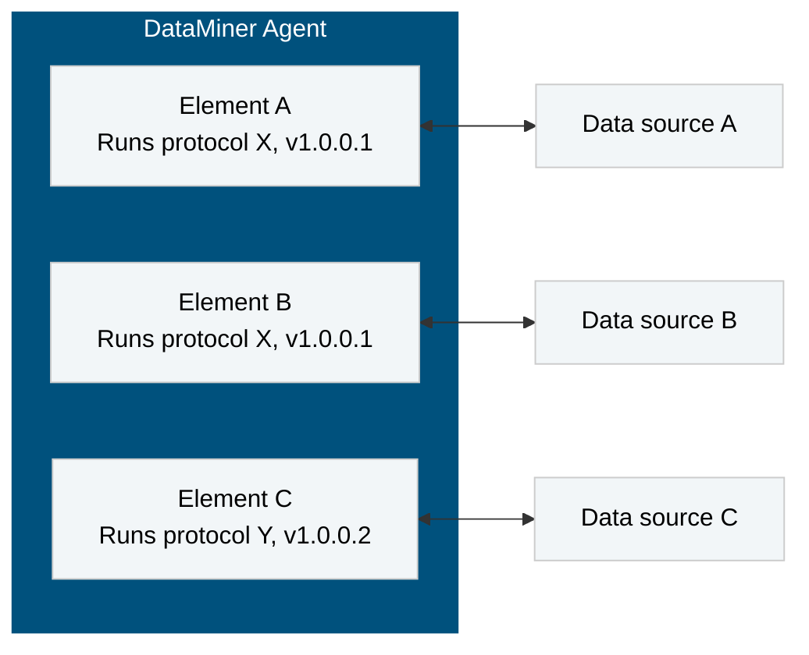

# Getting started

## About DataMiner connectors

A DataMiner connector (also referred to as a "driver" or "protocol") is an XML file containing all the information a DataMiner Agent needs to be able to communicate with a data source: instructions on how to poll the data source and display all relevant data on the user interface (i.e., DataMiner Cube element cards), default port settings, alarm thresholds, parameter labels, etc. The language used to define a protocol is referred to as the [DataMiner Protocol Markup Language (DPML)](xref:Protocol).

A DataMiner protocol can be uploaded to a DataMiner Agent, so that elements can be created that will run the protocol.

## Get to know the basics

- Overview of the available connector metadata: <xref:Metadata>
- For more information about logic-related components such as parameters, actions, triggers, and so on, see <xref:Logic>.
- For an overview of the different UI components that can be used in a DataMiner protocol, see <xref:UIComponents>.
- For an overview of the different connection types that are supported in DataMiner, see <xref:Connections>.
- To find out more on how to implement alarming and trending support in a protocol, see <xref:Monitoring>.
- To test your knowledge of DataMiner protocols or find the answers to particular questions, see <xref:QuestionsAndAnswers>.
- [Best practices](xref:CodingGuidelines)

> [!NOTE]
> As mentioned above, a protocol is an XML file. However, where possible, this guide makes abstraction of the way something is defined in DPML by providing a conceptual description. To learn more about this markup language, see [DataMiner Protocol Markup Language](xref:Protocol).

## Discover data source integrations

- [Connections](xref:Connections)
- [DataMiner Connector Integration: HTTP Basics (online course)](https://community.dataminer.services/courses/dataminer-connector-integration-http-basics/)

## More on advanced integrations

- [Advanced functionality](xref:AdvancedFunctionality)

## Discover the full list of available features

- [DataMiner Protocol Markup Language](xref:Protocol)
- [DataMiner Class Library](xref:ApiDocumentation)

## Using DataMiner connectors in a DataMiner System

When you have created or updated a DataMiner protocol, it first needs to be uploaded to a DataMiner Agent,
which will then automatically copy it to each of its peers in the DataMiner System it belongs to. You can then
start creating elements that will use that protocol.

- For more information on how to upload a protocol, refer to <xref:Adding_a_protocol_or_protocol_version_to_your_DataMiner_System>.
- For more information on how to create an element, refer to <xref:Adding_elements>.
