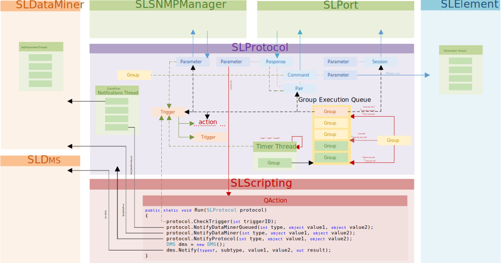

# Overview

To summarize, the following figure illustrates the interaction between the different protocol components in the SLProtocol process.

The main component in the main execution thread of the SLProtocol process is the group execution queue. Groups get added to this queue either by a timer (in which case the groups are added to the end of the queue) or via an action (In this case, the place where the group is added to the queue depends on the selected action). Actions are indicated by means of a red line in the figure.

Groups present in the queue are processed as soon as they arrive at the front of the queue. A group can either contain one or more parameters, pairs, sessions, triggers or actions. This is indicated by a dashed black line in the figure. Each item in the group is executed sequentially.

See also: [Groups](xref:LogicGroups)

In case the item from the group to be executed is a Pair (serial, smart-serial) or a Session (HTTP), interaction with the SLPort process is initiated. In case the item from the group is a parameter, interaction with the SLSNMPManager is initiated (note that this is intended for parameters that will poll data via SNMP). In case the item from the group is an action, the specified action is executed. Finally, in case the item from the group is a trigger, the trigger is executed. A trigger either triggers another trigger or an action.

An action is executed because it is referred to by a trigger or because it is part of the content of a group being executed.

A trigger gets executed because it is triggered by a specified parameter, command, response, pair, group, timer or protocol. A trigger can also be forced to execute from a Quick Action (using the CheckTrigger method of the SLProtocol interface), by another trigger, or because it is part of a group being executed. This is indicated by a green dashed line.

## See also

- [Triggers](xref:LogicTriggers)
