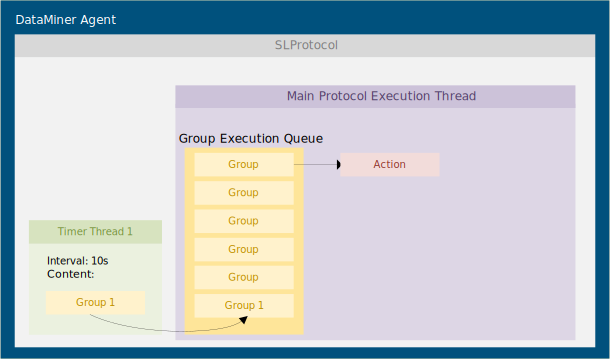
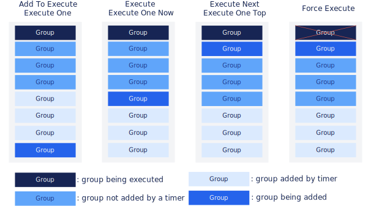
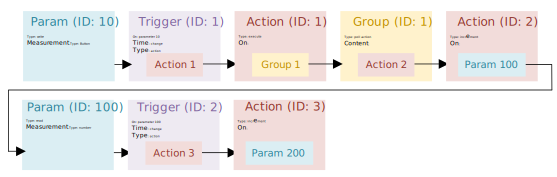
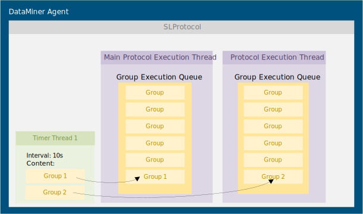
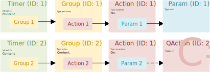

# SLProtocol

The SLProtocol process is responsible for executing the logic defined in the protocol. By default, five SLProtocol processes are running simultaneously and the elements of the DataMiner Agent are spread over these processes at startup.

> [!NOTE]
> The number of simultaneously running SLProtocol processes on a DataMiner Agent can be customized. For more information, refer to [Setting the number of simultaneously running SLPort processes](xref:Configuration_of_DataMiner_processes#setting-the-number-of-simultaneously-running-slport-processes).

For each element that is managed by an SLProtocol process, the process contains the following threads:

- a main protocol execution thread ("ProtocolThread").
- a number of timer threads (one for each defined timer in the protocol) ("TimerThread").

## Timer threads

Each timer defined in a protocol introduces an additional timer thread. The timer thread is responsible for making sure that the groups referred to by the timer are processed.

Groups of type "poll", "poll action" or "poll trigger" (sometimes referred to as "poll groups") will be added to the so-called group execution queue of the main protocol execution thread (see [Main protocol execution thread](xref:InnerWorkingsSLProtocol#main-protocol-execution-thread)).

As mentioned in [Read, write, fixed and dummy parameters](xref:LogicParameters#read-write-fixed-and-dummy-parameters), groups of type "action" or "trigger" will be executed by the initiating thread. In this case, this means that these types of groups will be handled by the timer thread.

## Main protocol execution thread

The main protocol execution thread maintains a group execution queue and is responsible for processing groups from this queue. It is important to note that the group execution queue is a priority queue. This means that when a group is added to the queue, the priority given to this group determines where it will be inserted in the queue. A queued group travels through the queue until it reaches the front. At this point, the group gets executed.

Poll groups of a timer are always added to the end of the queue as illustrated in the following diagram:



> [!NOTE]
> These groups will only be added to the queue in case the queue does not already contain this group.

Timers are not the only way to add groups to the group execution queue. Multiple types of actions have been defined for adding groups to the group execution queue. The following table provides an overview of the different actions defined for adding groups to the group execution queue.

|Type  |Result  |
|---------|---------|
|Add to execute     |Adds the specified group or groups to the very end of the group execution queue.         |
|Execute     |Adds the specified group or groups to the group execution queue, after the last group in the queue that was not added by a timer, but before groups that were added by a timer.         |
|Execute next     |Adds the specified group or groups at the beginning of the group execution queue, right after the group that is currently being executed.         |
|Execute one     |Checks if the specified group or groups are present on the queue. If present, nothing will happen. If not present, the group is added to the group execution queue at the very end, after groups that were added by a timer.         |
|Execute one top     |Checks if the specified group or groups are present on the queue. If present, nothing will happen. If not present, the group is added at the beginning of the group execution queue, right after the group that is currently being executed.         |
|Execute one now     |Checks if the specified group or groups are present on the queue. If present, nothing will happen. If not present, the group is added to the group execution queue, after the last group that was not added by a timer, but before groups that were added by a timer.         |
|Force Execute     |Force execute will make sure the group is executed as soon as possible. The ongoing item (Action, Pair, Param, Session, or Trigger) of the ongoing group will finish, then the group you want to "force execute" will be executed, and then the remaining items of the previously ongoing group will be executed.        |

The following figure illustrates the resulting location of the added group based on the selected action type.



The action types "execute one", "execute one now", and "execute one top" correspond to "add to execute", "execute", and "execute next", respectively. The only difference is that when "execute one", "execute one now", and "execute one top" are used, the group will only get added to the queue in case the group is not already present in the queue (i.e. the group should only be present in the queue once; hence the word "one" in the name of the action types). In the figure above, it is assumed that the group being added is not already present in the queue.

A group that is being executed by the protocol thread is not taken into account when verifying if a group is present in the queue, because before a group is executed, it is taken from the queue. This could lead to unwanted behavior when you use e.g. Execute One Top to obtain that a group is only executed once but the action is triggered multiple times in a short time span.

## Item Execution

A group travels through the queue and is processed once it reaches the front of the queue. After the group is processed, the next group in the queue will be processed (if present).

The processing of a group is considered finished as soon as all items in the group are processed. The processing of an item in a group is considered finished as soon as the item and all its linked items are processed.

For example, consider the following functionality being implemented in a protocol. When a button is pressed (parameter with ID 10), a trigger triggers containing an action to add group 1 to the group execution queue. The content of group 1 is an action to increment the value of parameter 100 (named "Parameter A").

Now suppose that there is also a trigger defined in the protocol that triggers on a value change of parameter 100 (the incremented parameter), which in turn initiates another action to increment parameter 200 (named "Parameter B"). The trigger and action are considered linked to the group item and therefore must complete before the processing of the group item is considered finished.



This can be seen when development logging of an element running the protocol is enabled (in this example, the initial values of parameter A and B were set to 5 and 10, respectively):

```bash
[YYYY/MM/DD HH:mm:ss.fff]|SLProtocol - [ProcessID] - [ElementName]|[ThreadID]|CGroup::Execute|DBG|6|Start executing group 1 (interval = -1) (depth=1)

[YYYY/MM/DD HH:mm:ss.fff]|SLProtocol - [ProcessID] - [ElementName]| [ThreadID]|CParameter::SetValue|DBG|2|-> Parameter A set value to VT_R8 : 6.000000 (calculated = 6.000000)

[YYYY/MM/DD HH:mm:ss.fff]|SLProtocol - [ProcessID]- [ElementName]| [ThreadID]|CParameter::SetValue|DBG|2|-> Parameter B set value to VT_R8 : 11.000000 (calculated = 11.000000)

[YYYY/MM/DD HH:mm:ss.fff]|SLProtocol - [ProcessID]- [ElementName]|[ThreadID]|CGroup::Execute|DBG|6|Finished executing group 1
```

All linked items are considered blocking. However, it is important to note that when an item gets added to a queue, this operation only blocks until the item has been added to the queue. This means that it will not be blocking until the item that was added to the queue itself was executed. For an example, refer to [SLScripting](xref:InnerWorkingsSLScripting).

## Defining multiple protocol execution threads

It is possible to define additional protocol execution threads next to the main protocol execution thread, where each additional protocol execution thread maintains a group execution queue. This can be useful, for example, to separate time-critical actions from actions related to polling a device.

Each additional protocol execution thread in a protocol is linked to a connection. This can be a real connection (e.g. SNMP, serial, etc.) or a virtual connection (for non-polling related functionality, e.g. for implementing cleanup).

On a group, it is then possible to define the connection (i.e. which protocol execution thread) this group must be executed from.

For more information on how to implement multiple protocol execution threads in a protocol, see [Multi-threading](xref:AdvancedMultiThreading).



## Executing groups by timer threads

When a timer has as content groups that are not poll groups (i.e. the group type is "trigger" or "action"), that group will be executed by the timer thread.

By letting the timer thread perform some actions while the main protocol thread is busy performing another operation (e.g. executing a QAction), multi-threaded behavior can be obtained.

For example, consider two timers, where the first timer contains a group of type "poll action" and is therefore added to the group execution queue. This group contains an action to increment a parameter value. The second timer contains a group of type "action". The action lets a QAction triggering on parameter 2 execute. The QAction will increase the value of parameter 3 every second, until it reaches 5.



The following development logging illustrates what happens:

```bash
[YYYY]/[MM]/[DD] [HH]:[MM]:32.958|SLProtocol - 11020 - [element name]|24704|CTimer::Init()|DBG|2|
Init timer 1

[YYYY]/[MM]/[DD] [HH]:[MM]:32.958|SLProtocol - 11020 - [element name]|24704|CTimer::Init()|DBG|2|
Time for Timer 1 = 5000

[YYYY]/[MM]/[DD] [HH]:[MM]:32.958|SLProtocol - 11020 - [element name]|24704|CTimer::Init()|DBG|2|
Group for Timer 1 = 1

...

[YYYY]/[MM]/[DD] [HH]:[MM]:32.958|SLProtocol - 11020 - [element name]|24704|CTimer::Init()|DBG|2|
Timer thread started (0x0000025C - 16136) (bInitial = 1, m_uiDataDisplayTime = -1, m_uiTime = 5000)

[YYYY]/[MM]/[DD] [HH]:[MM]:32.958|SLProtocol - 11020 - [element name]|24704|CTimer::Init()|DBG|2|
Init timer 2

[YYYY]/[MM]/[DD] [HH]:[MM]:32.958|SLProtocol - 11020 - [element name]|24704|CTimer::Init()|DBG|2|
Time for Timer 2 = 3600000

[YYYY]/[MM]/[DD] [HH]:[MM]:32.958|SLProtocol - 11020 - [element name]|24704|CTimer::Init()|DBG|2|
Group for Timer 2 = 2

[YYYY]/[MM]/[DD] [HH]:[MM]:32.958|SLProtocol - 11020 - [element name]|16136|TimerThread|DBG|2|
Launched Timer thread

...

[YYYY]/[MM]/[DD] [HH]:[MM]:32.958|SLProtocol - 11020 - [element name]|24704|CTimer::Init()|DBG|2|
Timer thread started (0x00000894 - 20580) (bInitial = 1, m_uiDataDisplayTime = -1, m_uiTime = 3600000)

...

[YYYY]/[MM]/[DD] [HH]:[MM]:32.958|SLProtocol - 11020 - [element name]|20580|TimerThread|DBG|2|
Launched Timer thread

...

[YYYY]/[MM]/[DD] [HH]:[MM]:32.959|SLProtocol - 11020 - [element name]|20580|TimerThread|DBG|0|-- Waiting for DataMiner to launch.

[YYYY]/[MM]/[DD] [HH]:[MM]:32.959|SLProtocol - 11020 - [element name]|20580|TimerThread|DBG|0|-- DataMiner fully launched.

...

[YYYY]/[MM]/[DD] [HH]:[MM]:33.048|SLProtocol - 11020 - [element name]|24704|CProtocol::Start|CRU|-1|
Starting Timers

...

[YYYY]/[MM]/[DD] [HH]:[MM]:33.336|SLProtocol - 11020 - [element name]|24704|CTimer::SetActive|DBG|1|
Timer 1 Activated

[YYYY]/[MM]/[DD] [HH]:[MM]:33.336|SLProtocol - 11020 - [element name]|24704|CTimer::SetActive|DBG|1|
Timer 2 Activated

[YYYY]/[MM]/[DD] [HH]:[MM]:33.336|SLProtocol - 11020 - [element name]|24704|CProtocol::StartTimers|
CRU|0|Starting protocol thread.

[YYYY]/[MM]/[DD] [HH]:[MM]:33.336|SLProtocol - 11020 - [element name]|24704|CProtocol::Start|CRU|-1|
Starting Protocol done

[YYYY]/[MM]/[DD] [HH]:[MM]:33.336|SLProtocol - 11020 - [element name]|20580|CParameter::RunQActions|
DBG|5|Find QAction 2

...

[YYYY]/[MM]/[DD] [HH]:[MM]:33.337|SLProtocol - 11020 - [element name]|20580|CParameter::RunQActions|
DBG|5|Run QAction 2

...

[YYYY]/[MM]/[DD] [HH]:[MM]:33.337|SLProtocol - 11020 - [element name]|20580|CQAction::Run|INF|2|
QAction [2] triggered by [pid=2/idx=-1/pk=/user=]

     Input: new = <NULL>

     Input: old = <NULL>

     Input: extra = <NULL>

...

[YYYY]/[MM]/[DD] [HH]:[MM]:33.337|SLProtocol - 11020 - [element name]|22764|CGroup::Execute|DBG|6|Start executing group 1 (interval = 75) (depth=1)

[YYYY]/[MM]/[DD] [HH]:[MM]:33.337|SLProtocol - 11020 - [element name]|22764|CParameter::SetValue|
DBG|2|-> ParameterSetViaAction set value to VT_R8 : 1.000000 (calculated = 1.000000)

...

[YYYY]/[MM]/[DD] [HH]:[MM]:33.345|SLElement.exe|14772|CElement::SetParameterValue|DBG|1|** Parameter 1 changed to VT_R8 : 1.000000

...

[YYYY]/[MM]/[DD] [HH]:[MM]:33.413|SLProtocol - 11020 - [element name]|22764|CGroup::Execute|DBG|6|
Finished executing group 1

[YYYY]/[MM]/[DD] [HH]:[MM]:33.413|SLProtocol - 11020 - [element name]|16136|TimerThread|DBG|6|
Last group finished.

[YYYY]/[MM]/[DD] [HH]:[MM]:34.436|SLProtocol - 11020 - [element name]|30044|CParameter::SetValue|
DBG|2|-> ParameterSetFromQAction set value to VT_R8 : 1.000000 (calculated = 1.000000)

[YYYY]/[MM]/[DD] [HH]:[MM]:34.436|SLProtocol - 11020 - [element name]|30044|CParameter::SetValue|
DBG|2|   000000  31                                               1

[YYYY]/[MM]/[DD] [HH]:[MM]:34.436|SLElement.exe|18384|CElement::SetParameterValueFunc|DBG|5|
Set for PID 3 Value = VT_R8 : 1.000000

[YYYY]/[MM]/[DD] [HH]:[MM]:34.442|SLElement.exe|14772|CElement::SetParameterValue|DBG|1|** Parameter 3 changed to VT_R8 : 1.000000

[YYYY]/[MM]/[DD] [HH]:[MM]:35.436|SLProtocol - 11020 - [element name]|30044|CParameter::SetValue|
DBG|2|-> ParameterSetFromQAction set value to VT_R8 : 2.000000 (calculated = 2.000000)

[YYYY]/[MM]/[DD] [HH]:[MM]:35.436|SLProtocol - 11020 - [element name]|30044|CParameter::SetValue|
DBG|2|   000000  32                                               2

[YYYY]/[MM]/[DD] [HH]:[MM]:35.436|SLElement.exe|18384|CElement::SetParameterValueFunc|DBG|5|Set for PID 3 Value = VT_R8 : 2.000000

[YYYY]/[MM]/[DD] [HH]:[MM]:35.450|SLElement.exe|14772|CElement::SetParameterValue|DBG|1|** Parameter 3 changed to VT_R8 : 2.000000

[YYYY]/[MM]/[DD] [HH]:[MM]:36.436|SLProtocol - 11020 - [element name]|30044|CParameter::SetValue|
DBG|2|-> ParameterSetFromQAction set value to VT_R8 : 3.000000 (calculated = 3.000000)

[YYYY]/[MM]/[DD] [HH]:[MM]:36.436|SLProtocol - 11020 - [element name]|30044|CParameter::SetValue|
DBG|2|   000000  33                                               3

[YYYY]/[MM]/[DD] [HH]:[MM]:36.436|SLElement.exe|18384|CElement::SetParameterValueFunc|DBG|5|Set for PID 3 Value = VT_R8 : 3.000000

[YYYY]/[MM]/[DD] [HH]:[MM]:36.441|SLElement.exe|14772|CElement::SetParameterValue|DBG|1|** Parameter 3 changed to VT_R8 : 3.000000

[YYYY]/[MM]/[DD] [HH]:[MM]:37.436|SLProtocol - 11020 - [element name]|30044|CParameter::SetValue|
DBG|2|-> ParameterSetFromQAction set value to VT_R8 : 4.000000 (calculated = 4.000000)

[YYYY]/[MM]/[DD] [HH]:[MM]:37.436|SLProtocol - 11020 - [element name]|30044|CParameter::SetValue|
DBG|2|   000000  34                                               4

[YYYY]/[MM]/[DD] [HH]:[MM]:37.436|SLElement.exe|18384|CElement::SetParameterValueFunc|DBG|5|Set for PID 3 Value = VT_R8 : 4.000000

[YYYY]/[MM]/[DD] [HH]:[MM]:37.448|SLElement.exe|14772|CElement::SetParameterValue|DBG|1|** Parameter 3 changed to VT_R8 : 4.000000

[YYYY]/[MM]/[DD] [HH]:[MM]:38.336|SLProtocol - 11020 - [element name]|16136|TimerThread|DBG|6|
Resetting last group

[YYYY]/[MM]/[DD] [HH]:[MM]:38.336|SLProtocol - 11020 - [element name]|16136|CTimer::Execute|DBG|6|
1 groups to execute

[YYYY]/[MM]/[DD] [HH]:[MM]:38.336|SLProtocol - 11020 - [element name]|16136|TimerThread|DBG|6|
Waiting for last group to be finished.

[YYYY]/[MM]/[DD] [HH]:[MM]:38.345|SLProtocol - 11020 - [element name]|22764|CGroup::Execute|DBG|6|
Start executing group 1 (interval = 75) (depth=1)

[YYYY]/[MM]/[DD] [HH]:[MM]:38.345|SLProtocol - 11020 - [element name]|22764|CParameter::SetValue|
DBG|2|-> ParameterSetViaAction set value to VT_R8 : 2.000000 (calculated = 2.000000)

[YYYY]/[MM]/[DD] [HH]:[MM]:38.345|SLProtocol - 11020 - [element name]|22764|CParameter::SetValue|
DBG|2|   000000  32                                           2

[YYYY]/[MM]/[DD] [HH]:[MM]:38.345|SLElement.exe|18384|CElement::SetParameterValueFunc|DBG|5|Set for PID 1 Value = VT_R8 : 2.000000

[YYYY]/[MM]/[DD] [HH]:[MM]:38.348|SLElement.exe|14772|CElement::SetParameterValue|DBG|1|** Parameter 1 changed to VT_R8 : 2.000000

[YYYY]/[MM]/[DD] [HH]:[MM]:38.424|SLProtocol - 11020 - [element name]|22764|CGroup::Execute|DBG|6|
Finished executing group 1

[YYYY]/[MM]/[DD] [HH]:[MM]:38.424|SLProtocol - 11020 - [element name]|16136|TimerThread|DBG|6|Last group finished.

[YYYY]/[MM]/[DD] [HH]:[MM]:38.436|SLProtocol - 11020 - [element name]|30044|CParameter::SetValue|
DBG|2|-> ParameterSetFromQAction set value to VT_R8 : 5.000000 (calculated = 5.000000)

[YYYY]/[MM]/[DD] [HH]:[MM]:38.436|SLProtocol - 11020 - [element name]|30044|CParameter::SetValue|
DBG|2|   000000  35                                           5

[YYYY]/[MM]/[DD] [HH]:[MM]:38.436|SLElement.exe|18384|CElement::SetParameterValueFunc|DBG|5|Set for PID 3 Value = VT_R8 : 5.000000

[YYYY]/[MM]/[DD] [HH]:[MM]:38.439|SLElement.exe|14772|CElement::SetParameterValue|DBG|1|** Parameter 3 changed to VT_R8 : 5.000000

[YYYY]/[MM]/[DD] [HH]:[MM]:39.436|SLProtocol - 11020 - [element name]|20580|CParameter::RunQActions|
DBG|5|QAction 2 finished

[YYYY]/[MM]/[DD] [HH]:[MM]:39.436|SLProtocol - 11020 - [element name]|20580|CGroup::Execute|DBG|6|
Finished executing group 2

[YYYY]/[MM]/[DD] [HH]:[MM]:39.436|SLProtocol - 11020 - [element name]|20580|TimerThread|DBG|6|
Waiting for last group to be finished.

[YYYY]/[MM]/[DD] [HH]:[MM]:39.436|SLProtocol - 11020 - [element name]|20580|TimerThread|DBG|6|Last group finished.
```

> [!NOTE]
> Although it is possible to let a timer thread execute groups, it is advised to always add groups to the group execution queue. This means that groups in a protocol should always be of type ("poll", "poll action" or "poll trigger").

It is possible that a parameter used in both timers could be "VT_EMPTY" for one thread when it is being updated by the other thread. For example, if timer A contains increment actions, and in timer B there is a poll trigger with a condition on a counter incremented in A, there could be issues.

This problem can be solved by using a buffer group containing an "execute next" action. This action should then add the group you actually wanted to execute to the group execution queue as the poll groups in timer A.

> [!NOTE]
>
> - Be sure to verify if the group is indeed executed on the same "depth" as the other poll groups (use development logging).
> - Other actions like "execute", "add to execute", etc. could also work.

Consider another example, where a timer will run a group that executes from the timer thread (because it is of type "action") and will immediately run 2 actions.

Timer   => group1 (type: "action")

=> action1 => execute group2

=> action2 => QAction

The first action will add a group to the group execution queue of the main protocol execution thread, the second one will trigger a QAction.

The second action will be executed as soon as the group from action 1 (i.e. group 2) is added to the group execution queue. This means that the QAction will be executed before the main protocol execution thread has executed the group from the queue.

If we change the type of group 1 to "poll action" (or "poll"), the group will be added to the group execution queue of the main protocol execution thread, but the remaining flow will stay the same.

The impact of this flow is that the QAction can run before group 2 is executed due to other items being present on the execution queue.
