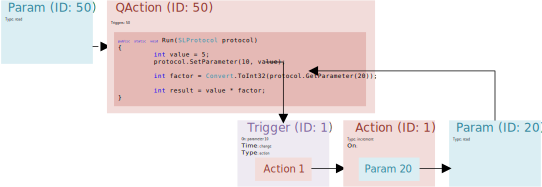

# SLScripting

The SLScripting process is responsible for executing QActions. It is important to understand how the QAction execution proceeds in relation to other protocol building blocks such as triggers and actions.

Consider for example a protocol with two parameters A (ID 10) and B (ID 12). Parameter B is set to a default value of 10. When a button is pressed (parameter with ID 50), a QAction is executed which sets parameter A to value 5 and multiplies the values of parameter A and B.

In addition, a trigger is defined that triggers on a change of parameter A. This trigger executes an action that increments the value of parameter B.

As illustrated below, in the QAction, a SetParameter method call is used to set the value of parameter A to 5. As a trigger is defined on a change of parameter A, this trigger gets executed before the remaining code in the QAction. The trigger initiates an action and this action must also complete.

The resulting value in the variable "result" in the example above will therefore be 55.

Now consider what will happen if the trigger does not immediately trigger the increment action, but instead adds a group to the group execution queue that holds the increment action.

")

The trigger will run an action that will add a group to the group execution queue. Once the group has been added to the queue, the action is considered finished. At this point the QAction resumes execution. In this case, the variable "result" will hold the value 50.

> [!NOTE]
> A QAction can contain a SetParameter (SLProtocol) or a CheckTrigger (SLProtocol) method call. Both cases will result in the same behavior regarding execution and when the QAction will continue execution. The QAction does not continue until everything being triggered by the SetParameter or CheckTrigger method call is executed. When a group needs to be added to the queue, it will stop there and does not wait until this group was executed.

A difference between the SetParameter and CheckTrigger methods is that CheckTrigger is handled by a thread created by the QAction (and therefore not started from the protocol thread). Consequently, it is not possible to start e.g. a 'set with wait' action from a QAction unless you add a group to the queue containing the "set with wait" action.

A QAction can contain the option "queued", which means that it will not wait until it is finished before another instance can run. This should only be used when needed and when external applications need to be used, such as a database or external DLLs.

> [!NOTE]
> DataMiner provides multiple configuration options related to the SLScripting process, which are described in [Configuring DataMiner processes](xref:Configuration_of_DataMiner_processes).
