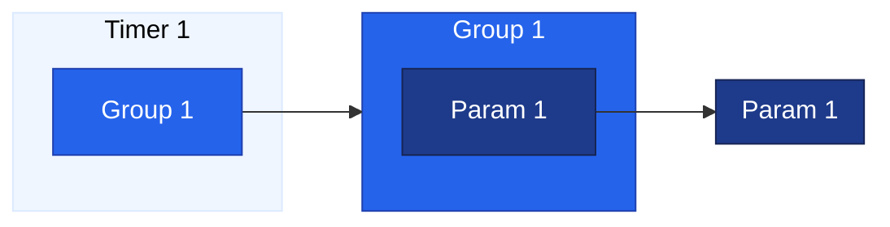
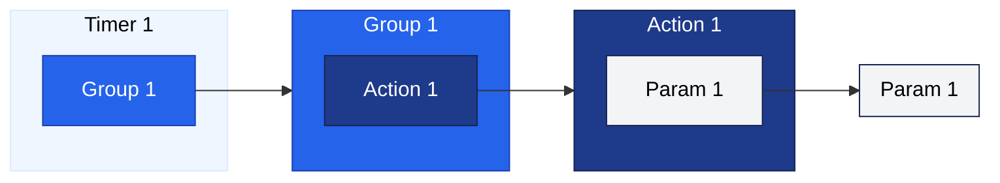
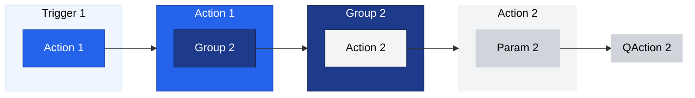

# Examples

The following examples illustrate how protocol components can be combined in order to implement functionality.

- Periodically retrieving a MIB variable
- Periodically incrementing a parameter value
- Executing a QAction after startup

## Periodically retrieving a MIB variable

In order to periodically retrieve a MIB variable, a timer needs to be defined and set to the desired interval (e.g., 10s). Then a [Group](xref:Protocol.Groups.Group) is defined of type "poll", containing a [Param](xref:Protocol.Params.Param) to be polled. The parameter definition includes the [OID](xref:Protocol.Params.Param.SNMP.OID) of the variable that must be retrieved via SNMP.



## Periodically incrementing a parameter value

The following diagram shows the components needed to let a parameter increment its value every 10 seconds. In this example, an [Action](xref:Protocol.Actions.Action) of type [increment](xref:LogicActionIncrement) is used on a parameter.



## Executing a QAction after startup

The following example illustrates how to execute logic defined in a QAction after a DMA element has completely started. First, a [Trigger](xref:Protocol.Triggers.Trigger) is defined triggering after startup (`<Time>after startup</Time>`) of the protocol (`<On>protocol</On>`). This trigger will execute an [Action](xref:Protocol.Actions.Action) that adds Group 2 to the group execution queue.

This Group in turn executes an action of type [run actions](xref:LogicActionRunActions) on Param 2. Actions of type `run actions`  execute the QAction linked with the specified parameter (via the [QAction@trigger](xref:Protocol.QActions.QAction-triggers)).

By using a group, we ensure that the QAction will be executed after the main protocol thread has started.



```xml
<Protocol>
  <Params>
	<Param id="2">
		<Name>AfterStartup</Name>
		<Description>After Startup</Description>
		<Type>dummy</Type>
	</Param>
  </Params>
  <Triggers>
	<Trigger id="1">
		<Name>After Startup</Name>
		<On>protocol</On>
		<Time>after startup</Time>
		<Type>action</Type>
		<Content>
			<Id>1</Id>
		</Content>
	</Trigger>
  </Triggers>
  <Actions>
	<Action id="1">
		<Name>After Startup Group</Name>
		<On id="2">group</On>
		<Type>execute next</Type>
	</Action>
	<Action id="2">
		<Name>After Startup QAction</Name>
		<On id="2">parameter</On>
		<Type>run actions</Type>
	</Action>
  </Actions>
  <Groups>
	<Group id="2">
		<Name>After Startup</Name>
		<Description>After Startup</Description>
		<Type>poll action</Type>
		<Content>
			<Action>2</Action>
		</Content>
	</Group>
  </Groups>
  <QActions>
    <QAction id="2" name="After Startup" encoding="csharp" triggers="2" />
        ...
    </QAction>
  </QActions>
</Protocol>
```
