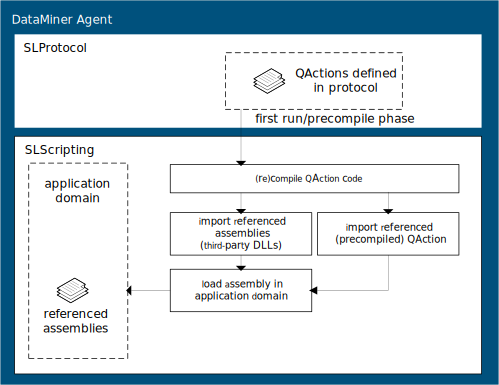

# QActions

## Introduction

Quick Actions (often referred to as "QActions") are used to implement custom functionality that cannot be implemented by other protocol constructs (e.g. parsing a JSON response received from the device, etc.).

In the past, QActions were written in C#, JScript or VBScript. However, recent protocols are written exclusively in C#, so this chapter only considers C# QActions.

A QAction is executed by the SLScripting process (see <xref:InnerWorkingsSLScripting>) and is defined in a connector using the [QAction](xref:Protocol.QActions.QAction) tag.

The following QAction runs when a button (with parameter ID 100) is clicked and counts the number of times the button was pressed:

```xml
<QAction id="100" name="Count Executions" encoding="csharp" triggers="100">
<![CDATA[
    using System;
    using Skyline.DataMiner.Scripting;

    public class QAction
    {
        public static void Run(SLProtocol protocol)
        {
            int count = Convert.ToInt32(protocol.GetParameter(10));
            count++;
            protocol.SetParameter(10, count);

            protocol.Log("Number of times button was pressed on this element: " + count, LogType.Error, LogLevel.NoLogging);
        }
    }
]]>
</QAction>
```

A descriptive name can be provided using the [name](xref:Protocol.QActions.QAction-name) attribute. This only serves to improve readability and has no influence on the functionality of the QAction.

The [encoding](xref:Protocol.QActions.QAction-encoding) attribute defines the language in which the QAction is written (this value is set to "csharp" for QActions written in C#).

The triggers attribute indicates the ID(s) of the parameter(s) that trigger the QAction. A QAction is executed on a change event of one of these parameters. (For more information about change events, see [Executing a QAction](xref:LogicQActions#executing-a-qaction).)

The default entry point of the QAction is the static Run method of the QAction class. The entry point method has a parameter of type [SLProtocol](xref:Skyline.DataMiner.Scripting.SLProtocol), which serves as the link with the SLProtocol process (the QAction is executed by the SLScripting process).

The Run method in the example above increments the execution count and writes the execution count to the log file of the element running this protocol using the Log method of the SLProtocol interface (see SLProtocol.Log method).

> [!NOTE]
>
> - To access the log files of an element in DataMiner Cube, right-click the element in the Surveyor and select View > Log or click the apps button in the Cube navigation pane and select System Center > Logging > Elements and select the element.
> - For a complete overview of the SLProtocol interface, see [SLProtocol](xref:Skyline.DataMiner.Scripting.SLProtocol) interface. It is also possible to use the SLProtocolExt interface (see [SLProtocolExt](xref:Skyline.DataMiner.Scripting.SLProtocolExt) interface). This is an extension of the SLProtocol interface, which makes it possible to write more readable code.
> - The following example protocols are available in the Protocol Development Guide Companion Files:
>   - SLC SDF QActions - Column Manipulation
>   - SLC SDF QActions - Triggering

## QAction Compilation

A C# QAction is compiled and loaded when it needs to run for the first time (unless the [precompile](xref:Protocol.QActions.QAction-options#precompile) option is used).

By default, the result is a DLL with the following name: `[protocolName].[protocolVersion].QAction.[QActionID].dll`, e.g. `Newtec CD6000.1.0.0.1.QAction.1.dll`.
For more information on how a custom name can be used, see [dllName=name.dll](xref:Protocol.QActions.QAction-options#dllnamenamedll).

The QAction DLLs are stored in the directory `C:\Skyline DataMiner\ProtocolScripts`.

> [!NOTE]
>
> - From DataMiner 9.6.11 (RN 23095) onwards, DataMiner uses the .NET Compiler Platform (version 2.9) to compile QActions, allowing the use of C# syntax up to and including version 7.3.
> - DataMiner detects the most recent version of the .NET Framework that is installed and uses this version in the SLScripting process. The compiled QActions will then target this version of the .NET Framework.

### Preprocessor directives

DataMiner compiles QActions with the following preprocessor directives:

- **DCFv1**: From DataMiner 8.5.8 onwards (RN 10061), this preprocessor directive ("#define DCFv1") is automatically added when a QAction is compiled.

   In QActions, all DCF-related code can then be enclosed within the following preprocessor directives:

    ```csharp
   #if DCFv1
   // DCF related code.
   #endif
   ```

- **DBInfo**: From DataMiner 9.0.0 onwards (RN 10395), this preprocessor directive ("#define DBInfo") is automatically added when a QAction is compiled. The presence of this directive indicates that the GetLocalDatabaseType method (SLProtocol), which was introduced in the same DataMiner version, can be used to get the type of the local database.
   Before this method call was used, it was good practice to use "#if DBInfo" in order to check whether the method is supported on the DataMiner Agent. However, since the minimum supported DataMiner version now already supports this method, enclosing the call as illustrated below is no longer required. For example:

   ```csharp
   #if DBInfo
   string databaseType = protocol.GetLocalDatabaseType();
   protocol.Log("Local DB type is: " + databaseType);
   #else
   protocol.Log("This version cannot check local DB.");
   #endif
   ```

- **ALARM_SQUASHING**: From DataMiner 10.1.6 onwards (RN 29549), this preprocessor directive ("#define ALARM_SQUASHING") is automatically added when a QAction is compiled.

   In QActions, all code related to alarm squashing (i.e. the combination of consecutive alarm events without a severity change into a single consolidated event) should be enclosed as illustrated below, to allow protocols that contain alarm squashing functionality to also be compiled on DataMiner versions that do not support alarm squashing:

   ```csharp
   #if ALARM_SQUASHING
   // Code specific for alarm squashing (DataMiner 10.1.0 and later)
   #else
   // Code for DataMiner 10.0.0 and earlier
   #endif
   ```

## Entry methods

The entry method is the entry point of the QAction. By default, the Run method of the QAction class in the global namespace is used as the entry point of the QAction.

Both static or instance entry methods are supported, as described below.

The entry point method must be a public method of a public class.

### Static entry methods

In the example above, the Run method of the QAction class is defined as a static method.

It is also possible to define static fields in the QAction class. As only one copy of a static member exists, regardless of how many instances of the class are created, static fields are also shared between all the elements executing this protocol and persist as long as the SLScripting process is running.

> [!NOTE]
> Static fields are only shared between elements with the same protocol version.

Consider the following example of a protocol that defines a button (with parameter ID 100) triggering a QAction. The QAction defines a static field executionCount and a static method Run:

```xml
<QAction id="1" name="Count Executions" encoding="csharp" triggers="100">
<![CDATA[
    using Skyline.DataMiner.Scripting;

    public class QAction
    {
        private static int executionCount;
        private static object thisLock = new object();

        public static void Run(SLProtocol protocol)
        {
            lock (thisLock)
            {
                executionCount++;

                protocol.Log("QA" + protocol.QActionID + "|Quick Action execution count: " + executionCount, LogType.Error, LogLevel.NoLogging);
            }
        }
     }
]]>
</QAction>
```

In case the DataMiner Agent has multiple elements running this protocol, this means that every time the button is pressed on one of these elements, the executionCount variable is incremented, i.e. the executionCount field will hold the number of times this QAction has been executed as a result of a button being pressed by any of the elements executing this protocol (note that in this case locking is required).

In case you only want to keep track of the execution count on a per element basis, either define a protocol parameter that will hold the execution count (as illustrated in the first example in the [Introduction](xref:LogicQActions#introduction)) instead of a static field in the QAction class, or use the approach described in the section [Instance entry methods](xref:LogicQActions#instance-entry-methods).

### Instance entry methods

From DataMiner 7.5.6.2 (RN 5481) onwards, it is possible to use instance entry methods in QActions. To obtain this behavior, define the entry method as an instance method (by removing the keyword "static" of the Run method).

In the QAction class, you can now define instance fields, which are available in the instance entry method.

When instance entry methods are used, DataMiner will create one instance of the QAction class per element. That is to say, when a QAction is triggered, DataMiner will first verify whether the entry method is an instance method. If this is the case, it will verify whether a QAction instance has already been created for this QAction for this element. If no instance has been created yet for this QAction for this element, an instance will be created. Otherwise the existing instance will be used. If the entry point is a static method, no instance is required.

The instance persists as long as the SLScripting process is running and the element is not removed, stopped or restarted.

The following example will count the number of times the button has been pressed for this element (note that the value will be set to 0 again if the element is stopped or restarted, or if the SLScripting process is restarted):

```xml
<QAction id="100" name="Count Executions" encoding="csharp" triggers="100">
<![CDATA[
    using Skyline.DataMiner.Scripting;

    public class QAction
    {
        private int executionCount = 0;

        public void Run(SLProtocol protocol)
        {
            executionCount++;
        }
    }
]]>
</QAction>
```

### Multiple entry methods

The Run method of the QAction class is the default entry point method of a QAction. Using the entryPoint attribute, a different entry point method can be defined for every parameter that triggers the QAction.

For example, in the following QAction two parameters can trigger a QAction. However, depending on which parameter triggered the QAction execution, another entry point method is selected.

```xml
<QAction id="200" name="Subscriptions" encoding="csharp" triggers="200;201" entryPoint="Initialize;ProcessMessages" dllImport="[ProtocolName].[ProtocolVersion].QAction.0.dll">
```

By default, the entry method is expected to be defined in the QAction class. However, it is possible to refer to a method of another class as an entry point method. Refer to [entryPoint](xref:Protocol.QActions.QAction-entryPoint) for more information.

## Executing a QAction

A QAction is executed by a change event of a parameter referred to in the triggers attribute.

A change event is initiated when:

- the value of a parameter changes
- a value is set to a parameter of type "write", even if the value is the same as the previous value
- an action of type "run actions" is performed on a parameter
- a parameter is set from a QAction using an instance of the SLProtocol(Ext) class, e.g. SetParameter
   > [!NOTE]
   > This will also trigger the QAction even if the set value is the same as the current value.

### Executing a QAction on a row change

Often, when data of a row changes in a table, a QAction must be executed to process the change.

You can trigger on a row change by using the row attribute when defining a QAction, setting it to "true" and specifying a write column parameter:

```xml
<QAction id="..." encoding="..." triggers="1052" row="true">
```

In the example above, the triggers attribute is set to the parameter ID of the write parameter for a column in the table. This means the QAction will be triggered by any change made to this write parameter for every row.

> [!NOTE]
>
> - From DataMiner 9.5.1 onwards, you can use a read column parameter as a trigger on a QAction with row=true option. Prior to DataMiner 9.5.1, triggering a QAction on a change of a particular read column is not possible. (RN 15040 & 15531)
> - For SNMP tables, it is also possible to provide the ID of a table parameter. In this case, the QAction will trigger every time a row has been updated.

In a QAction, the following methods are available to retrieve information about the row that triggered the execution of the QAction:

|Method  |Description  |
|---------|---------|
|[RowIndex](xref:Skyline.DataMiner.Scripting.SLProtocol.RowIndex)     |Gets the 1-based row position of the row that triggered the execution of the QAction.         |
|[RowKey](xref:Skyline.DataMiner.Scripting.SLProtocol.RowKey)     |Gets the primary key of the row that triggered the execution of the QAction.         |
|[OldRow](xref:Skyline.DataMiner.Scripting.SLProtocol.OldRow)     |Gets information about the previous cell values before the row was updated.         |
|[NewRow](xref:Skyline.DataMiner.Scripting.SLProtocol.NewRow)     |Gets information about the updated cells in a row.         |

> [!NOTE]
> For more information about how to implement SNMP tables, see [Retrieving tables](xref:ConnectionsSnmpRetrievingTables).

## Retrieving data from SLProtocol

Often, a QAction needs to retrieve parameter values from the SLProtocol process. There are two different ways to retrieve parameter values in a Quick Action:

- By including the parameter IDs in the [inputParameters](xref:Protocol.QActions.QAction-inputParameters) attribute.
- By retrieving the values via an instance of the SLProtocol or SLProtocolExt interface (e.g. by using the GetParameter method).

Which approach should be used to retrieve data from the SLProtocol process depends on the situation:

- For tables, we advise you to use inputParameters when you will need the entire table. If inputParameters is used, the SLScripting process will convert the table to a usable object, whereas when the data is retrieved using the SLProtocol interface, the SLProtocol process is responsible for doing this conversion. This offloads some of the load from the SLProtocol process to the SLScripting process.

   See [Via inputParameters attribute](xref:LogicQActions#via-inputparameters-attribute).

- In all other cases, retrieve the value via the SLProtocol(Ext) instance.
  
   See [Via SLProtocol(Ext) interface](xref:LogicQActions#via-slprotocolext-interface).

### Via inputParameters Attribute

When the inputParameters attribute is used, the parameter values are cast to an object in the Run method of the QAction. This is done by the SLScripting process.

> [!NOTE]
> It is important to note that objects referred to via inputParameters will contain the value of the parameters at the time the QAction started.

Also keep in mind that DataMiner needs to convert the parameter to an object that can be used in the QAction. This will increase the load of the SLScripting process. The object itself is stored in memory.

A reference to the input parameters can be obtained by providing an additional parameter of type object for each input parameter defined in the inputParameters attribute.

In the example below, the values of parameters with ID 200 and 201 are passed to the Quick Action via the objects errors and timespan respectively.

```xml
<QAction id="100" name="Process Errors" encoding="csharp" triggers="100" inputParameters="200;201">
<![CDATA[
using Skyline.DataMiner.Scripting;

public class QAction
{
    /// <summary>
    /// Quick Action entry point.
    /// </summary>
    /// <param name="protocol">Link with SLProtocol process.</param>
    /// <param name="errors">Errors that need to be processed.</param>
    /// <param name="timespan">Timespan in which the errors occurred.</param>
    public static void Run(SLProtocol protocol, object errors, object timespan)
    {
        //// ...
    }
}
]]>
</QAction>
```

Alternatively, the GetInputParameter method can be used:

```xml
<QAction id="100" name="Process Errors" encoding="csharp" triggers="100" inputParameters="200;201">
<![CDATA[
using Skyline.DataMiner.Scripting;

public class QAction
{
    /// <summary>
    /// Quick Action entry point.
    /// </summary>
    /// <param name="protocol">Link with SLProtocol process.</param>
    public static void Run(SLProtocol protocol)
    {
        string errors = Convert.ToString(protocol.GetInputParameter(0));
        //// ...
    }
}
]]>
</QAction>
```

### Via SLProtocol(Ext) interface

Instead of passing all the needed parameters, it is possible to retrieve the parameter values by invoking methods on the SLProtocol interface. To do this, there are multiple methods defined in the SLProtocol interface.

In the example below, the values of two standalone parameters are retrieved by parameter ID and by parameter name using the GetParameter method. This will retrieve the current value of the parameter (not the value at the time the QAction started as in the previous section).

```csharp
using System;
using Skyline.DataMiner.Scripting;

public class QAction
{
    /// <summary>
    /// Quick Action example.
    /// </summary>
    /// <param name="protocol">Link with SLProtocol process.</param>
    public static void Run(SLProtocol protocol)
    {
        string errors = Convert.ToString(protocol.GetParameter(10));
        int timespan = Convert.ToInt32(protocol.GetParameter(Parameter.timespan));
    }
}
```

When data is retrieved via the SLProtocol interface, the load is spread over the SLScripting and SLProtocol processes.

It is important to realize that almost every method invoked on the protocol object results in inter-process communication between the SLScripting process and the SLProtocol process, which is a costly operation. Therefore, the number of method invocations on the SLProtocol interface should always be reduced to an absolute minimum. The example above could be improved by using the GetParameters method to obtain the parameter values in one call:

```csharp
public static void Run(SLProtocol protocol)
{
   object[] parameters = (object[]) protocol.GetParameters(new uint[] { 10, 12 });

   string errors = Convert.ToString(parameters[0]);
   int timespan = Convert.ToInt32(parameters[1]);
}
```

In order to avoid so-called magic numbers, the Parameter or ProtocolExt class can be used.

For example, using the Parameter class:

```csharp
object[] parameters = (object[])protocol.GetParameters(new uint[] { Parameter.errors, Parameter.timespan });
```

or using the SLProtocolExt interface:

```csharp
string errors = Convert.ToString(protocol.Errors);
```

## Using DLLs in QActions

A QAction can make use of the functionality defined in an external DLL. In order to be able to use an external DLL, the DLL must be specified in the dllImport attribute of the QAction (see [dllImport](xref:Protocol.QActions.QAction-dllImport)).

```xml
<QAction id="6" name="Process Response" encoding="csharp" triggers="6" dllImport="System.xml.dll">
```

From DataMiner version 8.0.9 onwards, it is also possible to use [ProtocolName] and [ProtocolVersion] placeholders in the dllImport attribute. With these placeholders you can avoid having to update the references every time the protocol name or version is updated.

```xml
<QAction id="6" name="Process Response" encoding="csharp" triggers="6" dllImport="System.xml.dll;[ProtocolName].[ProtocolVersion].QAction.1.dll">
```

A QAction results in a DLL that is stored in the same folder (`C:\Skyline DataMiner\ProtocolScripts`). This raises the question whether a QAction can reference another QAction to use functionality defined in the other QAction. This is indeed possible.

Referencing another QAction is mainly done in case the referenced QAction contains generic code. This allows you to centralize code in one QAction that is then used by other QActions that make use of the functionality defined in this generic QAction. This is the recommended practice as it helps to avoid code duplication.

> [!NOTE]
> The generic QAction typically will not be triggered by any parameters (i.e. there is no triggers attribute present for the QAction containing the generic code) and the QAction does not have an entry point method.

The QAction that is referred to by another QAction must be compiled before the referring QAction is compiled. Therefore, QActions that are referred to by other QActions must use the "precompile" option (see [precompile](xref:Protocol.QActions.QAction-options)).

The following code fragment shows an example of a generic QAction that is used by another QAction. The generic QAction defines a data model class "Probe", which can then be used in the other QAction.

```xml
<QAction id="1" name="Generic Functionality" encoding="csharp" options="precompile">
<![CDATA[
namespace Skyline.Protocol.Model
{
    public class Probe
    {
        public string Name { get; set; }
        public int State { get; set; }
        public double Capacity { get; set; }
    
        public Probe(string name, int state, double capacity)
        {
            this.Name = name;
            this.State = state;
            this.Capacity = capacity;
        }
    
        ////...
    }
}
]]>
</QAction>
```

```xml
<QAction id="7" name="Process Table Content" encoding="csharp" triggers="7" dllImport="[ProtocolName].[ProtocolVersion].QAction.1.dll">
<![CDATA[
using Skyline.DataMiner.Scripting;
using Skyline.Protocol.Model;

public class QAction
{
  public static void Run(SLProtocol protocol)
  {
     Probe probe = new Probe("Probe 1", 0, 1000);

      ////...
  }
}
]]>
</QAction>
```

There is an important difference between QAction DLLs and third-party DLLs. When a protocol is updated, the QActions are recompiled and the new versions of these QActions are loaded in the application domain. The protocol will then start using these new versions of the QActions. This allows the editing of QActions of protocols without the need for a restart of the SLScripting process (which requires a DataMiner restart). Restarting the elements that run the protocol suffices to start using the edited QAction. This is not the case for third-party DLLs. Once loaded in the application domain, these cannot be unloaded, so a DataMiner restart is required in order to start using an edited third-party DLL.



## Queued QActions

A QAction can be defined with the option "queued". Using the option "queued", the QAction will be executed asynchronously: the QAction is triggered and set in the background. This means that it will not wait until it is finished before another QAction can run.

This option should only be used if really needed and care must be taken during implementation. For example, make sure to implement locking when needed.

## Starting an Automation script from a QAction

To start an Automation script from a QAction, the SLNet message "ExecuteScriptMessage" can be used. You can send this message using the ExecuteScript method on SLProtocol. This is introduced in DataMiner 10.0.5 (RN 24475).

```csharp
public static void Run(SLProtocol protocol)
{
    try
    {
        string[] scriptOptions = { "OPTIONS:0", "CHECKSETS:TRUE", "EXTENDED_ERROR_INFO", "DEFER:TRUE" };
        
        ExecuteScriptMessage message = new ExecuteScriptMessage
        {
            ScriptName = "Automation script",
            Options = new SA(scriptOptions),
            DataMinerID = -1,
            HostingDataMinerID = -1
        };
        
        var response = protocol.ExecuteScript(message) as ExecuteScriptResponseMessage;
        bool succeeded = response != null && !response.HadError;
        
        if (!succeeded)
        {
            // Script did not succeed.
        }
    }
    catch (Exception ex)
    {
        protocol.Log("QA" + protocol.QActionID + "|" + protocol.GetTriggerParameter() + "|Run|Exception thrown:" + Environment.NewLine + ex, LogType.Error, LogLevel.NoLogging);
    }
}
```

For more information, refer to Skyline.DataMiner.Net.Messages.

> [!NOTE]
> To start an Automation script from a QAction, the use of the Interop.SLAutomation DLL is now deprecated. The ExecuteScriptMessage should be used instead.

## Implementing the IDisposable interface

From DataMiner 10.2.9 onwards (RN 33965), DataMiner will call the [Dispose](https://learn.microsoft.com/en-us/dotnet/api/system.idisposable.dispose) method of the [IDisposable](https://docs.microsoft.com/en-us/dotnet/api/system.idisposable) interface when a QAction instance is released (i.e. when the element is stopped, removed, or restarted) if this interface is implemented on the QAction class.

> [!NOTE]
>
> - DataMiner will only create an instance of a class containing an entry point method if this method is not a static method (see [Instance entry methods](xref:LogicQActions#instance-entry-methods)). Therefore, if you want to make use of the IDisposable functionality, make sure you use a non-static entry point method so that an instance gets created.
> - This also applies to any other class the entry point may be in (see [Multiple entry methods](xref:LogicQActions#multiple-entry-methods)).
> - This coincides with the IsActive property of the SLProtocol interface being set to false, which prevents further function calls to the object from being executed.
> - The Dispose method is called by a separate thread than the one stopping the element. Its purpose is to release lingering resources and connections when the element is stopped.

## Examples

The following QActions implement some functionality that is often required when developing a protocol.

- [Reading from Files](#reading-from-files)
- [Reading from a (protected) Shared Folder](#reading-from-a-protected-shared-folder)
- [Processing JSON](#processing-json)
- [Processing MIME](#processing-mime)
- [Processing Gzip compressed data](#processing-gzip-compressed-data)
- [Creating an alarm in a QAction](#creating-an-alarm-in-a-qaction)

### Reading from Files

Reading data from files can be done using an instance of the StreamReader class (System.IO). Always specify the default encoding (System.Text) so content with special characters will be interpreted correctly. By additionally using a FileStream instance (System.IO), it is possible to read files that are already in use.

```csharp
using System;
using System.Collections.Generic;
using System.IO;
using System.Text;

using Skyline.DataMiner.Scripting;

public class Utility
{
	public static List<string> GetFileData(string file)
	{
		List<string> lines = new List<string>();

		if (File.Exists(file))
		{

			using (FileStream logReader = new FileStream(file, FileMode.Open, FileAccess.Read, FileShare.ReadWrite))
			{
				using (StreamReader sr = new StreamReader(logReader, Encoding.Default))
				{
					while (!sr.EndOfStream)
					{
						lines.Add(sr.ReadLine());
					}
				}
			}
		}

		return lines;
	}
}
```

### Reading from a (protected) shared folder

The following C# code fragment illustrates how to read from a shared folder, assuming the protocol defines the following parameters:

|ID  |Description  |
|---------|---------|
|1     |Username         |
|3     |Password         |
|6     |Share         |
|8     |Domain name         |
|10     |File name         |

```csharp
using System;
using System.Collections.Generic;
using System.IO;
using System.Runtime.InteropServices;
using Skyline.DataMiner.Scripting;

using DWORD = System.UInt32;
using LPWSTR = System.String;
using NET_API_STATUS = System.UInt32;

public class QAction
{
	/// <summary>
	/// Quick Action example.
	/// </summary>
	/// <param name="protocol">Link with SLProtocol process.</param>
	public static void Run(SLProtocol protocol)
	{
		uint[] ids = new uint[] { 1, 8, 3, 6, 10 };
		object[] parameters = (object[]) protocol.GetParameters(ids);

		object userName = parameters[0];
		object domainName = parameters[1];
		object password = parameters[2];
		object share = parameters[3];
		object filename= parameters[4];

		List<string> lines = SharedFile.ReadFromSharedFile(protocol, userName, domainName, password, share, filename);
	}

	public class SharedFile
	{
		[DllImport("NetApi32.dll", SetLastError = true, CharSet = CharSet.Unicode)]
		internal static extern NET_API_STATUS NetUseAdd(
		LPWSTR UncServerName,
		DWORD Level,
		ref USE_INFO_2 Buf,
		out DWORD ParmError);

		[DllImport("NetApi32.dll", SetLastError = true, CharSet = CharSet.Unicode)]
		internal static extern NET_API_STATUS NetUseDel(
		LPWSTR UncServerName,
		LPWSTR UseName,
		DWORD ForceCond);

		[StructLayout(LayoutKind.Sequential, CharSet = CharSet.Unicode)]
		internal struct USE_INFO_2
		{
			internal LPWSTR ui2_local;
			internal LPWSTR ui2_remote;
			internal LPWSTR ui2_password;
			internal DWORD ui2_status;
			internal DWORD ui2_asg_type;
			internal DWORD ui2_refcount;
			internal DWORD ui2_usecount;
			internal LPWSTR ui2_username;
			internal LPWSTR ui2_domainname;
		}

		public static List<string> ReadFromSharedFile(SLProtocol protocol, object userName, object domainName, object password, object share, object filename)
		{
			List<string> lines = new List<string>();

			USE_INFO_2 useInfo = new USE_INFO_2();
			useInfo.ui2_remote = Convert.ToString(share);
			useInfo.ui2_password = Convert.ToString(password);
			useInfo.ui2_username = Convert.ToString(userName);
			useInfo.ui2_domainname = Convert.ToString(domainName);
			useInfo.ui2_asg_type = 0xFFFFFFFF;
			useInfo.ui2_usecount = 1;
			uint paramErrorIndex;
			uint returnCode = NetUseAdd(null, 2, ref useInfo, out paramErrorIndex);

			if (returnCode != 0)
			{
			protocol.Log(8, -1, "NetUseAdd failed " + Convert.ToString(returnCode) +  ".");
			}
			else
			{
				protocol.Log(8, -1, "NetUseAdd succeeded.");

				using (StreamReader sr = new StreamReader(Convert.ToString(share) + "\\" + Convert.ToString(filename), System.Text.Encoding.Default))
				{
					string line = sr.ReadLine();

					while (line != null)
					{
						lines.Add(line);
						line = sr.ReadLine();
					}
				}
			}

			returnCode = NetUseDel(null, Convert.ToString(share), 2);

			if (returnCode != 0)
			{
				protocol.Log(8, -1, "NetUseDel failed " + Convert.ToString(returnCode));
			}
			else
			{
				protocol.Log(8, -1, "NetUseDel Succeeded.");
			}

			return lines;
		}
	}
}
```

### Processing JSON

While in the past the Json class (System.Web.Helpers) was used to process JSON (JavaScript Object Notation) data, now the JavaScriptSerializer class (System.Web.Script.Serialization) is preferred (Available since .NET Framework v3.5).

It is not necessary to load additional DLLs into DataMiner when using this approach. However, the QAction does need a reference to "System.Web.Extensions.dll" (using the dllimport attribute).

The following code will create a dictionary of all the items in the JSON data:

```csharp
using System;
using System.Collections.Generic;
using System.Text;
using System.Web.Script.Serialization;

using Skyline.DataMiner.Scripting;

public class QAction
{
	public static void Run(SLProtocol protocol)
	{
		var serializer = new JavaScriptSerializer();
		try
		{
			string data = Convert.ToString(protocol.GetParameter(10));
			var deserializedResult = serializer.Deserialize((string)data, typeof(object)) as Dictionary<string, object>;

			if (deserializedResult != null)
			{
				string portNumber = Convert.ToString(deserializedResult["port_number"]);
			}
		}
		catch (Exception e)
		{
			protocol.Log("QA" + protocol.QActionID + "|Run|An unexpected error occurred during deserialization of JSON data: " + e.ToString(), LogType.Error, LogLevel.NoLogging);
		}
	}
}
```

> [!NOTE]
> - When an instance of the JavaScriptSerializer is created, it has a maximum length of JSON strings that are accepted. In case a device can return large JSON responses, this default size can be too small. If this is the case, be sure to set the maximum length property of the JavaScriptSerializer instance before using the instance to deserialize the response.
> - A useful JSON editor can be found at http://jsoneditor.appspot.com/.
> - The online generator available at http://json2csharp.com/ can be used to convert JSON to C# classes.


See also:
- www.json.org 
- http://msdn.microsoft.com/enus/library/system.web.helpers.json(v=vs.99).aspx 
- http://msdn.microsoft.com/enus/library/system.web.script.serialization.javascriptserializer(v=vs.110).aspx 

### Processing MIME

Information on MIME (multipart content type) can be found at http://www.w3.org/Protocols/rfc1341/7_2_Multipart.html. It is important to know that the boundary string should start with at least "-", otherwise the multipart will not be recognized.

```csharp
string filePath = Convert.ToString(protocol.GetParameter(10));

try
{
	XmlDocument document = new XmlDocument();

	document.Load(filePath);

	string content = document.InnerXml;
	string boundary = "------------Ij5KM7KM7Ij5gL6Ij5GI3GI3Ef1ae0\r\n";
	string multipartl = "Content-Disposition: form-data; name=\"Filename\"\r\n\r\n'";
	string[] datal = filePath.Split(Convert.ToChar("\\"));
	string dataFile = datal[datal.Length - 1];
	string multipart2 = "Content-Disposition: form-data; name=\"" + dataFile +
	"\"3 filename=\"" + dataFile + "\" \r\nContent-Type: application/octet-stream\r\n\r\n";
	string multipart3 = "Content-Disposition: form-data; name=\"Upload\"\r\n\r\n";
	string data3 = "Submit Query";
	string endBoundary = "\r\n------------Ij5KM7KM7Ij5gL6Ij5GI3GI3Ef1ae0-- ";

	content = boundary + multipartl + dataFile + "\r\n" + boundary + multipart2 + content + "\r\n" + boundary + multipart3 + data3 + endBoundary;

	protocol.SetParameters(new int[] { 3100, 3103 }, new object[] { content, "Import Started" });
}
catch (Exception e)
{
	protocol.Log(protocol.QActionID + "|ProcessMime|Load configuration XML-file failed (Check the correct format of the XML-file):" + Environment.NewLine + filePath + Environment.NewLine + e.ToString(),LogType.Error, LogLevel.NoLogging);
}
```

### Processing gzip-compressed data

It is possible that an HTTP response contains gzip compressed data in the response. Processing gzip compressed data can be done as illustrated in the example below. The content is being received in parameter with ID 307.

See also: https://www.gnu.org/software/gzip/

```csharp
using System;
using System.IO;
using System.IO.Compression;
using System.Text;

using Skyline.DataMiner.Scripting;

/// <summary>
/// Processing gzip compressed data.
/// </summary>
public class QAction
{
	/// <summary>
	/// QAction entry point.
	/// </summary>
	/// <param name="protocol">Link with SLProtocol process.</param>
	public static void Run(SLProtocol protocol)
	{
		Array bytes = (Array)protocol.GetData("PARAMETER", 307);
		byte[] bytesToParse = new byte[bytes.Length];

		for (int i = 0; i < bytes.Length; i++)
		{
			bytesToParse[i] = Convert.ToByte(bytes.GetValue(i));
		}

		byte[] decompressedBytes = Decompress(bytesToParse, protocol);

		if (decompressedBytes.Length > 1)
		{
			UTF8Encoding encoding = new UTF8Encoding();
			string xmlDocument = encoding.GetString(decompressedBytes);

			//// Code processing the XML document...
		}
	}

	/// <summary>
	/// Decompresses gzip compressed data.
	/// </summary>
	/// <param name="compressedData">The compressed data.</param>
	/// <param name="protocol">Link with SLProtocol process.</param>
	/// <returns>The decompressed data.</returns>
	public static byte[] Decompress(byte[] compressedData, SLProtocol protocol)
	{
		try
		{
			using (GZipStream stream = new GZipStream(new MemoryStream(compressedData), CompressionMode.Decompress))
			{
				const int Size = 4096;
				byte[] buffer = new byte[Size];

				using (MemoryStream memory = new MemoryStream())
				{
					int count = 0;
					
					do
					{
						count = stream.Read(buffer, 0, Size);
						
						if (count > 0)
						{
							memory.Write(buffer, 0, count);
						}
					}
					while (count > 0);

					return memory.ToArray();
				}
			}
		}
		catch (Exception e)
		{
			protocol.Log("QA" + protocol.QActionID + "|Decompress|An unexpected error occurred: " + e.ToString(), LogType.Error, LogLevel.NoLogging);

			return new byte[] { 0 };
		}
	}
}
```

### Creating an alarm in a QAction

To create an alarm from a QAction, the SLProtocolScripts.dll DLL needs to be imported (Skyline.DataMiner.ProtocolScripts).

```csharp
int elementID = 214;
int parameterID = 100;
string information = "Text to set in Information event/alarm";

Alarm alarm = new Alarm();

string[] alarmData = alarm.NewAlarm(elementID, parameterID, information, "Major");

protocol.NotifyDataMiner(106, 0, alarmData);   // NT_MAKE_ALARM call.
```

```xml
<Param id="20" trending="false">
	<Name>a1armReceiver</Name>
	<Description>Alarm Receiver</Description>
	<Type options="linkAlarmValue=..">read</Type>
	<Interprete>
		<RawType>other</RawType>
		<LengthType>next param</LengthType>
		<Type>string</Type>
	</Interprete>
	<Display>
		<RTDisplay>true</RTDisplay>
	</Display>
	<Alarm>
		<Monitored>true</Monitored>
	</Alarm>
	<Measurement>
		<Type>string</Type>
	</Measurement>
</Param>
```

Alarm linking can be done by:
- linkAlarmValue=true

   This option allows the linking of externally generated alarms based on the alarm value. When there is an exact value match, the alarms are linked whether or not a root key has been specified.
- linkAlarmValue=[xx]
  
   This option allows the linking of alarms based on the value between the two specified characters.

In case you want alarms to be linked if the values between two brackets match:

- options="LinkAlarmValue=()"
  
In case you want alarms to be linked if the values between two dots match:

- options="LinkAlarmValue=.."
  
With these options, you can link alarms to each other. Note that the linking will only work if you specify set alarm monitoring to true.

## See also

DataMiner Protocol Markup Language

- [Protocol.QActions](xref:Protocol.QActions)
- [QAction@entryPoint](xref:Protocol.QActions.QAction-entryPoint) attribute
