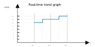

# Trending

DataMiner provides the possibility to show trend graphs of parameters indicating how the value of a parameter changes over time. For more information about trend templates in DataMiner, refer to [Trend templates](xref:About_trend_templates).

In a protocol, it is possible to define whether or not a parameter should support trending. If trending is not supported for a parameter, the parameter will not be included in the trend template.

By default, trending is supported when RTDisplay of the parameter is set to true. Use the trending attribute of the Param tag to disable trend support:

```xml
<Param id="100" trending="false">
```

In a trend template, you can define the type of trend information to be stored in the trending database:

- Real-time trending is written directly whenever the parameter value changes, in a sliding window of maximum 1000 hours.
- Average trending logs average trend information per time slot. The time slot depends on the size of the window.

You can find more info on trending in the sections below:

## Average trending

In average trend graphs, for each window of 5 minutes (or 60 minutes for the last year trend graph) an average value is calculated and the minimum and maximum value in this window is determined.

From DataMiner version 7.5 onwards, it is possible to define the following trend types in addition to the default average:

- Last: Last value in the time span
- Sum: Sum of all the values in the time span. This cannot be used for parameters holding discrete values
- Max: Maximum value in the time span
- Min: Minimum value in the time span
- Average: Average value in the time span (default when no trending tag is present)

 ```xml
<Display>
   <RTDisplay>true</RTDisplay>
   <Trending>
      <Type>MAX</Type>
</Trending>
</Display>
<Alarm>
   <Monitored>true</Monitored>
</Alarm>
```

By default, when the window has passed, the average value of this window is calculated (and the minimum and maximum values are determined).

For example, consider a protocol that has a trended parameter (ID 100) with an initial value of 10. The element starts at 9:06:14.

- In the real-time trend data table, the following entry is added:
  |param id|value|timestamp|
  |--- |--- |--- |
  |100|10|[YYYY]-[MM]-[DD] 09:06:14|

- In the average trend data table, the following entry is added:
  |param id|avg value|timestamp|
  |--- |--- |--- |
  |100|10|[YYYY]-[MM]-[DD] 09:06:14|

- At 09:07:56, the trended parameter gets set to a new value of 20. This results in a new entry being added in the real-time trend data table:
  |param id|value|timestamp|
  |--- |--- |--- |
  |100|20|[YYYY]-[MM]-[DD] 09:07:56|

- At 09:10:00, the 5-minute window automatically closes and this results in the following entry being added to the average trend data table for the element:
  |param id|avg value|timestamp|
  |--- |--- |--- |
  |100|15.4867256637168|[YYYY]-[MM]-[DD] 09:10:00|

The average value for the window from 09:06:14 to 09:10:00 (226s) is obtained as follows:

09:06:14 to 09:07:56 (102s): value 10

09:07:56 to 09:10:00 (124s): value 20

Average: ((102*10)+(124*20))/226=15.4867256637168

Below is a graphical representation of how an average trend graph is constructed. At 10:35, a new window begins, which lasts until 10:40. At 10:37:30, the value of the trended parameter changes from 12 to 14. At 10:40, the window closes automatically, and an average value of 13 is calculated for this window. The minimum and maximum value of the trended parameter in this window is 12 and 14, respectively. This is then shown in the average trend graph.




### History sets

In some cases, it is undesired that the window is automatically closed, as some data points that belong to a particular window are only received after the window has passed. For example, the window 10:35 to 10:40 closes at 10:40, but at 10:41:12 we obtain a data point with a corresponding timestamp of 10:39:00. As the window has already automatically closed, the average value has been calculated and therefore this data point was not used in the calculation of the average value of this window although this data point belongs to this window.

In such cases, the historySet attribute can be used (see historySet). When this attribute is set to true, the window will no longer be automatically closed. Instead, it will be closed when either a data point is provided with a timestamp that falls outside the window or a specific request is made to close the window.

The DataMiner class library (DCL) provides some methods that allow the performing of a history set. The following methods defined in the SLProtocol interface allow history settings:

- <xref:Skyline.DataMiner.Scripting.SLProtocol.SetParameter(System.Int32,System.Object,System.ValueType)>
- <xref:Skyline.DataMiner.Scripting.SLProtocol.SetParameterIndex(System.Int32,System.Int32,System.Int32,System.Object,System.ValueType)>
- <xref:Skyline.DataMiner.Scripting.SLProtocol.SetParameterIndexByKey(System.Int32,System.String,System.Int32,System.Object,System.ValueType)>
- <xref:Skyline.DataMiner.Scripting.SLProtocol.SetParameters(System.Int32[],System.Object[],System.DateTime[])>
- <xref:Skyline.DataMiner.Scripting.SLProtocol.SetParametersIndex(System.Int32[],System.Int32[],System.Int32[],System.Object[],System.DateTime[])>
- <xref:Skyline.DataMiner.Scripting.SLProtocol.SetParametersIndexByKey(System.Int32[],System.String[],System.Int32[],System.Object[],System.DateTime[])>
- <xref:Skyline.DataMiner.Scripting.SLProtocol.SetRow(System.Int32,System.Int32,System.Object,System.ValueType)>
- <xref:Skyline.DataMiner.Scripting.SLProtocol.SetRow(System.Int32,System.Int32,System.Object,System.ValueType,System.Boolean)>
- <xref:Skyline.DataMiner.Scripting.SLProtocol.SetRow(System.Int32,System.String,System.Object,System.ValueType)>
- <xref:Skyline.DataMiner.Scripting.SLProtocol.SetRow(System.Int32,System.String,System.Object,System.ValueType,System.Boolean)>
- <xref:Skyline.DataMiner.Scripting.SLProtocol.AddRow(System.Int32,System.Object[])>
- <xref:Skyline.DataMiner.Scripting.SLProtocol.FillArray(System.Int32,System.Object[],System.Nullable{System.DateTime})>
- <xref:Skyline.DataMiner.Scripting.SLProtocol.FillArray(System.Int32,System.Collections.Generic.List{System.Object[]},System.Nullable{System.DateTime})>
- <xref:Skyline.DataMiner.Scripting.SLProtocol.FillArray(System.Int32,System.Collections.Generic.List{System.Object[]},Skyline.DataMiner.Scripting.NotifyProtocol.SaveOption,System.Nullable{System.DateTime})>
- <xref:Skyline.DataMiner.Scripting.SLProtocol.FillArrayNoDelete(System.Int32,System.Object[],System.Nullable{System.DateTime})>
- <xref:Skyline.DataMiner.Scripting.SLProtocol.FillArrayNoDelete(System.Int32,System.Collections.Generic.List{System.Object[]},System.Nullable{System.DateTime})>
- <xref:Skyline.DataMiner.Scripting.SLProtocol.FillArrayWithColumn(System.Int32,System.Int32,System.Object[],System.Object[],System.Nullable{System.DateTime})>
- [NT_ADD_ROW (149)](xref:NT_ADD_ROW)
- [NT_FILL_ARRAY (193)](xref:NT_FILL_ARRAY)
- [NT_FILL_ARRAY_NO_DELETE (194)](xref:NT_FILL_ARRAY_NO_DELETE)
- [NT_FILL_ARRAY_WITH_COLUMN (220)](xref:NT_FILL_ARRAY_WITH_COLUMN)
- [NT_SET_PARAMETER_WITH_HISTORY (256)](xref:NT_SET_PARAMETER_WITH_HISTORY) (remote element)

When performing history sets, keep in mind that history sets must be done in chronological order. This means it is not allowed to perform a data point set with a timestamp of e.g. 14:10:30 once a data point with a later timestamp (e.g. 14:10:40) has been set.

It is also important to note that once a window has been closed, it cannot be reopened again. So once the window is closed, the calculated average value can no longer be changed.

When historySet is set to "true", its last set value will also not be stored in the trending database when the element is restarted.

### Closing a window without a new data point

It is also possible to close a window without having to provide an actual data point. This can be done by using a NotifyProtocol call type 374 "NT_CLOSE_HISTORY_TREND_WINDOW". For more information, see NT_CLOSE_HISTORY_TREND_WINDOW (374).

## Retrieving trend data from the database

From DataMiner 9.0.0 (RN 40653, RN 11750) onwards, the GetTrendDataMessage class should be used to retrieve trend data.

The following examples show how this class can be used to retrieve trend data.

See also: GetTrendDataMessage class

### Retrieving real-time trend data of a standalone parameter

```csharp
using System;
using Skyline.DataMiner.Net.Messages;
using Skyline.DataMiner.Net.Trending;
using Skyline.DataMiner.Scripting;

/// <summary>
/// Example on retrieving real-time trend data of a standalone parameter.
/// </summary>
public class QAction
{
    /// <summary>
    /// QAction entry point.
    /// </summary>
    /// <param name="protocol">Link with SLProtocol process.</param>
    
    public static void Run(SLProtocol protocol)
    {
        int dmaID = protocol.DataMinerID;
        int elementID = protocol.ElementID;
        int parameterID = 100;
        
        GetTrendDataMessage message = new GetTrendDataMessage(dmaID, elementID, parameterID)
        {
            TrendingType = TrendingType.Realtime,
            ReturnAsObjects = true   
        };
        
        DMSMessage[] response = protocol.SLNet.SendMessage(message);
        
        GetTrendDataResponseMessage resultMessage = (GetTrendDataResponseMessage)response[0];
        
        var records = resultMessage.Records;
        
        if (records != null)
        {
            foreach (string key in records.Keys)
            {
                var trendRecords = records[key];
        
                foreach (TrendRecord trendRecord in trendRecords)
                {
                    RealtimeTrendRecord realtimeTrendRecord = trendRecord as RealtimeTrendRecord;
        
                    if (realtimeTrendRecord != null)
                    {
                        string value = realtimeTrendRecord.Value;
                        DateTime time = realtimeTrendRecord.Time;
                        int status = realtimeTrendRecord.Status;
                
                        ////...
                    }
                }
            }
        }
    }
}
```

### Retrieving average trend data of a column parameter

```csharp
using Skyline.DataMiner.Scripting;

/// <summary>
/// Example on retrieving average trend data of a column parameter.
/// </summary>
public class QAction
{
    /// <summary>
    /// QAction entry point.
    /// </summary>
    /// <param name="protocol">Link with SLProtocol process.</param>
    public static void Run(SLProtocol protocol)
    {
        int dmaID = protocol.DataMinerID;
        int elementID = protocol.ElementID;
        int columnID = 2004;
        string primaryKey = "1";
        
        GetTrendDataMessage message = new GetTrendDataMessage()
        {
            DataMinerID = dmaID,
            ElementID = elementID,
            Parameters = new ParameterIndexPair[] { new ParameterIndexPair(columnID, primaryKey)
            ,
            StartTime = new DateTime(2017, 1, 14),
            EndTime = DateTime.Now,
            TrendingType = TrendingType.Average,
            ReturnAsObjects = true
        };
            
        DMSMessage[] response = protocol.SLNet.SendMessage(message);
            
        GetTrendDataResponseMessage trendDataResponseMessage = (GetTrendDataResponseMessage) response[0];
            
        var records = trendDataResponseMessage.Records;
            
        if (records != null)
        {
            foreach (string key in records.Keys)
            {
                var trendRecords = records[key];
            
                foreach (TrendRecord trendRecord in trendRecords)
                {
                    AverageTrendRecord averageTrendRecord = trendRecord as AverageTrendRecord;
            
                    if (averageTrendRecord != null)
                    {         
                        double average = averageTrendRecord.AverageValue;
                        double maximum = averageTrendRecord.MaximumValue;
                        double minimum = averageTrendRecord.MinimumValue;
                        DateTime time = averageTrendRecord.Time;
                        int status = averageTrendRecord.Status;
            
                        protocol.Log("QA" + protocol.QActionID + "|time: " + time + ", maximum: " + maximum + ", minimum: " + minimum, LogType.Error, LogLevel.NoLogging);
                    }
                }
            }
        }
    }
}
```

> [!NOTE]
> In the *ParameterIndexPair*, provide the key that is used to store the trend record. This is the primary key, except when the displayColumn attribute is used. In that case, provide the display key as this is the key used to store the trend record.
