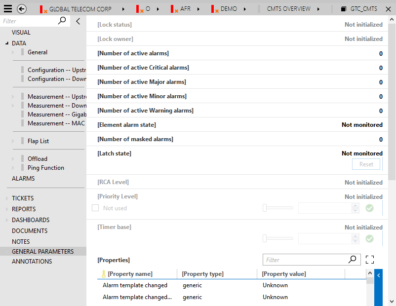

# DataMiner element control protocol

## Parameters

In addition to the parameters defined by a protocol developer, a number of general internal parameters are defined for each element. These general parameters are all defined in the 65 000 range.

The configuration of these parameters for an element are displayed on the GENERAL PARAMETERS page of the element:

There are four groups of general parameters: communication, DCF, replication and verification.

Since DataMiner version 9.0.1 (RN 12263), general parameters can be loaded dynamically and the following defaults apply:

- Communication: General parameters belonging to this group are not loaded for protocols of type http, websocket, opc, gpib, virtual, sla and service.
- DCF: Are only loaded if there is at least one ParameterGroup defined in the protocol.
- Verification: General parameters belonging to this group are not loaded when the MaintenanceSettings.xml say that the Command Execution Verification is enabled.
- Replication: By default, general parameters belonging to this group are always loaded (because it is always possible that an element will be replicated).

This default configuration can be overruled in a protocol via the ProtocolGroups tag.

In addition to the General Parameters page, it is also possible to show an additional Data Display page called General Parameters DEBUG. This page contains general parameters that are only used for debug purposes and that are not usually displayed. (For more information, refer to [Debug settings](xref:Computer_settings#debug-settings).

General Parameters (DataMiner Element Control Protocol):

|ID|Name|Description and/or possible values|
|--- |--- |--- |
|64501|TIMEOUT||
|64502|STATE||
|64503|New client registered||
|64504|New Element connection||
|64505|Client disconnected||
|64506|Element disconnection||
|64507|Parameter descriptions||
|64508|Link file||
|64509|Edited||
|64510|Element created||
|64511|Deleted||
|64514|Alarm Template Assigned||
|64516|Database optimization||
|64517|Database stack||
|64518|Mobile gateway||
|64519|Service path changed||
|64520|Startup DataMiner Agent||
|64521|Protocol Added||
|64522|Protocol Deleted||
|64523|Protocol Replaced||
|64524|Alarm Template Added||
|64525|Alarm Template Deleted||
|64526|Alarm Template Edited||
|64527|Script Added||
|64528|Script Deleted||
|64529|Script Edited||
|64530|Information Added||
|64531|Information Deleted||
|64532|Information Edited||
|64533|SMS Received||
|64534|SMS Sent||
|64535|GSM Signal Strength||
|64536|GSM General Information||
|64537|Trending Template Edited||
|64538|Trending Template Added||
|64539|Trending Template Deleted||
|64540|VDX Deleted||
|64541|VDX Added||
|64542|VDX Edited||
|64543|Trending Template Assigned||
|64544|Element Connections Edited||
|64545|Security Edited||
|64546|Views Edited||
|64547|Database settings edited||
|64548|SNMP-Managers edited||
|64549|Start Element Failed||
|64550|Load Element Failed||
|64551|Table Repair||
|64552|Set Parameter||
|64553|Import elements||
|64554|Information.xml assigned||
|64555|Start synchronization||
|64556|Synchronization finished||
|64557|DataMiner Agent found||
|64558|DataMiner Agent lost||
|64559|Error during synchronization||
|64560|No connection with DMA||
|64561|Connection established with DMA||
|64562|Automation info||
|64563|Scheduler info||
|64564|Script execution failure||
|64565|Load Protocol Failed||
|64566|Startup error||
|64567|Scheduled Task Created||
|64568|Scheduled Task Updated||
|64569|Scheduled Task Deleted||
|64570|Notification||
|64571|Stop DataMiner||
|64572|DataMiner run-time||
|64573|Task started||
|64574|Client notification||
|64575|Set as production protocol||
|64576|Element masked||
|64577|Element unmasked||
|64578|DMS Revisioned||
|64579|Backup status||
|64580|SNMPAgent||
|64581|File changed||
|64582|Filter added||
|64583|Filter edited||
|64584|Filter deleted||
|64585|User settings||
|64586|Document added||
|64587|Document edited||
|64588|Document removed||
|64589|Script started||
|64590|Linked to||
|64591|State change||
|64592|Service added||
|64593|Redundancy Group added||
|64594|Preset Created||
|64595|Preset Edited||
|64596|Preset Renamed||
|64597|Preset Deleted||
|64598|Real-time TCP Socket||
|64599|Database||
|64600|Correlation engine||
|64601|Alarm colors edited||
|64602|IP Settings||
|64603|Spectrum Script Edited||
|64604|Spectrum Script Deleted||
|64605|Spectrum Monitor Edited||
|64606|Spectrum Monitor Deleted||
|64607|Entered Prioritized Mode||
|64608|Left Prioritized Mode||
|64609|Spectrum Script Added||
|64610|Spectrum Monitor Created||
|64611|Mobile Gateway lost contact with DataMiner||
|64612|Spectrum Monitor Failure||
|64613|Collaboration Message||
|64614|DataMiner Failover Status||
|64615|Service Templates||
|64616|Client Eventing||
|64617|Latch reset info||
|64619|Annotations Edited||
|64620|Asset Manager Configuration||
|64621|Map Configuration||
|64622|SNMP Manager||
|64623|Redundancy Group State||
|64624|VDX Assigned||
|64625|Export Progress||
|64626|Import Progress||
|64627|Connectivity Engine||
|64628|Resource Manager info||
|64629|Tickets||
|64630|Notes||
|64631|Profile Manager info||
|64632|Spectrum trace recording started||
|64633|Spectrum trace recording stopped||
|64636|DataMiner Connectivity Framework||
|64637|Authentication Failure||
|64638|Sounds||
|64639|Disk Watcher||
|64640|Licensing||
|64641|Protocol Function Manager info||
|64642|Topology engine||
|64643|Failed Southbound SNMP Communication||
|64644|Service Manager info||
|64645|Property Configuration||
|64646|DOM Manager info||
|64647|Clearable Alarm Storm Protection||
|64648|Redundancy switch||
|64649|Azure Active Directory||
|65000|[Lock status]|0/empty = unlocked, 1 = locked, 2 = unlocked with force|
|65002|[Lock owner]|Username of the user who is locking the element|
|65003|[Number of active Alarms]||
|65004|[Number of active Critical Alarms]||
|65005|[Number of active Major Alarms]||
|65006|[Number of active Minor Alarms]||
|65007|[Number of active Warning Alarms]||
|65008|[Element Alarm state]|0 = Not monitored, 1 = Normal, 2 = Warning, 3 = Minor, 4 = Major, 5 = Critical, 7 = Timeout, 9 = Masked, 10 = Error|
|65009|[Number of masked Alarms]||
|65010|[Nbr of alarms]|Number of alarms table|
|65011|[PID]|Parameter ID column (Number of alarms table)|
|65012|[Number of alarms]|Number of alarms column (Number of alarms table)|
|65013|[Start time first alarm]|Start time first alarm column (Number of alarms table)|
|65014|[Start time last alarm]|Start time last alarm column (Number of alarms table)|
|65017|[Timer base]|Used for dynamic interval modification.|
|65018|[Timer base]|Write parameter|
|65019|[Properties]|Properties table parameter|
|65020|[Property name]|Property name column of the Properties table|
|65021|[Property type]|Property type column of the Properties table|
|65022|[Property Value]|Property value column of the Properties table|
|65026|[Element id]||
|65027|[RCA Level]||
|65028|[Reset time alarms]|Reset time alarms column (Number of alarms table)|
|65029|[Clients connected]|0 = No, 1 = Yes|
|65030|[Priority level]||
|65031|[Priority level]|Write parameter|
|65032|[Latch state]||
|65033|[Reset element latch]||
|65034|[Communication info]|Communication info table|
|65035|[Connection ID]|Connection ID column Communication info table|
|65036|[Device RTT]|Device RTT column Communication info table|
|65037|[Device Iterations]|Device Iterations column Communication info table|
|65038|[DataMiner TX]|DataMiner TX column Communication info table|
|65039|[DataMiner RX]|DataMiner RX column Communication info table|
|65040|[Session DataMiner TX]|Session DataMiner TX column Communication info table|
|65041|[Session DataMiner RX]|Session DataMiner RX column Communication info table|
|65042|[Device Message Drops]|Device Message Drops column Communication info table|
|65043|[Communication info state]||
|65044|[Communication info state]|Write parameter|
|65045|[Connection State]|Connection State column Communication info table|
|65046|Execution Verification||
|65047|[Connection Name]|Connection Name column Communication info table|
|65048|[Connection Type]|Connection Type column Communication info table|
|65049|[Interfaces]|Interfaces table (DCF)|
|65050|[Interface ID]|Interface ID column Interfaces table|
|65051|[Interface Name]|Interface Name column Interfaces table|
|65052|[Interface Type]|Interface Type column Interfaces table|
|65053|[Interface Alarm State]|Interface Alarm State column Interfaces table|
|65054|[Interface Properties]|Interface Properties table (DCF)|
|65055|[Interface Property name]|Interface Property name column Interface Properties table|
|65056|[Interface Property type]|Interface Property type column Interface Properties table|
|65057|[Interface Property value]|Interface Property value column Interface Properties table|
|65058|[Interface Property value]|Interface Property value column Interface Properties table|
|65059|[Interface Property link]|Interface Property link column Interface Properties table|
|65060|[Connections]|Connection table (DCF)|
|65061|[Connections ID]|Connections ID column Connections table|
|65062|[Source Interface]|Source Interface column Connections table|
|65064|[Destination Interface]|Destination Interface column Connections table|
|65065|[Source Interface]|Source Interface column Connections table|
|65067|[Destination Interface]|Destination Interface column Connections table|
|65068|[Connection Properties]|Connection Properties table (DCF)|
|65069|[Connection Property Name]|Connection Property Name column Connection Properties table|
|65070|[Connection Property Type]|Connection Property Type column Connection Properties table|
|65071|[Connection Property value]|Connection Property value column Connection Properties table|
|65072|[Connection Property value]|Connection Property value column Connection Properties table|
|65073|[Connection Property link]|Connection Property link column Connection Properties table|
|65074|[Add Connection]|Add Connection button (DCF)|
|65075|[Add Interface Property]|Add Interface Property button (DCF)|
|65076|[Add Connection Property]|Add Connection Property button (DCF)|
|65077|[Interface Property to delete]||
|65078|[Connection to delete]||
|65079|[Connection to delete]|Write parameter|
|65080|[Connection Property to delete]||
|65081|[Connection Property to delete]|Write parameter|
|65082|[Interface Property ID]|Interface Property ID column Interface Properties table|
|65083|[Connection Property ID]|Connection Property ID column Connection Properties table|
|65084|[Interface Property to delete]|Write parameter|
|65085|[Interface Property name]|Interface Property name column Interface Properties table (write parameter)|
|65086|[Interface Property type]|Interface Property type column Interface Properties table|
|65087|[Connection Property Name]|Connection Property Name column Connection Properties table|
|65088|[Connection Property type]|Connection Property type column Connection Properties table|
|65089|[Destination DataMiner/Element]|Destination DataMiner/Element column Connections table|
|65090|[Destination DataMiner/Element]|Destination DataMiner/Element column Connections table|
|65091|[Interface Property link]|Interface Property link column Interface Properties table|
|65092|[Connection Property link]||
|65093|[Custom Name]|Custom Name column Interfaces table|
|65094|[Custom Name]|Custom Name column Interfaces table|
|65095|[Interface Dynamic Link]|Interface Dynamic Link column Interfaces table|
|65096|[Connections Name]|Connections Name column Connections table|
|65098|[Interface Properties Input]||
|65099|[Connections Input]||
|65100|[Connections Properties Input]||
|65101|[Connections Filter]|Connections Filter column Connections table|
|65102|[Connections Filter]|Connections Filter column Connections table (write parameter)|
|65103|DataMiner Connectivity Framework|DataMiner Connectivity Framework page button|
|65104|DataMiner Availability|DataMiner Availability page button|
|65105|[DataMiner Availability]|DataMiner Availability table|
|65106|[DataMiner Availability ID]|DataMiner Availability ID column DataMiner Availability table|
|65107|[DataMiner Availability From]|DataMiner Availability From column DataMiner Availability table|
|65108|[DataMiner Availability To]|DataMiner Availability To column DataMiner Availability table|
|65109|[DataMiner Availability Reason]|DataMiner Availability Reason column DataMiner Availability table|
|65110|[DataMiner Availability Reference]|DataMiner Availability Reference column DataMiner Availability table|
|65111|[DataMiner Availability From]||
|65112|[DataMiner Availability To]||
|65113|[DataMiner Availability Reason]||
|65114|[DataMiner Availability Reference]||
|65117|Replication Info|Replication Info page button|
|65118|[Replicated Element]||
|65119|[Remote DMA IP]||
|65120|[Remote Element Name]||
|65121|[Connected Replication DMAs Count]||
|65122|[Connected Replication DMAs]|Connected Replication DMAs table|
|65123|[ID]|ID column Connected Replication DMAs table|
|65124|[DMA IP]|DMA IP column Connected Replication DMAs table|
|65125|[Replication State]|Replication State column Connected Replication DMAs table|
|65126|[Last Change]|Last Change column Connected Replication DMAs table|
|65127|[Replicated Element Name]|Replicated Element Name column Connected Replication DMAs table|
|65130|[Internal Lock owner]||
|65131|Resource Info|Resource info page button|
|65132|[Generic DVE Table]||
|65133|[DVE IDX]|DVE index column Generic DVE table|
|65134|DVE Name|DVE Name column Generic DVE table|
|65135|DVE Element|DVE Element column Generic DVE table|
|65136|DVE State|DVE State column Generic DVE table|
|65137|[DVE function GUID]|DVE function GUID column Generic DVE table|
|65138|DVE Link to Resource Manager|DVE Link to Resource Manager column Generic DVE table|
|65139|[Generic Interfaces]|Generic interfaces table|
|65140|[Interface IDX]|Interface IDX column Generic interfaces table|
|65141|Interface Name|Interface Name column Generic interfaces table|
|65142|Interface Type|Interface Type column Generic interfaces table|
|65143|Interface FK|Interface FK Generic interfaces table|
|65144|Interface Link to Resource Manager|Interface Link to Resource Manager column Generic interfaces table|
|65145|Interface ID|Interface ID column Generic interfaces table|
|65146|[Generic DVE Linker Table]||
|65147|[Linker Index]|Linker Index column Generic DVE Linker table|
|65148|[Linker Generic DVE FK]|Linker Generic DVE FK column Generic DVE Linker table|
|65149|[FK Data]|FK Data column Generic DVE Linker table|
|65150|[FK Table]|FK Table column Generic DVE Linker table|
|65157|[Interface delete/add]||
|65158|[DVE index to delete]||
|65159|[Interface Index to Delete]||
|66154|[DVE index to delete]||
|66155|[DVE delete/add]||
|66156|[Interface Index to Delete]||
|66163|[New Generic DVE Link]||
|66164|[New Generic DVE Link]||
|66165|[Generic DVE Link delete/add]||
|66167|[Alarm System Type]|If no topology cell is defined for a monitored parameter, the value of the alarm property "System Type" will be set to the value found in this parameter. Feature introduced in DataMiner 9.6.11 (RN 22632).|
|66168|[Alarm System Type]|Write parameter. Feature introduced in DataMiner 9.6.11 (RN 22632).|
|66169|[Alarm System Name]|If no topology cell is defined for a monitored parameter, the value of the alarm property "System Name" will be set to the value found in this parameter. Feature introduced in DataMiner 9.6.11 (RN 22632).|
|66170|[Alarm System Name]|Write parameter. Feature introduced in DataMiner 9.6.11 (RN 22632).|

> [!NOTE]
> Regarding the [Alarm System Type] and [Alarm System Name] parameters:
>
>- If the System Name and System Type properties do not exist in the system, they will not be created. Only creating an element that has a topology cell definition will automatically create these properties.
>- Setting these parameters will trigger a Property Changed update on the active alarms of the element. Even if the alarm in question is relying on the topology cell definition in the protocol rather than these newly added general parameters.
>- DVEs will not follow the values of the main element. Alarms on values that are exported to a DVE will only use that DVE's general parameter values. This is both for alarm templates set on the DVE and the main element.
>- Setting these general parameters will not overwrite the values defined by the topology cell definition.
>- Creating alarms when using virtual functions causes the alarms to be linked to the main element rather than the virtual function (virtual element). This means that the [Alarm System Type] and [Alarm System Name] parameters of the main element will be applicable for all the alarms. These parameters on the virtual functions do not have any function at the moment. However, if in the future these alarms are linked to the virtual functions instead, these parameter values will be applied.

## Other

For the other protocol constructs such as triggers, commands, responses, pairs, groups, timers, actions, QActions, parameter groups, etc. the following applies:

|Range|Owner|Minimum DMA version|Allowed|
|--- |--- |--- |--- |
|[1, 63 999]|Protocol|1.0.0|Yes|
|[64 000, 999 999]|DataMiner|1.0.0|No|
|[1 000 000, 9 999 999]|Protocol|9.0.4|Yes|
|[10 000 000, 9 999 999]|-|-|No|

For parameter groups, IDs larger than or equal to 10 000 should be avoided for existing drivers, as well as for drivers intended to be used with DataMiner versions before 9.0.4 (ID range 10 000+ was used for dynamic parameter groups prior to version 9.0.4. Previously assigned IDs remain reserved for existing elements).
