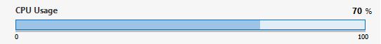

# Analog

Displays the numeric value of a parameter in accordance to the "graphic presentation" settings of the user interface.

Set the Type of the Measurement tag to "analog".

```xml
<Param id="266" trending="false">
  <Name>CPU Usage</Name>
  <Description/>
  ...
  <Type>read</Type>
  <Interprete>
     <RawType>numeric text</RawType>
     <LengthType>next param</LengthType>
     <Type>double</Type>
  </Interprete>
  <Display>
     <RTDisplay>true</RTDisplay>
     <Range>
        <Low>0</Low>
        <High>100</High>
     </Range>
     <Units>%</Units>
     <Positions>
     ...
     </Positions>
  </Display>
   <Measurement>
      <Type>analog</Type>
   </Measurement>
</Param>
```



## See also

DataMiner Protocol Markup Language:

- [Protocol.Params.Param.Measurement.Type@options: analog](xref:Protocol.Params.Param.Measurement.Type-options#options-for-measurement-type-analog)
