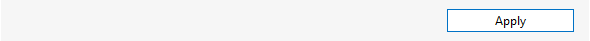

# Button

A button is a write parameter used to invoke an action when it is activated.

To define a button:

1. Create a parameter of type "write" and set the Measurement Type to "button".
1. Add a Discreets tag. Each Discreet tag that is added will introduce an additional button on the parameters row (e.g. putting two Discreet tags in the Discreets tag will result in two buttons). The Discreet Display text is the text that will appear on the button.
1. Define a button width (the value must be at least 110).
1. When the button is pressed, an operation must be performed. Implement this by defining:
    - either a QAction that is executed each time the button is clicked,
    - or a trigger that triggers on a button parameter change and an action (or multiple actions) that get initiated by the trigger.

```xml
<Param id="180">
  <Name>ApplyButton</Name>
  <Type>write</Type>
  <Interprete>
    <RawType>numeric text</RawType>
    <Type>double</Type>
    <LengthType>next param</LengthType>
  </Interprete>
  <Display>
    <RTDisplay>true</RTDisplay>
  </Display>
  <Measurement>
    <Type width="110">button</Type>
    <Discreets>
      <Discreet>
        <Display>Apply</Display>
        <Value>1</Value>
      </Discreet>
    </Discreets>
  </Measurement>
</Param>
```

> [!NOTE]
> Typically, the description tag is left empty when a button is defined.



## See also

DataMiner Protocol Markup Language:

- [Protocol.Params.Param.Measurement.Type: button](xref:Protocol.Params.Param.Measurement.Type#button)
- [Protocol.Params.Param.Measurement.Type@width](xref:Protocol.Params.Param.Measurement.Type-width)
