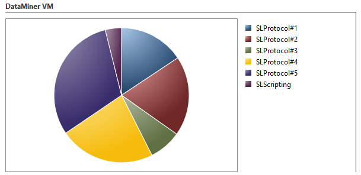
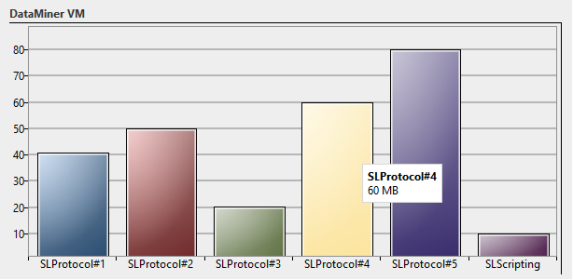
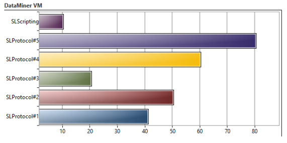

# Chart

DataMiner Cube supports pie charts, column charts and row charts. To render a chart, the ParametersView tag is used. The type attribute of the ParametersView tag specifies the type of chart that should be rendered. In the Parameters child tag, the parameters that should be included in the chart are mentioned.

> [!NOTE]
> Only parameters with Interprete.type set to "double" and Interprete.RawType set to "numeric text" can be used for charts.

## Pie chart

In order to render a column chart, set the type attribute of the ParametersView tag to "pie".

> [!NOTE]
> Pie charts only work if the referenced values are either all positive or all negative.

```xml
<Param id="40">
  <Name>DataMinerVMPie</Name>
  <Description>DataMiner VM (Pie)</Description>
  <Type>read</Type>
  <Display>
    <RTDisplay>true</RTDisplay>
    <ParametersView type="pie" options="Height=300">
      <Parameters>
        <Parameter id="99" tableIndex="SLProtocol*"/>
        <Parameter id="99" tableIndex="SLScripting*"/>
      </Parameters>
    </ParametersView>
  </Display>
  <Interprete>
    <Type>double</Type>
    <DefaultValue>0</DefaultValue>
  </Interprete>
  <Measurement>
    <Type>chart</Type>
  </Measurement>
</Param>
```



In the example above, the parameter with ID 99 is a column parameter. In case of column parameters, the tableIndex attribute can be used to filter which rows should be included in the chart. The tableIndex attribute specifies the primary key of a specific row or a wildcard ("*") can be used to include all matching rows (similar as filtering an alarm template).

> [!NOTE]
> The referenced parameter does not need to be a column parameter. Standalone parameters can be used as well. In this case the table index is not used.

## Column chart

In order to render a column chart, set the type attribute of the ParametersView tag to "column".

```xml
<Param id="41">
  <Name>DataMinerVMColumn</Name>
  <Description>DataMiner VM (Column)</Description>
  <Type>read</Type>
  <Display>
    <RTDisplay>true</RTDisplay>
    <ParametersView type="column" options="Height=300">
      <Parameters>
        <Parameter id="99" tableIndex="SLProtocol*"/>
        <Parameter id="99" tableIndex="SLScripting*"/>
      </Parameters>
    </ParametersView>
  </Display>
  <Interprete>
    <Type>double</Type>
    <DefaultValue>0</DefaultValue>
  </Interprete>
  <Measurement>
    <Type>chart</Type>
  </Measurement>
</Param>
```



## Row chart

In order to render a row chart, set the type attribute of the ParametersView tag to "row".

```xml
<Param id="42">
  <Name>DataMinerVMRow</Name>
  <Description>DataMiner VM (Row)</Description>
  <Type>read</Type>
  <Display>
    <RTDisplay>true</RTDisplay>
    <ParametersView type="row" options="Height=300">
      <Parameters>
        <Parameter id="99" tableIndex="SLProtocol*"/>
        <Parameter id="99" tableIndex="SLScripting*"/>
      </Parameters>
    </ParametersView>
  </Display>
  <Interprete>
    <Type>double</Type>
    <DefaultValue>0</DefaultValue>
  </Interprete>
  <Measurement>
    <Type>chart</Type>
  </Measurement>
</Param>
```



## See also

DataMiner Protocol Markup Language:

- [Protocol.Params.Param.Measurement.Type: chart](xref:Protocol.Params.Param.Measurement.Type#chart)
- [Protocol.Params.Param.Display.ParametersView](xref:Protocol.Params.Param.Display.ParametersView)
