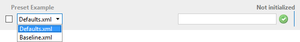

# Combo box

Allows the user to either type a value or select a value from a list.

To define a combo box, set Type to "string" and also provide a list of discrete values by referring to another parameter (via the dependencyId attribute) that holds the values.

```xml
<Param id="380">
  <Name>PresetCombobox</Name>
  <Description>Preset</Description>
  <Type>read</Type>
  <Interprete>
    <RawType>other</RawType>
    <Type>string</Type>
    <LengthType>next param</LengthType>
  </Interprete>
  <Display>
    <RTDisplay>true</RTDisplay>
  </Display>
  <Measurement>
    <Type>string</Type>
    <Discreets dependencyId="382" />
  </Measurement>
</Param>
<Param id="381" setter="true">
  <Name>PresetCombobox</Name>
  <Description>Preset</Description>
  <Type>write</Type>
  <Interprete>
    <RawType>other</RawType>
    <Type>string</Type>
    <LengthType>next param</LengthType>
  </Interprete>
  <Display>
    <RTDisplay>true</RTDisplay>
  </Display>
  <Measurement>
    <Type>string</Type>
    <Discreets dependencyId="382" />
  </Measurement>
</Param>
<Param id="382" trending="false">
  <Name>PresetComboboxValues</Name>
  <Description>Preset Combobox Values</Description>
  <Type>read</Type>
  <Interprete>
    <RawType>other</RawType>
    <Type>string</Type>
    <LengthType>next param</LengthType>
    <DefaultValue>Default.xml;Baseline.xml</DefaultValue>
  </Interprete>
  <Display>
    <RTDisplay>true</RTDisplay>
  </Display>
  <Measurement>
    <Type>string</Type>
  </Measurement>
</Param>
```


